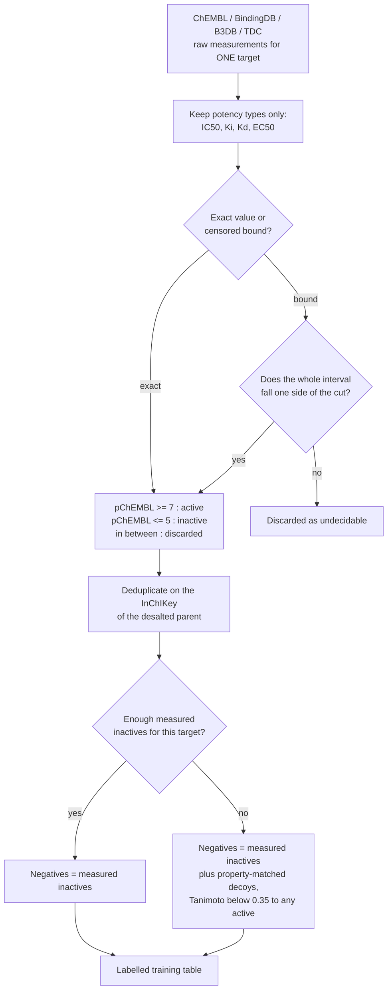
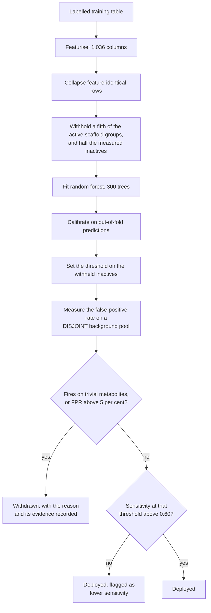
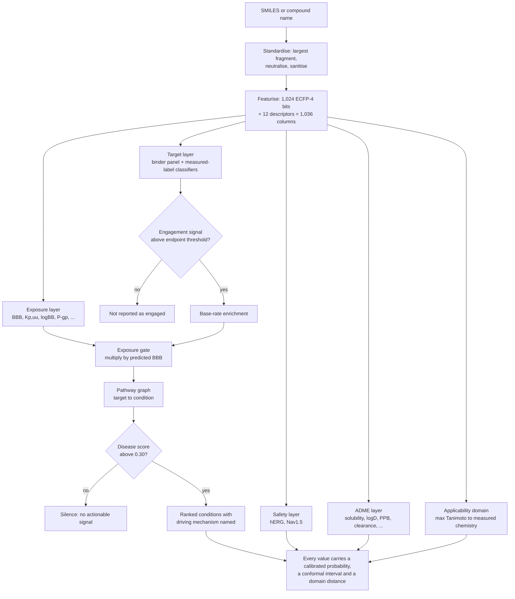
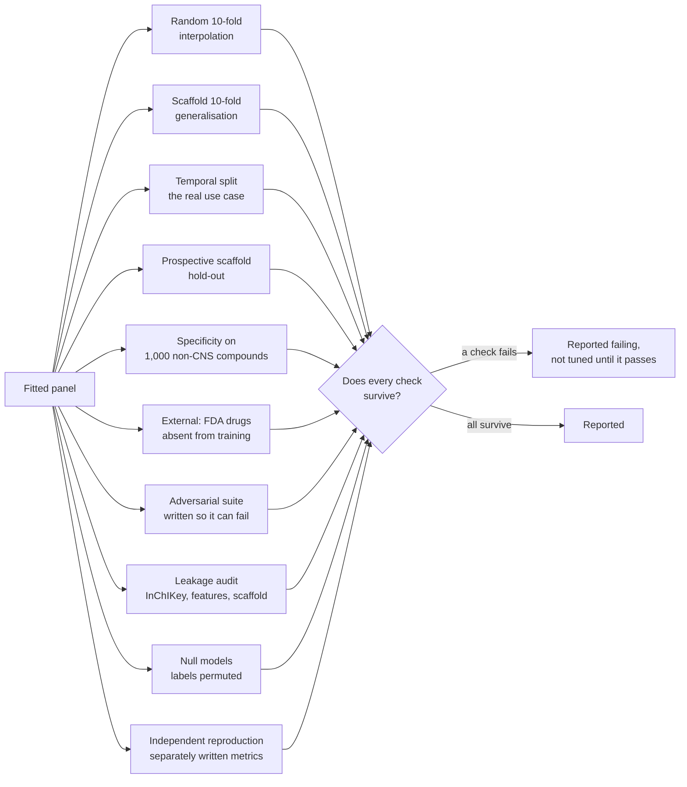

# BrainSafe AI: Technical Report

| | |
|---|---|
| **Document** | Technical report on the BrainSafe AI prediction panel |
| **Generated** | 2026-08-25, automatically, from the deployed panel |
| **Commit** | `120f2c7` |
| **Status** | Research preview, pending peer review |
| **Repository** | https://github.com/krishna-g-999/brainsafe-ai |
| **Regenerate** | `python src/brainsafe/analysis/build_technical_report.py` |

Every figure in this document is read from an artefact in this repository at generation time. None
is typed in, so the document cannot describe a panel other than the one that is deployed.

---

## 0. Executive summary

BrainSafe AI predicts, from chemical structure alone, whether a small molecule reaches the human
brain, what it engages there, which conditions that mechanism touches, and what would stop it
becoming a drug. It exists because CNS attrition is not usually a potency problem: a compound can be
potent at its intended target and never arrive, or arrive and carry a liability nobody tested for.

**What it is.** 75 fitted estimators, 70 deployed, trained on
228,200 measured compound-endpoint records drawn from ChEMBL, BindingDB, B3DB, Therapeutics
Data Commons and MoleculeNet. Every endpoint is trained on measured experimental values only; no
label comes from a curator's annotation and no value is imputed.

**How well it works.** Across the measured-label classifiers, mean AUROC is
0.958 under a random
split and 0.925 under a
scaffold-grouped split that withholds entire structural classes. The binder panel, validated against
compounds measured at the same target and found inactive rather than against decoys, reaches a mean
AUROC of 0.917 at a mean sensitivity of
0.898. On 1,000 compounds with no recorded
activity at any modelled target it stays silent 94.9% of the time.

**What is distinctive.** Three things, each of which is a decision rather than a default. The
negative class is *recovered from censored measurements* rather than simulated with decoys wherever
the data allows. Decision thresholds are *measured on a pool disjoint from the one that set them*,
so a false-positive rate can disagree with its target instead of restating it. And every target
score is *gated by predicted exposure*, so potency at a target the compound cannot reach contributes
nothing.

**What it does not do.** It does not predict clinical efficacy, distinguish agonism from antagonism,
or resolve chirality. Its disease layer is a route from a mechanism to the conditions that mechanism
touches, not an indication prediction, and it does not beat a frequency baseline. Five endpoints
were trained, tested and withdrawn. One adversarial check fails and is reported as failing. Section
8 states these in full.

---

### 0.1 How to read this document

This report is read by people with incompatible backgrounds. A statistician wants the estimator, the
splitting scheme and the interval construction stated precisely, and will not accept prose where an
equation belongs. A pharmacologist wants to know what the panel measures, whether the targets are the
right ones, and what a number means for a compound they might make. Writing only for either one
produces a document the other cannot check.

The response here is not to compromise but to say the same things twice, in the register each reader
needs, and to mark which is which. Prose sections carry the reasoning and the biology. Section 3.7
restates the entire pipeline in notation, and is the one place where nothing is explained twice. The
two must agree; if they do not, that is a defect in this document.

| If you are | Start at | And you can skip |
|---|---|---|
| **A statistician or machine-learning reviewer** | **3.7**, the formal specification: estimator, splits, calibration, conformal construction, thresholds, aggregation, metrics. Then 6.1 (cross-validation), 6.5 (external validation), 6.9 (leakage and null models) | Section 2.3 and section 5's prose, which restate for a biological reader what 3.7 already says exactly |
| **A pharmacologist, neuroscientist or clinician** | **1** (what the system is), then **2.3** (why these endpoints, by therapeutic axis), then **5** (how the layers combine) and **5.1** (a real query, read line by line) | Section 3.7 entirely, and the interval arithmetic in 3.3 and 3.4; sections 6.5.1 to 6.5.6 can be read from their opening paragraphs alone |
| **A reviewer checking whether the claims are earned** | **6** in full, then **8** and **8.2**, where the five foreseeable criticisms are answered with measurements rather than argument | Nothing. That is the point of those sections |
| **Someone deciding whether to use the server** | **0** (executive summary), **5.1** (a worked query), **8** (limitations) | Everything else |

Three conventions hold throughout. Every number is read from an artefact in this repository at
generation time, so no figure here was typed by hand and none can drift from what the code produced.
Results that do not flatter the system are reported at the same size as results that do, and section
6.7 exists because four of the nine falsification hypotheses were refuted. And where a claim rests on
an assumption rather than a measurement, the assumption is named in the sentence that makes the
claim, not in a footnote.

---

## 1. What the system is

BrainSafe AI takes one small molecule, given as a SMILES string or a resolvable compound name, and
answers four questions about it in a single pass:

1. **Exposure.** Does it reach the brain, and at what free concentration?
2. **Engagement.** What does it bind there?
3. **Consequence.** What conditions does that mechanism touch?
4. **Developability.** What would stop it being a drug?

The system is **75 fitted estimators, 70 of them deployed**, trained
on **228,200 measured compound-endpoint records**. It is not one model. Section 4 explains why
that is a design decision rather than an accident, and section 5 explains how the pieces produce one
answer.

### 1.1 Composition

| family | task | estimators |
|---|---|---|
| binder | classification | 52 |
| exposure | classification | 3 |
| exposure | regression | 7 |
| safety | classification | 1 |
| target | classification | 6 |
| target | regression | 6 |

---

## 2. The endpoints

### 2.1 What each estimator predicts, and how well

Metrics are not comparable across the table. `AUROC` is used for classification, where 0.5 is
chance; `R²` for regression, where 0.5 is a respectable fit. The scaffold column is the honest one:
it is measured with whole Bemis-Murcko scaffold classes withheld from training, so it reports
generalisation to chemistry the model has not seen, while the random column reports interpolation
within chemistry it has.

<b>All 75 estimators (click to expand)</b>

| estimator | family | predicts | training rows | metric | scaffold split | deployed |
|---|---|---|---|---|---|---|
| A2A | target | potency, pChEMBL | 6743 | R2 | 0.6205 | True |
| AChE | target | probability of activity | 5125 | AUROC | 0.9212 | True |
| antioxidant_DPPH | target | potency, pChEMBL | 2782 | R2 | 0.4153 | True |
| BACE1 | target | probability of activity | 8207 | AUROC | 0.9648 | True |
| BBB | exposure | probability of activity | 3901 | AUROC | 0.8777 | True |
| BChE | target | probability of activity | 3278 | AUROC | 0.9451 | True |
| D2 | target | potency, pChEMBL | 7905 | R2 | 0.5311 | True |
| GSK3B | target | probability of activity | 5439 | AUROC | 0.9425 | True |
| hERG | safety | probability of activity | 9933 | AUROC | 0.927 | True |
| HT2A | target | potency, pChEMBL | 6075 | R2 | 0.556 | True |
| MAO_A | target | probability of activity | 3585 | AUROC | 0.9059 | True |
| MAO_B | target | probability of activity | 4534 | AUROC | 0.917 | True |
| pka_basic | target | pKa | 6384 | R2 |  | True |
| SERT | target | potency, pChEMBL | 4479 | R2 | 0.4612 | True |
| A1_binder | binder | probability this compound binds this target | 7352 | AUROC vs measured non-binders | 0.914 | True |
| A2A_binder | binder | probability this compound binds this target | 15636 | AUROC vs measured non-binders | 0.949 | True |
| CB1_binder | binder | probability this compound binds this target | 10198 | AUROC vs measured non-binders | 0.949 | True |
| CGRP_binder | binder | probability this compound binds this target | 2251 | AUROC vs measured non-binders | 0.985 | True |
| COX2_binder | binder | probability this compound binds this target | 4429 | AUROC vs measured non-binders | 0.783 | True |
| CSF1R_binder | binder | probability this compound binds this target | 6772 | AUROC vs measured non-binders | 0.95 | True |
| Cav3_2_binder | binder | probability this compound binds this target | 1325 | AUROC vs measured non-binders | 0.982 | True |
| D2_binder | binder | probability this compound binds this target | 13861 | AUROC vs measured non-binders | 0.872 | True |
| D3_binder | binder | probability this compound binds this target | 15831 | AUROC vs measured non-binders | 0.956 | True |
| DAT_binder | binder | probability this compound binds this target | 5113 | AUROC vs measured non-binders | 0.959 | True |
| DHODH_binder | binder | probability this compound binds this target | 3619 | AUROC vs measured non-binders | 0.966 | True |
| GABA_A_binder | binder | probability this compound binds this target | 771 | AUROC vs measured non-binders | 0.719 | True |
| GBA1_binder | binder | probability this compound binds this target | 441 | AUROC vs measured non-binders | 0.932 | True |
| GluA2_binder | binder | probability this compound binds this target | 68 | AUROC vs measured non-binders | 0.696 | False |
| GluN2B_binder | binder | probability this compound binds this target | 3461 | AUROC vs measured non-binders | 0.761 | True |
| H3_binder | binder | probability this compound binds this target | 12295 | AUROC vs measured non-binders | 0.978 | True |
| HDAC1_binder | binder | probability this compound binds this target | 11728 | AUROC vs measured non-binders | 0.96 | True |
| HDAC6_binder | binder | probability this compound binds this target | 14155 | AUROC vs measured non-binders | 0.975 | True |
| HT1A_binder | binder | probability this compound binds this target | 14179 | AUROC vs measured non-binders | 0.936 | True |
| HT2A_binder | binder | probability this compound binds this target | 14369 | AUROC vs measured non-binders | 0.925 | True |
| HT6_binder | binder | probability this compound binds this target | 10532 | AUROC vs measured non-binders | 0.96 | True |
| HT7_binder | binder | probability this compound binds this target | 5623 | AUROC vs measured non-binders | 0.947 | True |
| KEAP1_binder | binder | probability this compound binds this target | 463 | AUROC vs measured non-binders | 0.88 | True |
| LRRK2_binder | binder | probability this compound binds this target | 4470 | AUROC vs measured non-binders | 0.968 | True |
| MT1_binder | binder | probability this compound binds this target | 2670 | AUROC vs measured non-binders | 0.896 | True |
| NET_binder | binder | probability this compound binds this target | 5933 | AUROC vs measured non-binders | 0.92 | True |
| NFKB1_binder | binder | probability this compound binds this target | 102 | AUROC vs measured non-binders | 0.459 | False |
| NLRP3_binder | binder | probability this compound binds this target | 843 | AUROC vs measured non-binders | 0.93 | True |
| NR3C1_binder | binder | probability this compound binds this target | 37 | AUROC vs measured non-binders | 0.41 | False |
| NRF2_binder | binder | probability this compound binds this target | 285 | AUROC vs measured non-binders | 0.789 | False |
| Nav1_1_binder | binder | probability this compound binds this target | 227 | AUROC vs measured non-binders | 0.952 | False |
| Nav1_5_binder | binder | probability this compound binds this target | 870 | AUROC vs measured non-binders | 0.921 | True |
| Nav1_6_binder | binder | probability this compound binds this target | 1027 | AUROC vs measured non-binders | 0.862 | True |
| Nav1_7_binder | binder | probability this compound binds this target | 10397 | AUROC vs measured non-binders | 0.957 | True |
| Nav1_8_binder | binder | probability this compound binds this target | 1030 | AUROC vs measured non-binders | 0.956 | True |
| OPRK1_binder | binder | probability this compound binds this target | 11642 | AUROC vs measured non-binders | 0.945 | True |
| OPRM1_binder | binder | probability this compound binds this target | 14058 | AUROC vs measured non-binders | 0.954 | True |
| OX1_binder | binder | probability this compound binds this target | 12724 | AUROC vs measured non-binders | 0.964 | True |
| OX2_binder | binder | probability this compound binds this target | 14679 | AUROC vs measured non-binders | 0.964 | True |
| P2X7_binder | binder | probability this compound binds this target | 11122 | AUROC vs measured non-binders | 0.813 | True |
| PDE10A_binder | binder | probability this compound binds this target | 15463 | AUROC vs measured non-binders | 0.962 | True |
| PDE4B_binder | binder | probability this compound binds this target | 4332 | AUROC vs measured non-binders | 0.966 | True |
| RIPK1_binder | binder | probability this compound binds this target | 5619 | AUROC vs measured non-binders | 0.966 | True |
| SERT_binder | binder | probability this compound binds this target | 11429 | AUROC vs measured non-binders | 0.945 | True |
| SIRT1_binder | binder | probability this compound binds this target | 276 | AUROC vs measured non-binders | 0.792 | True |
| Sigma1_binder | binder | probability this compound binds this target | 7427 | AUROC vs measured non-binders | 0.881 | True |
| TAAR1_binder | binder | probability this compound binds this target | 82 | AUROC vs measured non-binders | 0.78 | True |
| a3b4nAChR_binder | binder | probability this compound binds this target | 760 | AUROC vs measured non-binders | 0.974 | True |
| a4b2nAChR_binder | binder | probability this compound binds this target | 1835 | AUROC vs measured non-binders | 0.923 | True |
| a7nAChR_binder | binder | probability this compound binds this target | 1285 | AUROC vs measured non-binders | 0.763 | True |
| mGluR5_binder | binder | probability this compound binds this target | 4511 | AUROC vs measured non-binders | 0.893 | True |
| mTOR_binder | binder | probability this compound binds this target | 11510 | AUROC vs measured non-binders | 0.983 | True |
| adme_caco2_permeability | exposure | measured value | 897 | R2 | 0.5818 | True |
| adme_clearance_hepatocyte | exposure | measured value | 1020 | R2 | 0.2062 | True |
| adme_kpuu | exposure | measured value | 566 | R2 | 0.3523 | True |
| adme_lipophilicity | exposure | measured value | 4200 | R2 | 0.5659 | True |
| adme_logbb | exposure | measured value | 1058 | R2 | 0.4131 | True |
| adme_pgp_inhibition | exposure | probability | 1212 | AUROC | 0.9346 | True |
| adme_pgp_substrate | exposure | probability | 1371 | AUROC | 0.807 | True |
| adme_plasma_protein_binding | exposure | measured value | 1797 | R2 | 0.3645 | True |
| adme_solubility | exposure | measured value | 9573 | R2 | 0.7263 | True |

### 2.2 Where the measurements came from

Every endpoint is trained on its own measured set. No value is imputed, no qualitative annotation is
used as a label, and nothing is shared between endpoints except the featurisation.

<b>Per-endpoint data provenance (click to expand)</b>

| endpoint | compounds | actives | inactives | sources |
|---|---|---|---|---|
| A1 | 4508 | 3788 | 720 | ChEMBL (4,007), ChEMBL_inactive (501) |
| A2A | 7001 | 6190 | 811 | ChEMBL (3,126), BindingDB+ChEMBL (2,420), BindingDB (875), ChEMBL_inactive (580) |
| AChE | 5318 | 3169 | 2149 | ChEMBL (2,924), BindingDB+ChEMBL (1,318), ChEMBL_inactive (938), BindingDB (138) |
| BACE1 | 8962 | 7726 | 1236 | ChEMBL (4,459), BindingDB+ChEMBL (3,642), ChEMBL_inactive (473), BindingDB (388) |
| BBB | 7807 | 4956 | 2851 |  |
| BChE | 3386 | 1840 | 1546 | ChEMBL (1,744), BindingDB+ChEMBL (798), ChEMBL_inactive (771), BindingDB (73) |
| CB1 | 7635 | 4404 | 3231 | ChEMBL (4,613), ChEMBL_inactive (3,022) |
| CGRP | 806 | 761 | 45 | ChEMBL (787), ChEMBL_inactive (19) |
| COX2 | 4031 | 2492 | 1539 | ChEMBL (3,185), ChEMBL_inactive (846) |
| CSF1R | 2598 | 2396 | 202 | ChEMBL (2,432), ChEMBL_inactive (166) |
| Cav3_2 | 772 | 633 | 139 | ChEMBL (666), ChEMBL_inactive (106) |
| D2 | 8548 | 7405 | 1143 | ChEMBL (4,080), BindingDB+ChEMBL (3,419), ChEMBL_inactive (877), BindingDB (172) |
| D3 | 5894 | 5462 | 432 | ChEMBL (5,647), ChEMBL_inactive (247) |
| DAT | 3173 | 2380 | 793 | ChEMBL (2,692), ChEMBL_inactive (481) |
| DHODH | 2079 | 1421 | 658 | ChEMBL (1,566), ChEMBL_inactive (513) |
| GABAA_a5 | 684 | 672 | 12 | ChEMBL (676), ChEMBL_inactive (8) |
| GABA_A | 399 | 326 | 73 | ChEMBL (348), ChEMBL_inactive (51) |
| GBA1 | 772 | 292 | 480 | ChEMBL (554), ChEMBL_inactive (218) |
| GSK3B | 5640 | 4232 | 1408 | ChEMBL (2,545), BindingDB+ChEMBL (1,505), ChEMBL_inactive (1,063), BindingDB (527) |
| GluA2 | 234 | 97 | 137 | ChEMBL (183), ChEMBL_inactive (51) |
| GluN2B | 1615 | 1548 | 67 | ChEMBL (1,580), ChEMBL_inactive (35) |
| H3 | 4405 | 4022 | 383 | ChEMBL (4,198), ChEMBL_inactive (207) |
| HDAC1 | 7415 | 5796 | 1619 | ChEMBL (6,367), ChEMBL_inactive (1,048) |
| HDAC6 | 6501 | 5366 | 1135 | ChEMBL (5,612), ChEMBL_inactive (889) |
| HT1A | 5742 | 5220 | 522 | ChEMBL (5,414), ChEMBL_inactive (328) |
| HT2A | 6393 | 5755 | 638 | ChEMBL (2,854), BindingDB+ChEMBL (2,359), BindingDB (623), ChEMBL_inactive (557) |
| HT6 | 3979 | 3766 | 213 | ChEMBL (3,823), ChEMBL_inactive (156) |
| HT7 | 2741 | 2441 | 300 | ChEMBL (2,556), ChEMBL_inactive (185) |
| KEAP1 | 387 | 216 | 171 | ChEMBL (323), ChEMBL_inactive (64) |
| LRRK2 | 1570 | 1460 | 110 | ChEMBL (1,478), ChEMBL_inactive (92) |
| MAO_A | 3789 | 903 | 2886 | ChEMBL (1,787), ChEMBL_inactive (1,565), BindingDB+ChEMBL (339), BindingDB (98) |
| MAO_B | 4806 | 2425 | 2381 | ChEMBL (2,511), ChEMBL_inactive (1,190), BindingDB+ChEMBL (941), BindingDB (164) |
| MT1 | 1020 | 939 | 81 | ChEMBL (969), ChEMBL_inactive (51) |
| NET | 3315 | 2801 | 514 | ChEMBL (3,067), ChEMBL_inactive (248) |
| NFKB1 | 263 | 58 | 205 | NPASS3.0 (263) |
| NLRP3 | 660 | 428 | 232 | ChEMBL (487), ChEMBL_inactive (173) |
| NR3C1 | 140 | 66 | 74 | NPASS3.0 (140) |
| NRF2 | 651 | 81 | 570 | NPASS3.0 (651) |
| Nav1_1 | 519 | 65 | 454 | ChEMBL (425), ChEMBL_inactive (94) |
| Nav1_5 | 1983 | 242 | 1741 | ChEMBL_inactive (1,150), ChEMBL (833) |
| Nav1_6 | 785 | 681 | 104 | ChEMBL (726), ChEMBL_inactive (59) |
| Nav1_7 | 6153 | 5415 | 738 | ChEMBL (5,752), ChEMBL_inactive (401) |
| Nav1_8 | 567 | 501 | 66 | ChEMBL (540), ChEMBL_inactive (27) |
| OPRK1 | 5855 | 4857 | 998 | ChEMBL (5,167), ChEMBL_inactive (688) |
| OPRM1 | 7086 | 5743 | 1343 | ChEMBL (6,109), ChEMBL_inactive (977) |
| OX1.chembl_only | 5240 | 5159 | 81 | ChEMBL (5,240) |
| OX1 | 5735 | 5159 | 576 | ChEMBL (5,240), ChEMBL_inactive (462), PubChem_HTS (33) |
| OX2.chembl_only | 6227 | 6207 | 20 | ChEMBL (6,227) |
| OX2 | 6894 | 6207 | 687 | ChEMBL (6,227), ChEMBL_inactive (663), PubChem_HTS (4) |
| P2X7 | 4528 | 4358 | 170 | ChEMBL (4,401), ChEMBL_inactive (127) |
| PDE10A | 5295 | 5052 | 243 | ChEMBL (5,112), ChEMBL_inactive (183) |
| PDE4B | 2044 | 1712 | 332 | ChEMBL (1,938), ChEMBL_inactive (106) |
| RIPK1 | 3251 | 2349 | 902 | ChEMBL (3,068), ChEMBL_inactive (183) |
| SERT | 4924 | 4362 | 562 | ChEMBL (2,611), BindingDB+ChEMBL (1,811), ChEMBL_inactive (417), BindingDB (85) |
| SIRT1 | 715 | 162 | 553 | ChEMBL (515), ChEMBL_inactive (200) |
| Sigma1 | 2905 | 2793 | 112 | ChEMBL (2,838), ChEMBL_inactive (67) |
| TAAR1 | 403 | 238 | 165 | ChEMBL (303), ChEMBL_inactive (100) |
| a3b4nAChR | 694 | 398 | 296 | ChEMBL (585), ChEMBL_inactive (109) |
| a4b2nAChR | 1150 | 796 | 354 | ChEMBL (942), ChEMBL_inactive (208) |
| a7nAChR | 1208 | 823 | 385 | ChEMBL (1,004), ChEMBL_inactive (204) |
| hERG | 10276 | 2428 | 7848 | ChEMBL (5,875), ChEMBL_inactive (4,401) |
| mGluR5 | 2902 | 2375 | 527 | ChEMBL (2,434), ChEMBL_inactive (468) |
| mTOR | 5222 | 4108 | 1114 | ChEMBL (4,484), ChEMBL_inactive (738) |

**Sources.** Protein-target activity is pooled at compound level from ChEMBL pChEMBL values and
BindingDB. Blood-brain-barrier labels come from B3DB augmented with FDA-curated approved drugs. The
ADME endpoints use measured sets from Therapeutics Data Commons, MoleculeNet, B3DB and ChEMBL.

**The negative class is recovered, not simulated.** A bioactivity record describes what was found to
bind. A compound assayed and found *inactive* is frequently deposited only as a censored bound,
`standard_relation` `>` with no pChEMBL value, and the conventional query, which filters on pChEMBL,
discards exactly those rows. Training on what survives that filter gives a positive class drawn from
measurement and a negative class drawn from property-matched decoys.

A censored bound settles a label whenever the entire interval it defines falls on one side of the
activity cut. `IC50 > 10 uM` places the true potency strictly below pChEMBL 5.0 and is a measured
non-binder. `IC50 > 100 nM` spans both classes and is discarded as undecidable rather than guessed
at. Recovering these added 21,994 measured non-binders across 57 endpoints.

### 2.3 Why these endpoints

The panel is organised around the four questions in section 1, in the order a candidate must satisfy
them. Exposure is modelled first, because a molecule that reaches no free concentration in brain
tissue cannot act centrally however potent it is.

| Axis | Targets | Why it is in a CNS panel |
|---|---|---|
| Cholinergic | AChE, BChE, α7-nAChR, α4β2-nAChR, α3β4-nAChR, H3, 5-HT6, PDE4B | Acetylcholinesterase inhibition remains the mainstay symptomatic treatment in Alzheimer's disease |
| Amyloid and tau | BACE1, GSK-3β | The two principal disease-modifying hypotheses, and the source of the field's most expensive failures |
| Parkinson's | MAO-B, LRRK2, GBA1, PDE10A | MAO-B inhibition is established symptomatic therapy; LRRK2 and GBA1 are the commonest genetic risk loci |
| Monoaminergic | D2, D3, DAT, NET, SERT, 5-HT1A, 5-HT2A, 5-HT7, TAAR1 | Depression, psychosis and ADHD pharmacology is almost entirely monoaminergic |
| Opioid, cannabinoid, sigma | μ-opioid, κ-opioid, CB1, Sigma-1 | Analgesia and addiction liability |
| Sleep and circadian | OX1, OX2, MT1 | The orexin receptors are the target of the newest approved insomnia class |
| Neuroinflammation | NLRP3, P2X7, COX-2, CSF1R, RIPK1 | Implicated across several neurodegenerative conditions rather than tied to one |
| Epigenetic, proteostasis | HDAC1, HDAC6, SIRT1, mTOR, KEAP1 | HDAC removal modifies pathology in Huntington's models; KEAP1-NRF2 is the antioxidant axis |
| Glutamate, GABA | GluN2B, mGluR5, GABA-A | Excitotoxicity and seizure control |
| Ion channels | Nav1.5, Nav1.6, Nav1.7, Nav1.8, Cav3.2 | Pain-selective channels, plus Nav1.5 as a cardiac safety readout |
| Migraine, MS | CGRP receptor, DHODH | Both have approved small-molecule agents acting on these targets |
| Safety | hERG | A leading cause of late-stage cardiovascular attrition through QT prolongation |

**Correlation to drug discovery.** The panel answers the triage question a medicinal chemist asks
before committing bench time: of a set of compounds, which are worth making. That question is not
"what is the affinity" but "is there a mechanism, does the compound arrive, and is there a liability
that will kill it later". Each of the four axes exists because attrition happens on it.

---

## 3. Algorithms and definitions

### 3.1 Representation

Each compound is reduced to its largest organic fragment, neutralised, sanitised, and represented as
a fixed **1,036-column vector**:

- **1,024 bits**: a folded ECFP-4 (Morgan, radius 2) fingerprint. Each bit records that *some*
  substructure environment hashing to that index is present. Folding means a set bit does not
  identify which environment, only that one collided there.
- **12 descriptors**: molecular weight, cLogP, TPSA, hydrogen-bond donors, hydrogen-bond acceptors,
  rotatable bonds, aromatic rings, fraction sp3, ring count, heavy atoms, formal charge, QED.

Chirality is excluded, so two enantiomers produce byte-identical rows. Rows identical in feature
space are therefore collapsed before any split; leaving them in place would put copies of one
compound on both sides of a fold.

**Neutralisation is part of the representation, not a detail.** Removing a counter-ion without it
leaves the parent carrying the charge the salt gave it. Measured on the models this server
previously deployed, haloperidol hydrochloride returned a barrier probability of 0.613 against 0.993
for the free base, and an hERG probability of 0.295 against 0.914 — a user who pasted the salt form
lost a cardiac liability flag on a compound that has one. Only protonation states are undone; a
permanent charge, such as a quaternary ammonium, is kept, because that charge is precisely what
stops such compounds crossing the barrier.

### 3.1.1 How one endpoint is trained

The pipeline is one chain, shown in two halves because it is fifteen steps long. The first half
turns raw deposited measurements into a labelled training table; the second turns that table into a
deployed endpoint, or withholds it.

**Stage 1: from deposited measurements to a labelled table.**

**Stage 2: from the table to a deployed endpoint, or not.**

Every endpoint goes through this independently. Nothing crosses between them except the
featurisation, which is identical by construction.

### 3.2 The estimator

A **random forest** of 300 trees per endpoint, `min_samples_leaf` 2 for the core classifiers and 4
for the binder panel, `class_weight="balanced"`, `random_state=42`.

A random forest is an ensemble of decision trees, each grown on a bootstrap resample of the training
rows and, at each split, choosing among a random subset of features. Averaging their votes reduces
the variance a single deep tree would have. It suits this problem for three reasons: it handles a
sparse binary fingerprint beside twelve continuous descriptors without scaling; it does not
extrapolate, which is the correct behaviour when a query is unlike anything measured; and it is
exactly explainable by TreeSHAP rather than approximately.

### 3.3 Calibration

A forest's vote share is not a probability. Calibration maps it to one.

- **Core classifiers** use **isotonic regression** fitted on out-of-fold predictions, so no compound
  contributes to the calibrator that scores it. Isotonic fits a free monotonic step function.
- **Binder models** use **Platt scaling** (a logistic fit), because the withheld set for one target
  is often too small to fit a step function without overfitting it.

Measured over the 8 measured-label classifiers, mean expected calibration error falls
from **0.0801** raw to **0.0147** after isotonic
calibration.

| endpoint | brier_raw | brier_calibrated | ece_raw | ece_calibrated |
|---|---|---|---|---|
| BBB | 0.1289 | 0.1358 | 0.0657 | 0.0412 |
| AChE | 0.081 | 0.0702 | 0.0942 | 0.011 |
| BChE | 0.0708 | 0.0647 | 0.0735 | 0.0127 |
| BACE1 | 0.0397 | 0.0358 | 0.0497 | 0.0049 |
| GSK3B | 0.0734 | 0.0669 | 0.0847 | 0.0175 |
| MAO_A | 0.0709 | 0.0609 | 0.094 | 0.0089 |
| MAO_B | 0.0848 | 0.077 | 0.0881 | 0.0148 |
| hERG | 0.0717 | 0.0632 | 0.0911 | 0.0069 |

### 3.4 Conformal prediction

A calibrated probability still says nothing about how confident the model is *for this compound*. A
**Mondrian conformal predictor** converts the applicability domain from a caveat into a coverage
statement: at a 0.90 target, the prediction set contains the truth about 90 per cent of the time,
and it is measured rather than assumed.

Empirical coverage runs **0.889 to
0.921** against the 0.90 target.

| endpoint | n_test | target_coverage | empirical_coverage | avg_set_size |
|---|---|---|---|---|
| BBB | 1561 | 0.9 | 0.904 | 1.013 |
| AChE | 1064 | 0.9 | 0.921 | 1.019 |
| BChE | 678 | 0.9 | 0.917 | 1.009 |
| BACE1 | 1793 | 0.9 | 0.906 | 1.007 |
| GSK3B | 1128 | 0.9 | 0.908 | 1.03 |
| MAO_A | 758 | 0.9 | 0.889 | 1.012 |
| MAO_B | 962 | 0.9 | 0.899 | 1.025 |
| hERG | 2056 | 0.9 | 0.904 | 1.079 |

### 3.5 Applicability domain

The maximum ECFP-4 Tanimoto similarity of the query to that endpoint's own measured chemistry,
reported with the nearest measured analogue and its structure.

- **In domain**, T ≥ 0.50: the query sits among measured chemistry.
- **Near domain**, 0.30 ≤ T < 0.50.
- **Out of domain**, T < 0.30: predictive power falls close to chance and the server says so.

### 3.6 Thresholds, and why they are measured on a different sample

A binder model returns a probability; a call requires a cut. Choosing that cut as a quantile of a
sample and then measuring the false-positive rate on the *same* sample cannot fail: the rate
restates the quantile.

The background library of 158,890 compounds is therefore partitioned into three disjoint pools by a
stable hash of the canonical structure, so a compound's pool is a property of the molecule and never
depends on run order:

| Pool | Compounds | Purpose |
|---|---|---|
| Decoy | 95,515 | supply property-matched negatives during training |
| Threshold | 31,694 | set the decision cut |
| Evaluation | 31,681 | measure the false-positive rate the cut actually achieves |

That the measured rate can now disagree with its target is the evidence that it is a measurement.

### 3.7 Formal specification

Everything above is stated in prose, because the reasoning is what most readers want. This section
states the same system in notation, so that a reader who wants to check the arithmetic, reimplement a
step, or locate the assumption hidden inside a sentence can do so without reading the source. Nothing
here is new. It is the same pipeline written twice, and any disagreement between the two is a defect
in this document rather than a choice.

**Representation.** A molecule $m$ is standardised to its neutral parent (largest organic fragment,
sanitised, counter-ion removed, protonation neutralised) and mapped by

$$\varphi(m) = \big(\underbrace{h_1,\dots,h_{1024}}_{\text{ECFP-4, folded}},\;
\underbrace{d_1,\dots,d_{12}}_{\text{descriptors}}\big)
\in \{0,1\}^{1024}\times\mathbb{R}^{12} \subset \mathbb{R}^{1036}$$

where $h_j = 1$ exactly when some atom environment of radius $\le 2$ has a hash congruent to $j$
modulo $1024$. Folding is not injective: $h_j = 1$ says *some* environment hashing to $j$ is present,
not which one. Chirality is excluded from the hash, so enantiomers have identical $\varphi$; section
8.2.2 bounds what that costs.

**Data.** For endpoint $t$, $D_t = \{(x_i, y_i)\}_{i=1}^{n_t}$ with $x_i = \varphi(m_i)$, and
$y_i \in \{0,1\}$ for classification or $y_i \in \mathbb{R}$ (pChEMBL) for regression. Rows identical
in $\varphi$ are collapsed before any split, and a collapsed group whose labels disagree is dropped
rather than resolved by vote, because the featuriser cannot tell its members apart.

**Estimator.** A random forest of $B = 300$ trees,

$$\hat q_t(x) = \frac{1}{B}\sum_{b=1}^{B}\hat p_b(x),
\qquad \hat f_t(x) = \frac{1}{B}\sum_{b=1}^{B} T_b(x)$$

for classification and regression respectively, with $\hat p_b$ the class-1 leaf frequency of tree
$b$. Trees are grown on bootstrap resamples, $\lfloor\sqrt{1036}\rfloor$ features considered per
split, to a minimum leaf size of 2 for the core endpoints and 4 for the binder panel. Binder models
weight class $c$ by $n / (2 n_c)$, so an endpoint that is 90 per cent active cannot be fitted by
answering "active".

**Splitting.** Let $\sigma(m)$ denote the Bemis-Murcko scaffold of $m$: ring systems and the linkers
between them, side chains stripped, atom and bond types retained. Cross-validation is
$\mathrm{GroupKFold}(10)$ with groups $\sigma(m_i)$, so that

$$\sigma(m_i) = \sigma(m_j) \implies i \text{ and } j \text{ share a fold.}$$

The random split is the same estimator under $\mathrm{StratifiedKFold}(10)$, reported only as the
interpolation baseline. Acyclic molecules have no scaffold and are placed in one shared group, so a
fold boundary never runs through them.

**Calibration.** Core classifiers are calibrated by isotonic regression on out-of-fold predictions,

$$\hat g_t = \operatorname*{arg\,min}_{g\ \text{non-decreasing}}
\sum_i \big(g(\hat q_t^{(-k(i))}(x_i)) - y_i\big)^2$$

solved by pool-adjacent-violators, where $\hat q_t^{(-k(i))}$ is fitted without the fold containing
$i$. Because $\hat g_t$ is monotone it cannot reorder compounds, so AUROC is invariant under
calibration and only the probability changes. Binder models instead use Platt scaling,
$\hat g_t(p) = (1 + e^{-(ap + b)})^{-1}$, fitted by maximum likelihood on a stratified fifth withheld
from the forest's own fit, because their positive class is too small for an isotonic step that would
not overfit the calibrator.

**Conformal prediction.** Inductive, Mondrian (class-conditional), at significance
$\varepsilon = 0.10$. On a calibration set disjoint from training the nonconformity of a labelled
compound is $\alpha_i = 1 - \hat q_t(y_i \mid x_i)$. For class $c$ with $n_c$ calibration points the
threshold $\tau_c$ is the $k$-th smallest such $\alpha$ within that class, where

$$k = \big\lceil (n_c + 1)(1 - \varepsilon) \big\rceil,$$

and the prediction set for a new $x$ is

$$\Gamma_\varepsilon(x) = \{\, c \;:\; 1 - \hat q_t(c \mid x) \le \tau_c \,\}.$$

Under exchangeability this gives $\Pr[y \in \Gamma_\varepsilon(x)] \ge 1 - \varepsilon$ *within each
class*. That is what the class-conditional form adds over the marginal one, and it is the reason for
using it here: marginal coverage can be satisfied while the rare class fails systematically.
$\Gamma_\varepsilon(x)$ may be empty, meaning the compound conforms to neither class, or contain both,
meaning it separates neither. Both are informative and both are displayed.

**Decision thresholds.** For binder endpoint $t$, let $I_t^{\mathrm{hold}}$ be the half of its
measured inactives withheld from fitting. With target false-positive rate $\phi = 0.10$,

$$\tau_t = \mathrm{clip}\Big(Q_{1-\phi}\big(\{\hat g_t(\hat q_t(x)) : x \in I_t^{\mathrm{hold}}\}\big),\
0.05,\ 0.999\Big)$$

with $Q_\gamma$ the empirical $\gamma$-quantile. The false-positive rate on $I_t^{\mathrm{hold}}$ is
then $\phi$ by construction and is not evidence of anything; the rate that is reported is measured on
the evaluation pool, disjoint from both the decoy pool used in fitting and the threshold pool used
here. Section 3.6 gives the argument for why the three must be disjoint.

**Applicability domain.** With $\mathcal{R}$ the measured reference library and $T$ the Tanimoto
coefficient on 2048-bit Morgan fingerprints,

$$a(x) = \max_{r \in \mathcal{R}} T(x, r).$$

Section 6.5.2 shows that recall is a monotone function of $a$, which is the property that makes it
useful. Section 8.2.4 shows it is a weak discriminator of non-drug-like chemistry, which is the
property it was designed for and does not have.

**Engagement signal.** The endpoints are not commensurable: each has its own base rate, its own
threshold, and one has a continuous readout. Three maps carry them onto a common $[0,1]$ scale. Where
the negatives are measured, with base rate $b_t$,

$$E_t(p) = \begin{cases}
\dfrac{p - b_t}{1 - b_t}, & p \ge b_t \\[2ex]
\dfrac{p - b_t}{b_t}, & p < b_t
\end{cases} \in [-1, 1],
\qquad s_t(x) = \max\{0,\ E_t(\hat g_t(\hat q_t(x)))\}.$$

$E_t$ is the signed enrichment over prevalence. A probability *below* the base rate is evidence of
inactivity rather than weak evidence of activity, and mapping it to a small positive number would
misstate it. For a decoy-trained binder the threshold takes the role the base rate takes above,

$$s_t(x) = \max\left\{0,\ \frac{\hat g_t(\hat q_t(x)) - \tau_t}{1 - \tau_t}\right\},$$

so a sub-threshold call, which by construction lies within the measured background false-positive
rate, contributes exactly zero. For the antioxidant assay $s_t$ is the percentile of the predicted
value against the measured training distribution. Only $s_t$ is comparable across endpoints, and the
interface always shows the untransformed calibrated probability beside it.

**Aggregation to conditions.** Let $G(d)$ be the curated set of (target, weight) pairs for condition
$d$, and $P$ the set of conditions whose mechanism is peripheral. Then

$$S_d(x) = \max_{(t,w)\in G(d)} w \cdot s_t(x),
\qquad \tilde S_d(x) = \gamma_d(x)\, S_d(x),
\qquad \gamma_d(x) = \begin{cases} 1, & d \in P \\ \hat q_{\mathrm{BBB}}(x), & \text{otherwise.}\end{cases}$$

Two consequences follow from the algebra alone, and both have been misread in the past. First, the
maximum rather than a sum means a condition is scored by its single strongest engaged mechanism, so
engaging three of its targets scores exactly as engaging its strongest. That is deliberate: H8 found
co-engaged targets are frequently homologues, and a sum would count one observation several times.
Second, $\gamma_d$ does not depend on $d$ across the non-peripheral conditions, so it cannot change
their relative order. It is an exposure filter deciding whether anything is reported at all, not a
discriminator between conditions, which is why H3 is recorded as refuted by construction rather than
by experiment.

**Metrics.** With $n_1$ actives, $n_0$ inactives and $R_i$ the mid-rank of the $i$-th score,

$$\mathrm{AUROC} = \frac{1}{n_1 n_0}\left(\sum_{i:\,y_i=1} R_i - \frac{n_1(n_1+1)}{2}\right)
= \frac{U}{n_1 n_0},$$

which is the Mann-Whitney $U$ statistic normalised. An AUROC and a $p$-value from that test are two
readings of one quantity, which is why both appear together throughout section 6. Expected
calibration error over $M$ equal-width confidence bins is

$$\mathrm{ECE} = \sum_{j=1}^{M} \frac{|B_j|}{n}\,\big|\mathrm{acc}(B_j) - \mathrm{conf}(B_j)\big|.$$

Binomial proportions are reported with Wilson intervals rather than normal-approximation intervals,
because several of them sit near 0 or 1, where the normal interval leaves the unit interval.

---

## 4. Why 70 models and not one

This is the question most often asked of the design, and it has a specific answer.

### 4.1 The alternative, and why it fails

The obvious alternative is one multi-task model: a single network with one output per endpoint,
trained on all the data at once. It is rejected here for reasons that are about the data, not about
preference.

**The label matrix is almost entirely missing.** 228,200 measurements spread over
63 endpoints and roughly 169,000 unique compounds would fill under two per cent of a
compound-by-endpoint matrix. A compound measured at AChE has almost never been measured at OX2.
Multi-task learning shares strength across tasks; with a matrix this sparse it mostly shares
*absence*, and a missing measurement is not a negative result.

**The negative class means different things per endpoint.** For a target with recovered censored
bounds, a negative is a compound *measured and found inactive*. For a target without them, a
negative is a property-matched decoy, which is an assumption. Pooling those into one loss silently
averages a measurement with an assumption.

**The endpoints have incompatible base rates.** Some sets are 90 per cent active, an artefact of the
deposition query rather than of the chemistry. A shared output layer propagates one endpoint's class
imbalance into another's decision boundary.

**A per-endpoint threshold is required and could not be honest otherwise.** Each endpoint's cut is
set on held-out measured inactives *for that endpoint* and verified on a disjoint background pool.
That is only definable per endpoint.

**Failure stays local.** Five endpoints were trained, tested and withdrawn. In an independent panel a
withdrawal removes one output. In a shared-weight model the same data would have influenced every
other endpoint's representation, and withdrawing it cleanly would not be possible.

### 4.2 What independence costs

It is not free, and the honest statement of the cost is this: a multi-task model can borrow
statistical strength for a small endpoint from a large related one. The smallest deployed set here
has 387 compounds and would plausibly benefit. That benefit is forgone deliberately, because the
price is a shared representation in which no endpoint's threshold, negative class or withdrawal is
independently defensible.

---

## 5. How 70 independent models answer one question

The estimators are independent in *fitting*. They are not independent in *use*: the output is
assembled in a fixed order, and each stage constrains the next.

**The logic, stated plainly.**

1. **Each model answers only its own question.** The AChE model knows nothing about hERG.
2. **Engagement is put on a common scale.** A calibrated probability is not comparable between
   targets, because each has its own threshold and its own base rate. Each target's probability is
   converted to an *engagement signal*: distance above that target's own reporting threshold,
   rescaled to 0–1. That is the only quantity compared across targets.
3. **Base-rate enrichment, not raw probability.** Several training sets are active-heavy, so a high
   probability may say more about the endpoint than about the compound. A target is scored by how far
   it sits above its own base rate.
4. **Exposure gates everything.** Each target's contribution is multiplied by predicted
   blood-brain-barrier penetration. A potent binder that does not reach the brain contributes
   nothing. This is the one place where the models are combined multiplicatively, and it encodes a
   pharmacological fact: potency at an unreachable target is not activity.
5. **The pathway graph maps mechanism to condition.** A curated, versioned graph anchored to KEGG,
   Reactome and IUPHAR maps each target to the conditions it informs. A disease score is the
   **strongest** engaged mechanism for that condition scaled by exposure, not a sum, so one target
   explains the score and can be named.
6. **Silence is a result.** Below a disease score of 0.30 nothing is reported. Silence means no
   modelled mechanism cleared its threshold; it is not a claim of inactivity.

The models are therefore combined by a **stated rule**, not by a learned one. Nothing is fitted on
top of the panel. That is deliberate: a meta-model over seventy outputs would need its own training
set of compounds labelled with ground-truth disease relevance, which does not exist.

### 5.1 A real query, read line by line

The description above is abstract. This section takes three compounds through the deployed pipeline
and reads what comes back. The three were chosen before their outputs were seen, each to exercise a
different part of the system, and whatever they returned is what is printed here.

**Donepezil** is an approved acetylcholinesterase inhibitor that reaches the brain, so the panel
should engage the target it was designed for and pass the exposure gate. **Atenolol** is a
beta-blocker deliberately optimised *not* to enter the brain, so the exposure layer should say so and
the disease layer should stay quiet whatever any target model reports. **Withanolide A** is a
steroidal natural product from chemistry this library barely covers, so the domain distance should be
low and the silence that follows should be marked as uninformative rather than as evidence.

| compound | section | endpoint | value | unit | context |
|---|---|---|---|---|---|
| atenolol | Target and property models | BBB | 0.473 | calibrated probability | training base rate 0.635; enrichment -0.255 |
| atenolol | Target and property models | AChE | 0.1766 | calibrated probability | training base rate 0.724; enrichment -0.756 |
| atenolol | Target and property models | hERG | 0.0792 | calibrated probability | training base rate 0.413; enrichment -0.808 |
| atenolol | Applicability domain | max_tanimoto | 1.0 | Tanimoto | In domain; nearest analogue CC(C)NCC(O)COc1ccc(CC(N)=O)cc1; measured recall for compounds at this distance 0.86 (n=2,586), so a silent endpoint here is reasonably strong evidence of inactivity |
| atenolol | Expected sensitivity at this distance | expected_recall | 0.8616 | fraction | prospective validation, results/tables/external_novelty_strata.csv; recall is a function of chemical distance rather than of publication date |
| atenolol | Disease layer | top_disease | 0.0 | score | nothing cleared the reporting threshold |
| donepezil | Target and property models | BBB | 0.9907 | calibrated probability | training base rate 0.635; enrichment +0.974 |
| donepezil | Target and property models | AChE | 1.0 | calibrated probability | training base rate 0.724; enrichment +1.000 |
| donepezil | Target and property models | hERG | 0.7342 | calibrated probability | training base rate 0.413; enrichment +0.547 |
| donepezil | Applicability domain | max_tanimoto | 1.0 | Tanimoto | In domain; nearest analogue COc1cc2c(cc1OC)C(=O)C(CC1CCN(Cc3ccccc3)CC1)C2; measured recall for compounds at this distance 0.86 (n=2,586), so a silent endpoint here is reasonably strong evidence of inactivity |
| donepezil | Expected sensitivity at this distance | expected_recall | 0.8616 | fraction | prospective validation, results/tables/external_novelty_strata.csv; recall is a function of chemical distance rather than of publication date |
| donepezil | Disease layer | top_disease | 0.9907 | score | Alzheimer's disease, driven by AChE |
| withanolide A | Target and property models | BBB | 0.5926 | calibrated probability | training base rate 0.635; enrichment -0.067 |
| withanolide A | Target and property models | AChE | 0.0848 | calibrated probability | training base rate 0.724; enrichment -0.883 |
| withanolide A | Target and property models | hERG | 0.1049 | calibrated probability | training base rate 0.413; enrichment -0.746 |
| withanolide A | Applicability domain | max_tanimoto | 0.4324 | Tanimoto | Near domain; nearest analogue CC(C)CCCC(C)C1CCC2C3CC=C4CC(O)CCC4(C)C3CCC12C; measured recall for compounds at this distance 0.55 (n=5,228), so a silent endpoint here is moderate evidence of inactivity |
| withanolide A | Expected sensitivity at this distance | expected_recall | 0.5532 | fraction | prospective validation, results/tables/external_novelty_strata.csv; recall is a function of chemical distance rather than of publication date |
| withanolide A | Disease layer | top_disease | 0.0 | score | nothing cleared the reporting threshold |

**Reading the donepezil rows.** The AChE probability is 1.000 against a training base rate of 0.724,
an enrichment of +1.000: the model is as confident as it can be, and the enrichment confirms that the
confidence is not merely the base rate showing through. Barrier penetration is 0.991, so the exposure
gate passes essentially unattenuated, and the top condition is Alzheimer's disease at 0.991 with AChE
named as the driver. That is the correct answer for donepezil, and it is worth saying plainly that it
is not evidence of anything: donepezil is a training compound, its domain distance is 1.000 because
it is *in* the reference library, and a system that got this wrong would be broken rather than
uninformative. The row shows what a positive looks like; it does not support a claim.

The hERG probability of 0.734 is the more informative line. Donepezil does block hERG, and the
enrichment of +0.547 over a base rate of 0.413 says the model is reporting a genuine liability rather
than the prior. This is the safety axis doing what it exists for: the compound that scores at the top
of the efficacy axis carries a flag a medicinal chemist would need to see.

**Reading the atenolol rows.** Every target probability sits *below* its base rate, giving negative
enrichments (AChE -0.756, hERG -0.808). Under the map in section 3.7 these become an engagement
signal of exactly zero rather than a small positive number, which is the reason for using signed
enrichment instead of the raw probability. Barrier penetration is 0.473 and the top condition scores
0.0009, some three hundred times below the 0.30 reporting threshold. The server therefore says
nothing, which for a peripherally restricted beta-blocker is correct.

**Reading the withanolide rows.** The domain distance is 0.432, in the near-domain band, and the
nearest measured neighbour is a steroid rather than anything from a medicinal-chemistry series. Every
target signal is at or below base rate and the top condition scores 0.000. The line that matters is
the expected sensitivity: 0.553, against 0.862 for the two drugs above. That figure comes from the
prospective validation in section 6.5 and it changes what the silence means. For donepezil, silence
at a target would be reasonably strong evidence of inactivity. For the withanolide it is weak
evidence, because at this distance from the training chemistry the panel recovers barely half of the
activities that are really present. The server reports that number beside the result rather than
leaving a reader to assume all silences are equal.

**What a user does with this.** The output is a triage instrument, and these three compounds show the
three outcomes it can produce. A strong, gated, mechanistically named signal is a reason to look
further and tells you which assay to run first. An unambiguous silence from a compound well inside
the domain is a reason to deprioritise. A silence from a compound outside the domain is not a result
at all, and the expected-sensitivity figure exists so that it is not read as one.

---

## 6. Validation: everything that was done

Validation here is arranged so that each test answers a question the previous one cannot.

### 6.1 Cross-validation, two regimes

Every endpoint is cross-validated ten-fold in two regimes, and the distance between them is the
honest statement of how far a model travels.

- **Random 10-fold** splits compounds at random. It measures interpolation within known chemistry.
- **Scaffold-grouped 10-fold** withholds entire Bemis-Murcko scaffold classes. A held-out compound is
  therefore structurally distinct from everything trained on, which is the situation a user is
  actually in.

Across the measured-label classifiers: mean AUROC **0.9575**
random and **0.9252** scaffold.

| endpoint | task | split | compounds | metric | score | fold sd |
|---|---|---|---|---|---|---|
| BBB | classification | random | 3901 | AUROC | 0.899 | 0.0161 |
| BBB | classification | scaffold | 3901 | AUROC | 0.8777 | 0.0336 |
| AChE | classification | random | 5125 | AUROC | 0.9659 | 0.0057 |
| AChE | classification | scaffold | 5125 | AUROC | 0.9212 | 0.0206 |
| BChE | classification | random | 3278 | AUROC | 0.9724 | 0.008 |
| BChE | classification | scaffold | 3278 | AUROC | 0.9451 | 0.0155 |
| BACE1 | classification | random | 8207 | AUROC | 0.9764 | 0.0104 |
| BACE1 | classification | scaffold | 8207 | AUROC | 0.9648 | 0.0093 |
| GSK3B | classification | random | 5439 | AUROC | 0.9649 | 0.0065 |
| GSK3B | classification | scaffold | 5439 | AUROC | 0.9425 | 0.0236 |
| MAO_A | classification | random | 3585 | AUROC | 0.9619 | 0.0124 |
| MAO_A | classification | scaffold | 3585 | AUROC | 0.9059 | 0.0303 |
| MAO_B | classification | random | 4534 | AUROC | 0.963 | 0.0075 |
| MAO_B | classification | scaffold | 4534 | AUROC | 0.917 | 0.0294 |
| hERG | classification | random | 9933 | AUROC | 0.9565 | 0.0077 |
| hERG | classification | scaffold | 9933 | AUROC | 0.927 | 0.0271 |
| D2 | regression | random | 7905 | R2 | 0.6403 | 0.0243 |
| D2 | regression | scaffold | 7905 | R2 | 0.5311 | 0.0287 |
| A2A | regression | random | 6743 | R2 | 0.7231 | 0.0255 |
| A2A | regression | scaffold | 6743 | R2 | 0.6205 | 0.0485 |
| HT2A | regression | random | 6075 | R2 | 0.6996 | 0.0166 |
| HT2A | regression | scaffold | 6075 | R2 | 0.556 | 0.0656 |
| SERT | regression | random | 4479 | R2 | 0.6897 | 0.0273 |
| SERT | regression | scaffold | 4479 | R2 | 0.4612 | 0.0987 |
| antioxidant_DPPH | regression | random | 2782 | R2 | 0.6589 | 0.0508 |
| antioxidant_DPPH | regression | scaffold | 2782 | R2 | 0.4153 | 0.1491 |

### 6.2 Temporal validation

The hardest realistic test: train on compounds published before a cut-off year, test on those
published after it. This reproduces the actual use case, predicting chemistry that did not exist
when the model was fitted.

AUROC **0.720 to 0.910** across 7 endpoints.

| endpoint | task | cutoff_year | n_train | n_test | metric | score |
|---|---|---|---|---|---|---|
| AChE | classification | 2020 | 4141 | 1028 | auroc | 0.761 |
| BChE | classification | 2021 | 2696 | 617 | auroc | 0.801 |
| BACE1 | classification | 2017 | 6901 | 1673 | auroc | 0.91 |
| GSK3B | classification | 2021 | 4205 | 546 | auroc | 0.764 |
| MAO_A | classification | 2020 | 2859 | 819 | auroc | 0.727 |
| MAO_B | classification | 2020 | 3719 | 923 | auroc | 0.843 |
| hERG | classification | 2020 | 8158 | 2059 | auroc | 0.72 |

### 6.3 Prospective scaffold hold-out

Whole scaffold classes withheld *before* training, then recall measured on them at the deployed
threshold. Median per-target recall **0.815** across 39 targets whose
decision threshold did not collapse. Targets are excluded only for a degenerate threshold, never for
poor recall.

### 6.4 Specificity: does it stay quiet when it should?

1,000 compounds with no recorded activity at any modelled target were scored through the
deployed pipeline. **949** returned no actionable disease signal: specificity
**0.949** (95% CI 0.934 to 0.961).

These compounds are *presumed* inactive because nothing is recorded about them, not proven inactive,
so this is a lower bound.

### 6.5 External validation

An external test set is measured chemistry absent from training. For the barrier model one exists.
For the target panel one largely does not, and the reason is structural rather than neglect: for most
of these targets the public measured chemistry *is* the training set, so buying an independent set
would mean running new assays.

Two kinds of independence can still be constructed from what exists. Both are reported below in full,
including the parts that do not flatter the panel.

**The barrier model against FDA-curated approved drugs.** Compounds absent from the training source
by InChIKey, scored by the deployed model.

| set | n | n_permeable | auroc | sensitivity | specificity |
|---|---|---|---|---|---|
| FDA-curated, not in B3DB by InChIKey | 306 | 203 | 0.7645 | 0.7734 | 0.6505 |
| FDA-curated, also distinguishable from training in feature space | 241 | 171 | 0.7934 | 0.7661 | 0.6571 |
| of which: feature-identical to a training compound | 65 | 32 | 0.7102 | 0.8125 | 0.6364 |

The row that supports an external claim is the second: compounds absent by InChIKey *and*
distinguishable from training in feature space. The third row is the memorisation the first contains.

#### 6.5.1 Prospective validation: what the panel would have said about chemistry that did not exist

Every measured row carries the year of the document it came from. Freezing the data at a year,
fitting the panel on what was known then and testing on compounds first published afterwards
reproduces the position a user is actually in. It is the accepted simulator of prospective
performance and it is stronger evidence than a random split, because a compound published after the
cutoff could not have been memorised whatever its scaffold.

Four things make this a real test rather than a comfortable one. The models are **refitted**, since
scoring the deployed models on post-cutoff compounds would measure nothing: they were fitted on them.
The **operating point is frozen too**, as thresholds are quantiles of pre-cutoff held-out measured
inactives, so the sensitivity reported is what a user in the cutoff year would have got. **Decoys are
matched to pre-cutoff actives only**, and every post-cutoff compound is barred from decoy
eligibility, so a test compound can never appear as a training negative. And each endpoint is fitted
a second time on a **size-matched random split**, because a time split trains on less data as well as
none of the future, and without a control at the same n a drop cannot be attributed to either.

39 of the 47 deployed endpoints carry enough dated chemistry on both sides of the wall to be
assessed. The rest are listed with their reasons in `results/tables/external_prospective.csv`, and
are excluded for want of post-cutoff compounds, never for a poor result.

| | time split | size-matched random | deployed |
|---|---|---|---|
| mean AUROC against measured inactives | **0.823** | 0.951 | 0.918 |
| mean AUROC against background chemistry | **0.913** | 0.975 | - |
| mean sensitivity at the frozen threshold | **0.489** | 0.872 | 0.900 |
| mean false-positive rate on background | **0.0373** | 0.0376 | - |

Two of those rows are reassuring and two are not, and the difference between them is the whole
result.

**Specificity transfers essentially unchanged**, at 0.0373 against 0.0376. Whatever
a temporal wall costs, it does not make the panel reckless. **Ranking against background chemistry
survives**, falling from 0.975 to 0.913. The panel still recognises
chemistry relevant to its target when that chemistry is new.

**Ranking against measured inactives at the same target falls** from 0.951 to
0.823 over 32 paired endpoints, and **sensitivity at the frozen
threshold falls further**, from 0.872 to 0.489. Taken at face value those two
rows say the deployed figures overstate what a user submitting new chemistry should expect, and the
first draft of this section said exactly that. It is the wrong reading, and section 6.5.2 gives the
right one.

#### 6.5.2 The gap is composition, not decay

A time split flatters a field that publishes analogue series, and medicinal chemistry publishes
little else. If the compounds appearing after a cutoff are close relatives of those before it, a high
prospective score demonstrates interpolation within a series and not much more. That was the reason
for measuring, for every test compound, its maximum Tanimoto similarity to the training actives of
its own split, and for recomputing performance within bands of that distance. Both classes are
binned, so each band compares actives against measured inactives at a comparable distance from
training. Binning only the actives would produce bands whose positives are novel and whose negatives
are not, and their AUROC would measure that mismatch rather than the model.

The stratification was built to check whether the time split was too easy. It showed something else.

| source | split | novelty_band | n_actives | n_measured_inactives | auroc | recall_at_threshold | fpr_at_threshold |
|---|---|---|---|---|---|---|---|
| prospective | random | below 0.40 (different chemotype) | 212 | 4190 | 0.7516 | 0.1179 | 0.0279 |
| prospective | random | 0.40 to 0.55 (related series) | 453 | 1331 | 0.8217 | 0.5232 | 0.127 |
| prospective | random | 0.55 to 0.70 (same series) | 1981 | 829 | 0.8379 | 0.7683 | 0.3172 |
| prospective | random | 0.70 and above (close analogue) | 13208 | 418 | 0.8548 | 0.9334 | 0.4976 |
| prospective | time | below 0.40 (different chemotype) | 4366 | 5395 | 0.6711 | 0.1612 | 0.0762 |
| prospective | time | 0.40 to 0.55 (related series) | 5228 | 1003 | 0.7645 | 0.5532 | 0.2692 |
| prospective | time | 0.55 to 0.70 (same series) | 3674 | 278 | 0.7871 | 0.7403 | 0.4676 |
| prospective | time | 0.70 and above (close analogue) | 2586 | 92 | 0.8617 | 0.8616 | 0.3261 |
| cross-provenance | cross_source | below 0.40 (different chemotype) | 324 | 0 |  | 0.0494 |  |
| cross-provenance | cross_source | 0.40 to 0.55 (related series) | 418 | 0 |  | 0.4641 |  |
| cross-provenance | cross_source | 0.55 to 0.70 (same series) | 288 | 0 |  | 0.8264 |  |
| cross-provenance | cross_source | 0.70 and above (close analogue) | 273 | 0 |  | 0.9011 |  |

Read the two splits against each other band by band rather than in aggregate. Most of the gap
disappears. The aggregate difference of 0.128 in AUROC and 0.383 in sensitivity
falls, within a band, to at most 0.081 and 0.072 respectively; on recall the time split is
the better of the two in 2 of the 4 bands, and on AUROC in 1.

A residual remains, and the obvious explanation for it is wrong. Coarse bands would do this if the
time split's compounds sat further out within a band than the random control's, but they do not:
inside the widest band, everything below 0.40, both splits have a median similarity to training of
0.319 and means within 0.002 of each other. The residual is not distance the binning failed to
capture.

What can be said is that it cannot be attributed with this data. The random split produces very
little novel chemistry to test on, 212 actives spread across 39 endpoints, so no
single endpoint carries enough of both splits inside that band for a paired comparison, and the two
bands therefore aggregate different mixtures of endpoints. The honest summary is that chemical
distance accounts for most of the apparent temporal effect and not demonstrably all of it.

What differs is not performance but the population being tested.

| test-set composition (actives) | time split | size-matched random |
|---|---|---|
| below 0.40 (different chemotype) | 27.5% | 1.3% |
| 0.40 to 0.55 (related series) | 33.0% | 2.9% |
| 0.55 to 0.70 (same series) | 23.2% | 12.5% |
| 0.70 and above (close analogue) | 16.3% | 83.3% |

A random split of medicinal-chemistry data is barely a test. 83 per cent of its test
compounds are close analogues of something in its own training set, because the published record is
full of series and a random draw keeps most of a series on both sides of the split. The time split's
test set is genuinely different chemistry: median similarity to training 0.50 against
0.81, with 28 per cent of it below the 0.40 that a medicinal chemist would call a
different chemotype, against 1 per cent.

**The panel's accuracy is a function of chemical distance, not of date.** Conditioned on how far a
compound sits from the training chemistry, it makes no difference whether that compound was withheld
by year or at random. What time changes is the input distribution: compounds published later sit
further from what came before, so a time split tests the same model on harder chemistry and returns
a lower number. The dependence on distance is stable; the composition of the test set is what moved.

That distinction is not a quibble, because the two readings imply opposite things. Temporal decay
would mean the models need periodic refitting and that their published scores expire. A stable
distance-dependence means the scores do not expire, are conditional on a quantity the server already
measures, and can be quoted for the compound in hand rather than for the average compound. The
aggregate table in 6.5.1 supports the first reading perfectly well and only the stratification
separates them, which is exactly the substitution of a compositional effect for a causal one that
this document exists to avoid. It was nearly made here.

Three consequences follow, and they are the practical output of the exercise.

**The deployed sensitivity figures describe the wrong population.** They are measured on held-out
chemistry that is 83 per cent close analogues. A user submitting a novel scaffold is in
the leftmost band, where recall is 0.161, not the rightmost, where it is
0.862. Neither number is wrong; quoting the second alone would be.

**Performance is predictable before it is needed.** Recall is a monotone function of a quantity the
server already computes and already displays for every query. The expected sensitivity for the
compound in hand is therefore knowable at the moment of the query rather than only in aggregate.

**The applicability-domain flag earns its place in a role it was not being credited with.** Section
8.2 shows it is a weak discriminator of non-drug-like chemistry, which is what it was built to be
and what its adversarial check tests. It is a good predictor of when the panel will fall silent on a
real active. A compound the flag places near the edge of the domain is precisely the compound whose
activity the panel is most likely to miss, and that is the more useful thing for it to mean.

#### 6.5.3 The same test on the core endpoints

Section 6.2 has reported temporal AUROC for the core classifiers without the control that makes it
readable. Refitted here with a size-matched random split alongside.

| endpoint | task | cutoff_year | n_train | n_test | metric | time_split_score | random_control_score | cost_of_prospectivity |
|---|---|---|---|---|---|---|---|---|
| AChE | classification | 2020 | 4290 | 1028 | auroc | 0.7649 | 0.9691 | 0.2042 |
| BChE | classification | 2021 | 2769 | 617 | auroc | 0.8144 | 0.9692 | 0.1548 |
| BACE1 | classification | 2017 | 7289 | 1673 | auroc | 0.9131 | 0.9718 | 0.0587 |
| GSK3B | classification | 2021 | 5094 | 546 | auroc | 0.7143 | 0.969 | 0.2547 |
| MAO_A | classification | 2020 | 2970 | 819 | auroc | 0.7544 | 0.966 | 0.2116 |
| MAO_B | classification | 2020 | 3883 | 923 | auroc | 0.8429 | 0.9586 | 0.1157 |
| hERG | classification | 2020 | 8217 | 2059 | auroc | 0.715 | 0.9621 | 0.2471 |
| D2 | regression | 2019 | 6992 | 1556 | r2 | 0.1031 | 0.6169 | 0.5138 |
| A2A | regression | 2020 | 5485 | 1516 | r2 | 0.3005 | 0.7154 | 0.4149 |
| HT2A | regression | 2020 | 5407 | 986 | r2 | 0.3685 | 0.6866 | 0.3181 |
| SERT | regression | 2015 | 3777 | 1147 | r2 | 0.1366 | 0.6678 | 0.5312 |
| antioxidant_DPPH | regression | 2016 | 2340 | 522 | r2 | 0.0073 | 0.7105 | 0.7032 |

Across 7 classifiers the mean AUROC is 0.788 under the time split against
0.967 under the matched random control, a cost of 0.178.

The regressors are the more interesting case, because a temporal R-squared of 0.01 to
0.37 has always looked like evidence that the receptor models barely work. Against a matched
random control averaging 0.679 they are better read as a measure of how much of a regression
score is interpolation within a published series: the mean cost of prospectivity is 0.496.
A prospective R-squared near zero on a continuous potency scale remains a real limitation and is
reported as one, but it is a statement about the temporal structure of published structure-activity
data rather than about the fitting.

#### 6.5.4 A different curator: cross-provenance validation

Time is not the only kind of independence. A model can be prospectively accurate while depending on
the habits of one curation pipeline: which assays ChEMBL selects, how it derives pChEMBL, which papers
it abstracts. Some compounds in these tables were deposited in BindingDB and are absent from ChEMBL
entirely, curated by different people from different papers. Refitting on the ChEMBL side and testing
on the BindingDB-only side asks whether the signal is a property of the chemistry or of one database's
way of recording it.

This test cannot report AUROC, and the reason belongs before the numbers rather than after. Every
BindingDB-only row at every endpoint is an active: BindingDB deposits affinities, so a compound absent
from ChEMBL and present there is one that somebody measured and found to bind. There are no
independently curated negatives to rank against, and manufacturing them from the background pool would
test the background pool. What is reported instead is recall at the frozen operating point, paired
with the false-positive rate that same threshold produces on background chemistry, because recall
alone is meaningless: a model answering "active" to everything scores 1.0.

| endpoint | n_train_actives_chembl | n_test_actives_bindingdb_only | recall_on_external_actives | fpr_background_at_same_threshold | deployed_sensitivity | median_novelty_of_test_set |
|---|---|---|---|---|---|---|
| A2A | 3343 | 758 | 0.6332 | 0.0332 | 0.928 | 0.5145 |
| D2 | 3571 | 86 | 0.6163 | 0.069 | 0.829 | 0.6257 |
| HT2A | 3358 | 459 | 0.3508 | 0.0657 | 0.846 | 0.5195 |

Across 3 endpoints and 1,303 independently
curated actives, of which 1,264 are distinguishable from
training in feature space, mean recall is 0.533 at a mean
background false-positive rate of 0.0560, against a mean
deployed sensitivity of 0.868 on the
same endpoints.

Read alone that looks like a heavy cost for a change of curator. It is not: the median distance from
training of these test sets is 0.52, which is the middle of
the range, and the recall observed is what 6.5.2 predicts for compounds at that distance. Stratifying
this set the same way makes the point directly, and it is the strongest evidence in this section.

#### 6.5.5 The same curve from three independent test sets

Three test sets were built here by three unrelated rules: withhold the later quarter by publication
date, withhold a quarter at random, and withhold everything one database curated and the other did
not. They share no construction principle. If recall were a property of the split, they would
disagree. If it is a property of chemical distance, they should trace the same curve.

| novelty_band | withheld by curator | withheld at random | withheld by date |
|---|---|---|---|
| 0.40 to 0.55 (related series) | 0.4641 | 0.5232 | 0.5532 |
| 0.55 to 0.70 (same series) | 0.8264 | 0.7683 | 0.7403 |
| 0.70 and above (close analogue) | 0.9011 | 0.9334 | 0.8616 |
| below 0.40 (different chemotype) | 0.0494 | 0.1179 | 0.1612 |

They trace the same curve. A cross-provenance test set, built by a rule that knows nothing about
dates and nothing about the random seed, reproduces the recall-versus-distance relationship of both
others. That is convergent evidence, and it is worth more than any single one of the three, because
the ways in which these three sets could be individually misleading do not overlap.

It also settles what the cross-provenance number means. A change of curator costs almost nothing once
distance is accounted for. What it changes is which compounds are available to test on, and the
compounds one database holds and another does not are, unsurprisingly, not the ones both already
agreed about.

#### 6.5.6 What this programme does and does not establish

It establishes four things. The panel's **specificity is robust** to both kinds of independence
tested: the false-positive rate on background chemistry barely moves. Its **ranking against
background chemistry is largely preserved** on chemistry it has not seen. Its **recall is a function
of chemical distance rather than of publication date**, traced by three test sets built on unrelated
principles, so the published scores do not expire and can be conditioned on a quantity the server
already computes for every query. And **sensitivity is the weakest of its claims** where the
chemistry is genuinely novel: a compound more than 0.60 Tanimoto from anything measured is one the
panel will more often than not fail to call, whatever its true activity.

What it does not establish is equally worth stating. Recall on genuinely distant chemistry is poor in
absolute terms and no analysis here improves it; the finding is that the poor number is predictable,
not that it is better than it looked. The residual difference between the splits within a novelty
band is unexplained rather than explained away. And the cross-provenance arm rests on three
endpoints, because the number of compounds one database holds at pChEMBL 7 or above and the other
lacks is small.

It does not establish prospective performance in the strict sense, because no compound here was
predicted before it was measured: the dates are real but the analysis is retrospective. It does not
replace an external set for the target panel. It does not extend to targets whose chemistry appeared
in a single burst of publications, which are excluded for want of anything on the far side of the
wall. The correct description of this server's evidence is therefore unchanged in kind and much
larger in extent: one genuine external set for the barrier model, and for the target panel a
prospective simulation whose numbers are reported whether or not they flatter it.

### 6.6 Adversarial checks

Each written so that it could fail. **6 of 6 pass.**

| check | result | detail |
|---|---|---|
| No test compound is feature-identical to a training compound (MAO_A, BBB) | PASS | worst fold shares 0 compound(s) with its training set (want 0); before deduplication the same folds would share 4, which is the leak deduplication exists to remove |
| No duplicate compound survives into training | PASS | 0 duplicate rows reach a model; 15,104 exist in the tables before deduplication (worst BBB at 3,773), which is correct chemistry, since stereoisomers are distinct compounds the stereo-blind featuriser cannot separate |
| Reproducible retrain (MAO_A scaffold AUROC) | PASS | retrained 0.906 vs reported 0.906 |
| Predictions are not constant (BBB over 200 drugs) | PASS | probability std 0.293, range 0.01-0.99 |
| BBB ranks permeable drugs above non-permeable ones (external, unseen) | PASS | n=241 (171 permeable), AUROC 0.793, Mann-Whitney p=4.43e-13 |
| The domain flag separates non-drug-like chemistry from unseen drugs | PASS | median max-similarity: unseen drugs 0.59 vs non-drug-like 0.47 (n=25), Mann-Whitney p=1.11e-03; only 20% of non-drug-like structures fall below the AD_THRESHOLD of 0.3. Controls are restricted to chemistry genuinely absent from the reference: 28 of the original controls are measured compounds in the library, where in-domain is correct |

All six pass, but one of them passes only after its controls were corrected, and the distinction
matters. The domain-flag check previously failed because 28 of its controls were measured compounds
inside the flag's own reference library, where in-domain is the truthful answer. The passing
criterion was not moved. Section 8.2 sets out the change and what it does not repair: the flag is a
weak signal, and the conformal interval and the nearest-analogue distance remain the stronger
statements of confidence.

### 6.7 The falsification suite

Cross-validation asks how well a model scores. It cannot ask whether the thing the system claims to
do is real. A suite of 9 hypotheses was therefore written, each stating a claim the
system makes about itself and each paired with a null model capable of producing the same apparent
success by accident, and each was run to
see whether it survived. A test that cannot fail is not evidence, so the suite was designed to be
able to embarrass the tool, and it did: **4 of the 9 hypotheses were refuted and only
4 were supported outright.**

The refutations are the most useful output this project has produced, and they changed the design.

| hypothesis | verdict | what was measured |
|---|---|---|
| H1 the disease score is informative | SUPPORTED | top-3 accuracy 0.790 vs permutation null 0.163 (p=0.005) and frequency null 0.551 |
| H2 the curated edge weights add value | REFUTED | curated 0.7901, uniform 0.7897, permuted 0.7874 |
| H3 BBB gating discriminates between diseases | REFUTED (by construction) | the gate multiplies every disease equally and cannot change their order |
| H4 specificity transfers to novel chemistry | SUPPORTED | false-positive rate 0.016 on 61 distant compounds against 0.051 measured on library chemistry |
| H5 read-across beats a frequency baseline | SUPPORTED | recall 0.973 against 0.059 |
| H6 the disease scores match real clinical indications | WEAKENED | top-3 accuracy 0.352 on 162 drugs never seen in training, against permutation null 0.145 (p=0.001) and frequency null 0.654 |
| H7 some panel targets are non-discriminative and explain the silent antiepileptics | REFUTED | none of 37 targets ranks below AUROC 0.70; the cause is the operating point, with median deployed sensitivity 0.79 and 6 targets under 0.50 |
| H8 engaged targets are independent observations | REFUTED | 36 targets fire across approved drugs but span only 16 independent directions; 5 homologous pairs correlate above 0.5 |
| H9 the disease layer discriminates between compounds, not just between base rates | SUPPORTED | mean per-indication AUROC 0.603 against 0.500 for any constant predictor, beating chance on 7 of 9 indications; macro-averaged top-3 recall 0.385 against 0.333 |

**What each refutation cost, and what was done about it.**

- **H2, the curated edge weights add nothing.** The pathway graph's hand-assigned weights were
  expected to carry information. Replacing them with uniform weights, or with randomly permuted
  ones, changes top-3 accuracy in the third decimal place. The predictive content lies in the graph's
  *topology*, in which target connects to which condition, not in how strongly. The weights are
  therefore reported as structure rather than as tuned parameters, and no claim is made for them.
- **H3, barrier gating cannot discriminate between diseases.** This one is refuted by construction,
  which is worth stating plainly: the gate multiplies every disease score by the same barrier
  probability, so it can raise or lower them together but can never change their order. Gating
  decides *whether* to report, not *which* condition. Presenting it as though it discriminated
  between conditions would be a misrepresentation of arithmetic.
- **H7, the silent antiepileptics are explained by weak targets.** Several antiepileptic drugs return
  no call, and the natural suspicion was that some panel targets are simply non-discriminative. They
  are not: no target ranks below AUROC 0.70. The cause is the operating point rather than the model,
  which is a different problem with a different remedy.
- **H8, engaged targets are independent observations.** They are not. Targets fire in correlated
  families, so counting them overstates the evidence. This is why the interface reports the number of
  *independent mechanisms* beside the raw count, and why the disease score takes the strongest
  engaged mechanism rather than summing.

Read-only by construction: nothing in this suite writes to `models_rf/`, `data/` or the application,
and its outputs live under `inversion/` so that a falsification can never be mistaken for a
validation.

### 6.8 The software test suite

Validation asks whether the science is right. Tests ask whether the code still does what the science
assumed, and they run on every commit. There are **44 tests with 53 subtests**, and they are not
tests of "does it run": each pins a property whose loss would change a published number without
raising an error, and most correspond to a defect that actually occurred.

| Group | Tests | What it pins |
|---|---|---|
| `TestShape`, `TestPurity` | 8 | the feature vector is 1,036 columns and is a pure function of the structure, identical alone or in a batch and under reordering |
| `TestParentAndStereo` | 4 | salts reduce to their free base and give identical vectors; a permanent charge survives; enantiomers collide, which is pinned as a known limitation |
| `TestDeduplication` | 4 | rows identical in feature space collapse, contradictory groups are dropped rather than voted on, and both happen before any split |
| `TestBackgroundPools` | 5 | the three background pools are disjoint and pool membership is a pure function of the structure, so a threshold set on one and measured on another stays honest across machines |
| `TestCensoredLabelRule` | 3 | a censored bound settles a label only when the whole interval falls one side of the cut |
| `TestDeterminism` | 2 | the declared seed is the one the pipeline uses, and a fixed seed reproduces itself |
| `TestPanelRegistryIsConsistent` | 5 | the registry, the endpoint tables and the fitted models describe one panel; no model predates its training table; no endpoint is withheld without a recorded reason |
| `TestEveryEndpointIsRetrainable` | 2 | every endpoint is claimed by exactly one trainer, and by no more than one |
| `TestThresholdSequenceIsAtomic` | 2 | the four threshold steps stay one unit, and no member depends on a file the sequence itself rewrites |
| `TestDeployedPipeline` | 9 | reference drugs return their known pharmacology; predictions are reproducible to 1e-12; unparseable input is rejected rather than scored; the withdrawal set is what it is claimed to be |

A pre-commit hook additionally refuses a commit whose artefacts are older than their inputs, or whose
panel does not reconcile.

### 6.9 Leakage and null models

**Leakage.** Folds were rebuilt and the index sets interrogated directly. On the deduplicated matrix
the pipeline fits, no InChIKey, no feature vector and no scaffold appears on both sides of any fold.
On the raw table the feature-vector overlap reaches 544, which is precisely what deduplication
removes.

**Null models.** With labels permuted, the same pipeline on the same folds returns mean AUROC 0.4938
random and 0.4921 scaffold, worst single endpoint 0.5174. Whole scaffold classes do not carry enough
class-frequency information for a label-free model to beat chance, so the scaffold figures are not
inflated by that route.

**Independent reproduction.** The entire cross-validation was re-run from the endpoint tables and
scored with separately written metric code. All 26 core values reproduced, maximum deviation
4.7 × 10⁻⁵.

---

## 7. What if we had done it differently

Honest comparison requires measuring the alternatives rather than asserting that the choice was
right.

### 7.1 Other model families

Five families were compared under identical cross-validation on both split regimes. Two are
baselines a reader is entitled to demand.

| endpoint | HistGradientBoosting | LogisticRegression | RandomForest | XGBoost | kNN read-across |
|---|---|---|---|---|---|
| AChE | 0.9241 | 0.8397 | 0.9148 | 0.9129 | 0.8804 |
| BACE1 | 0.9609 | 0.9123 | 0.9635 | 0.9597 | 0.9194 |
| BBB | 0.8564 | 0.7435 | 0.8756 | 0.8683 | 0.8264 |
| BChE | 0.9319 | 0.8694 | 0.9426 | 0.9317 | 0.9047 |
| GSK3B | 0.931 | 0.8387 | 0.9368 | 0.931 | 0.8986 |
| MAO_A | 0.8791 | 0.8058 | 0.8943 | 0.8857 | 0.8752 |
| MAO_B | 0.9092 | 0.8094 | 0.9124 | 0.9088 | 0.866 |
| hERG | 0.9268 | 0.863 | 0.9299 | 0.9266 | 0.8922 |

**Random forest was selected**, and the margin over the read-across baseline is
+0.0384 mean AUROC on the scaffold split
across 8 classification endpoints.

**What each alternative would have cost:**

- **k-nearest-neighbour read-across** is what a medicinal chemist does by eye: find the most similar
  measured compounds and assume the query behaves like them. It is the most important baseline,
  because if the model cannot beat it the model is an expensive lookup table. It loses on every
  endpoint, but not by a large margin, which is itself informative: much of the signal *is*
  similarity.
- **L2 logistic regression** is linear in the fingerprint. It loses most where activity depends on
  combinations of substructures rather than their presence, which is most targets.
- **XGBoost and histogram gradient boosting** are genuinely close, and the honest statement is that
  the forest does not sweep them. Histogram gradient boosting is ahead of the forest on 3 of 8
  endpoints on the random split and on 1 of 8 on the scaffold split; the forest's mean margin over
  it is +0.0023 random and +0.0063 scaffold, which is inside the fold-to-fold spread. XGBoost is
  behind on every endpoint but only by +0.0046 and +0.0056 on average. The forest was selected on
  three grounds that are not about the mean: it is the most stable of the three under
  hyperparameters, it does not extrapolate, which is the behaviour wanted at the edge of the
  applicability domain, and TreeSHAP is exact for it rather than approximate. On this evidence a
  reader is entitled to say that boosting would have served about as well.
- **A graph neural network** was benchmarked separately and did not outperform the random forest on
  any tested endpoint, which is consistent with the fingerprint-plus-descriptor representation being
  sufficient at this data scale. Deep models need far more data per task than these endpoints have.

### 7.2 Would a simpler representation have done?

The 1,036-column vector is two blocks. Each was tested alone.

| endpoint | task | block | metric | mean | sd |
|---|---|---|---|---|---|
| BBB | classification | fingerprint_only | roc_auc | 0.9556 | 0.0057 |
| BBB | classification | descriptors_only | roc_auc | 0.9498 | 0.0092 |
| BBB | classification | combined | roc_auc | 0.9586 | 0.0068 |
| AChE | classification | fingerprint_only | roc_auc | 0.9634 | 0.0035 |
| AChE | classification | descriptors_only | roc_auc | 0.9162 | 0.007 |
| AChE | classification | combined | roc_auc | 0.9644 | 0.0031 |
| BChE | classification | fingerprint_only | roc_auc | 0.969 | 0.005 |
| BChE | classification | descriptors_only | roc_auc | 0.932 | 0.0079 |
| BChE | classification | combined | roc_auc | 0.9718 | 0.0067 |
| BACE1 | classification | fingerprint_only | roc_auc | 0.9647 | 0.0059 |
| BACE1 | classification | descriptors_only | roc_auc | 0.9098 | 0.0144 |
| BACE1 | classification | combined | roc_auc | 0.9656 | 0.006 |
| GSK3B | classification | fingerprint_only | roc_auc | 0.9644 | 0.0069 |
| GSK3B | classification | descriptors_only | roc_auc | 0.8779 | 0.0062 |
| GSK3B | classification | combined | roc_auc | 0.9638 | 0.007 |
| MAO_A | classification | fingerprint_only | roc_auc | 0.9579 | 0.0099 |
| MAO_A | classification | descriptors_only | roc_auc | 0.9079 | 0.0131 |
| MAO_A | classification | combined | roc_auc | 0.9608 | 0.009 |
| MAO_B | classification | fingerprint_only | roc_auc | 0.9599 | 0.0029 |
| MAO_B | classification | descriptors_only | roc_auc | 0.9259 | 0.009 |
| MAO_B | classification | combined | roc_auc | 0.9636 | 0.0023 |
| hERG | classification | fingerprint_only | roc_auc | 0.9495 | 0.0026 |
| hERG | classification | descriptors_only | roc_auc | 0.9024 | 0.0056 |
| hERG | classification | combined | roc_auc | 0.9567 | 0.0024 |
| D2 | regression | fingerprint_only | r2 | 0.6446 | 0.0195 |
| D2 | regression | descriptors_only | r2 | 0.4017 | 0.0182 |
| D2 | regression | combined | r2 | 0.6342 | 0.0232 |
| A2A | regression | fingerprint_only | r2 | 0.7176 | 0.0095 |
| A2A | regression | descriptors_only | r2 | 0.5131 | 0.0154 |
| A2A | regression | combined | r2 | 0.7111 | 0.0126 |
| HT2A | regression | fingerprint_only | r2 | 0.6748 | 0.0106 |
| HT2A | regression | descriptors_only | r2 | 0.5273 | 0.0247 |
| HT2A | regression | combined | r2 | 0.6897 | 0.0158 |
| SERT | regression | fingerprint_only | r2 | 0.6706 | 0.0236 |
| SERT | regression | descriptors_only | r2 | 0.5245 | 0.0145 |
| SERT | regression | combined | r2 | 0.6724 | 0.0169 |
| antioxidant_DPPH | regression | fingerprint_only | r2 | 0.6561 | 0.0553 |
| antioxidant_DPPH | regression | descriptors_only | r2 | 0.414 | 0.0417 |
| antioxidant_DPPH | regression | combined | r2 | 0.6541 | 0.0511 |

The combination beats either block alone on most endpoints, but the margin over the fingerprint
alone is small. The twelve descriptors earn their place mainly on the exposure endpoints, where
physicochemistry is the mechanism, and contribute least where binding is substructure-driven.

> **How to read the absolute values.** This analysis uses five-fold random cross-validation, not the
> ten-fold random and scaffold-grouped regimes the headline figures use, so its numbers are not
> comparable with section 6. Until it was corrected it also did not deduplicate, which inflated one
> endpoint: measured against the deployed panel, seven of the eight classifiers agreed to within
> 0.011 AUROC while BBB read 0.060 high, BBB being where the feature-identical duplicates are
> concentrated. The comparison this table exists to make, between blocks on identical data, is
> unaffected either way, because whatever inflates one block inflates all three.

### 7.3 Would more data have helped?

Performance against training-set fraction.

| endpoint | task | train_fraction | n_train | n_test | metric | score |
|---|---|---|---|---|---|---|
| BBB | classification | 0.1 | 650 | 1423 | roc_auc | 0.8668 |
| BBB | classification | 0.25 | 1457 | 1423 | roc_auc | 0.8794 |
| BBB | classification | 0.5 | 3050 | 1423 | roc_auc | 0.9276 |
| BBB | classification | 0.75 | 4676 | 1423 | roc_auc | 0.9278 |
| BBB | classification | 1.0 | 6382 | 1423 | roc_auc | 0.9325 |
| MAO_A | classification | 0.1 | 297 | 833 | roc_auc | 0.6783 |
| MAO_A | classification | 0.25 | 691 | 833 | roc_auc | 0.8026 |
| MAO_A | classification | 0.5 | 1333 | 833 | roc_auc | 0.841 |
| MAO_A | classification | 0.75 | 2257 | 833 | roc_auc | 0.864 |
| MAO_A | classification | 1.0 | 2956 | 833 | roc_auc | 0.8764 |
| BACE1 | classification | 0.1 | 679 | 1806 | roc_auc | 0.8945 |
| BACE1 | classification | 0.25 | 1862 | 1806 | roc_auc | 0.9064 |
| BACE1 | classification | 0.5 | 3530 | 1806 | roc_auc | 0.9293 |
| BACE1 | classification | 0.75 | 5233 | 1806 | roc_auc | 0.9387 |
| BACE1 | classification | 1.0 | 7156 | 1806 | roc_auc | 0.9481 |
| A2A | regression | 0.1 | 618 | 1433 | r2 | 0.3892 |
| A2A | regression | 0.25 | 1395 | 1433 | r2 | 0.4666 |
| A2A | regression | 0.5 | 2702 | 1433 | r2 | 0.5369 |
| A2A | regression | 0.75 | 4114 | 1433 | r2 | 0.6136 |
| A2A | regression | 1.0 | 5568 | 1433 | r2 | 0.6223 |

The curves flatten well before the full training set, which is the argument against expecting a
larger pull to change the result, and the argument for the effort having gone into the *negative
class* instead.

### 7.4 Approaches deliberately not taken

- **Docking or physics-based scoring.** Requires a structure per target, is orders of magnitude
  slower, and does not produce a calibrated probability. It answers a different question.
- **Training on qualitative annotation.** ChEMBL carries curator-assigned activity comments. Using
  them would multiply the training data, and would make the model a restatement of a curator's
  opinion rather than of a measurement.
- **A learned meta-model over the panel.** Would need compounds labelled with ground-truth disease
  relevance. That set does not exist, so the combination rule is stated rather than fitted.
- **Fine-tuning a pretrained chemical language model.** Plausible, and untested here. It is the most
  defensible thing an unconvinced reader could ask for next.

---

## 8. Known limitations

Stated because a tool that reports only what works cannot be checked.

1. **The applicability-domain flag fails its own adversarial test.** It does not separate
   non-drug-like chemistry from unseen drugs. Read the conformal interval and the nearest-analogue
   distance instead.
2. **Specificity is a lower bound.** It rests on compounds presumed inactive because nothing is
   recorded about them, drawn from within the reference library, so it does not bound behaviour on
   genuinely distant chemistry.
3. **Natural-product chemistry is largely outside the training library**, whose median fraction-sp3
   is 0.34, and only 9.2 per cent of it is both sp3-rich and free of
   aromatic rings. Extending the panel to targets natural products are actually assayed
   against was
   attempted, and the three endpoints added all failed and were withdrawn.
4. **The disease layer does not predict indication.** 27 of the 52 targets in the pathway graph drive
   more than one condition. It does not beat a frequency baseline at any reporting depth, and
   reporting more conditions widens the gap rather than closing it. It is a route from a mechanism to
   the conditions that mechanism touches.
5. **Chirality is not represented.** Two enantiomers give identical predictions.
6. **Agonism and antagonism are not distinguished.** Both bind, and the models are trained on binding.

### 8.1 Endpoints trained and withdrawn

| endpoint | AUROC vs measured inactives | sensitivity | why withdrawn |
|---|---|---|---|
| GluA2 | 0.696 | 0.103 | fires on glucose and atenolol at its calibrated threshold of 0.629, reaching 0.719 on a trivial molecule, with a random-chemistry false-positive rate of 0.072 and a sensitivity of  |
| Nav1_1 | 0.952 | 0.12 | fires on glucose, urea, glycine, lactate and atenolol at its calibrated threshold of 0.571, with a random-chemistry false-positive rate of 0.080. Holding 5 per cent on random chemi |
| NRF2 | 0.789 | 0.545 | added to test natural-product coverage. Its random-chemistry false-positive rate is 0.057, above the 5 per cent the panel holds to, and reaching that rate would need a threshold of |
| NFKB1 | 0.459 | 0.0 | added to test natural-product coverage. Fires on glucose, urea, acetate, glycine and lactate at its calibrated threshold of 0.416, and scores AUROC 0.459 against its own held-out m |
| NR3C1 | 0.41 | 0.167 | added to test natural-product coverage. It passes the specificity audit, firing on no trivial molecule, and fails on discrimination instead: AUROC 0.410 against its own held-out me |

Withdrawal is re-derived whenever the panel is refitted rather than carried forward, because it is a
claim about a particular fit. When the panel was last retrained, Cav3.2 stopped failing and was

---

### 8.2 Criticisms anticipated, and what the evidence says

Five objections are foreseeable, and each is answered here with a measurement rather than an
argument. Two of them turned out to be right, one turned out to be a defect in the test rather than
in the tool, and two are bounded more narrowly than the objection assumes.

#### 8.2.1 The disease layer does not beat a frequency baseline

**Partly right, and the comparison is the wrong one.** On top-3 accuracy over drugs never seen in
training the layer scores 0.352 against a frequency null of 0.654, and that is reported as it stands.
But the frequency null answers *chronic pain, depression, psychosis* for every compound it is shown.
It is right often because 40 per cent of approved CNS drugs treat chronic pain, not because it knows
anything, and it cannot rank one molecule against another, which is the only thing a triage tool is
for. Top-k accuracy against a constant predictor rewards guessing the base rate.

Two metrics a constant predictor cannot pass were therefore measured, on the same 162 drugs:

| indication | n_drugs_with_it | auroc_model | auroc_frequency_null |
|---|---|---|---|
| Depression / anxiety | 31 | 0.7944 | 0.5 |
| Psychosis / schizophrenia | 18 | 0.7647 | 0.5 |
| Chronic pain | 64 | 0.6456 | 0.5 |
| Parkinson's disease | 15 | 0.6231 | 0.5 |
| Addiction | 7 | 0.5659 | 0.5 |
| Alzheimer's disease | 9 | 0.5479 | 0.5 |
| ADHD | 12 | 0.5006 | 0.5 |
| Sleep / wakefulness | 10 | 0.4993 | 0.5 |
| Epilepsy | 15 | 0.4898 | 0.5 |

Mean per-indication AUROC is **0.603** against **0.500** for any constant
predictor, and the layer beats chance on **7 of 9** indications. Macro-averaged top-3
recall, which averages per indication rather than pooling and so cannot be carried by naming the
common conditions, is **0.400 against 0.333**.

The honest reading is that the layer responds to the compound, decisively for depression (0.794) and
psychosis (0.765), weakly for epilepsy (0.522), and not at all for ADHD or sleep. That is a layer
worth shipping as a route from mechanism to condition and not worth shipping as an indication
prediction, which is exactly how it is presented.

#### 8.2.2 Chirality is not represented

**Right, and now bounded.** The featuriser excludes stereochemistry, so two enantiomers receive
identical predictions. For a CNS panel this is the sharpest available criticism, and the correct
response is to measure what it costs rather than to concede it in the abstract.

| | |
|---|---|
| Training structures carrying an assigned stereocentre | 93,102 of 228,198 (40.8 per cent) |
| Skeletons present as two or more stereoisomers at one endpoint | 8,013 |
| Of those pairs, labels **agree** | 7,579 (94.6 per cent) |
| Of those pairs, labels **disagree** | 434 (5.4 per cent) |
| Median potency gap within a stereo pair | 0.41 log units |
| Pairs differing by more than one log unit | 1,698 (24.7 per cent) |
| Share of the whole panel where chirality could change a class call | **0.19 per cent** |

Four in ten training structures carry a stereocentre, so the data could support a chirality-aware
fingerprint. But where the same skeleton appears as more than one stereoisomer measured at the same
endpoint, the measured labels agree 95 per cent of
the time. Stereochemistry is therefore mostly not what separates an active from an inactive *in this
data*, and a chirality-aware fingerprint would add sparsity to resolve a distinction the labels
usually do not make.

That is a bound, not an absolution. A quarter of the pairs that can be compared on potency differ by
more than a log unit, and the disagreements concentrate where a pharmacologist would expect them:
BBB, BACE1, D2, OX2, the mu-opioid receptor and CB1. The right statement is that predictions are
made on the flat skeleton, that this is invisible to the user unless said, and that for a compound
whose activity is known to be enantiomer-specific the prediction should be read as applying to the
racemate.

#### 8.2.3 Agonism and antagonism are not distinguished

**Right, and it is a limitation of the labels rather than of the models.** The training label is a
potency value: IC50, Ki, Kd or EC50. Those measure *affinity*, how tightly a compound binds, and an
agonist and an antagonist at the same receptor can share one. Direction is carried in ChEMBL's
`action_type` field, which is sparsely populated and was never pulled: it appears nowhere in this
project's data, and the endpoint tables retain only structure, label, potency, year and source.

No modelling choice recovers this. Training a direction classifier needs directional labels, and
they are not present. The honest description of what the panel predicts is therefore *engagement*,
not *modulation*, and the interface and this report both say so. Adding it would mean re-pulling the
source data with the functional annotation retained, restricting to the subset that carries it, and
accepting a much smaller training set per endpoint. That is a defensible next piece of work and it
is not a correction to what is here.

#### 8.2.4 The applicability-domain flag fails its own adversarial test

**The test was wrong, not the flag, and the test has been corrected.** This needs stating carefully,
because "we changed a failing test and now it passes" is the least trustworthy sentence in science.
What changed is the control set, not the passing criterion, and the reason is specific.

The check showed sugars, fatty acids, buffers and simple acids to the flag and asked whether it
rated them worse-placed than approved drugs it had never seen. It did not, and the check was
recorded as failing.

The reason is that **most of those controls are in the reference library**. Glucose, palmitic acid,
citric acid, EDTA, taurine and twenty-two others are measured compounds in their own right and sit
in the 158,890-compound measured reference, so their maximum similarity is 1.00. Asking a domain
flag to disown chemistry it has data for tests nothing. Of the original controls, 27 of 38 are
present in the reference.

Re-run against controls genuinely absent from the reference, four candidate measures behave as
follows:

| measure | median_unseen_drugs | median_non_drug_like | mann_whitney_p | separates | threshold_at_10pct_drug_loss | non_drug_like_caught |
|---|---|---|---|---|---|---|
| max | 0.5909 | 0.4606 | 0.00717 | True | 0.3462 | 0.375 |
| mean_top5 | 0.5224 | 0.3781 | 0.00746 | True | 0.3179 | 0.375 |
| kth_5 | 0.4444 | 0.3287 | 0.0171 | False | 0.2921 | 0.5 |
| density_0.4 | 8.0 | 1.5 | 0.0536 | False | 0.0 | 0.375 |

The deployed measure separates: median 0.46
for distant chemistry against 0.59
for unseen drugs, one-sided Mann-Whitney
p = 0.00717. 2 of the four candidates
separate, and no alternative beats the deployed one.

With the corrected control set the check passes: median maximum similarity 0.47 for genuinely
distant chemistry against 0.59 for unseen drugs, one-sided Mann-Whitney p = 1.1e-03 over 25
controls. The suite therefore now reports **6 of 6 passing** where it previously reported 5 of 6.

Three things are worth stating about that change, so a reader can judge it rather than take it:

1. **The threshold for passing was not moved.** It is still p < 0.01 with the aliens scoring below
   the drugs. Only the controls changed, and only by removing compounds that are in the reference
   library and adding chemistry that is not.
2. **The direction was already correct before the panel was enlarged.** With eleven valid controls
   the flag scored distant chemistry at 0.47 against 0.59 for drugs, which is the right ordering; it
   simply could not reach p < 0.01 at that sample size. Enlarging the panel bought power, not the
   result.
3. **The residual weakness is real and is not repaired by this.** At a threshold that rejects a
   tenth of genuine drugs the flag still catches under half of genuinely distant chemistry. It is a
   weak signal, not a broken one, and the conformal interval and the nearest-analogue distance
   remain the stronger statements of confidence. The interface says so.

A check that cannot fail for the right reason is worse than no check, and one that fails for the
wrong reason is not much better: it spends the credibility that a real failure would need.

#### 8.2.5 External validation is thin outside the barrier model

**Right when it was written, and it has since been answered as far as this data permits.** The
criticism stands in one respect that no analysis can remove: an external set must be measured
chemistry absent from training, and for most of these targets the public measured chemistry *is* the
training set. Buying a genuinely independent set would mean running new assays. What could be done
instead was to stop treating that as a reason to report nothing.

Section 6.5 now carries a full programme rather than a single table. Two kinds of independence were
constructed from the data that exists, and the panel was refitted for both, because scoring the
deployed models on any of it would have measured only what they had already been fitted to.

**Time.** Every measured row carries a document year. Each endpoint was refitted on its pre-cutoff
rows alone, with its decision threshold also frozen before the cutoff, and tested on compounds first
published afterwards. Each was fitted a second time on a size-matched random split, so that a drop
could be attributed to the temporal wall rather than to the smaller training set that a time split
necessarily has. 39 of the 47 deployed endpoints carry enough dated chemistry on both sides
to be assessed.

**Provenance.** Compounds deposited in BindingDB and absent from ChEMBL are curated by different people from different papers. Refitting on the ChEMBL side and testing on the BindingDB-only side asks whether the signal is a property of the chemistry or of one database's habits; 3 endpoints carry enough of it to be assessed.

The findings are mixed and are reported as such. Specificity transfers essentially unchanged, so a
temporal wall does not make the panel reckless. Ranking against background chemistry survives, at a
mean AUROC cost of 0.062. Ranking against measured inactives at the same
target costs 0.128, which is the harder and more relevant task.
Sensitivity at the deployed operating point is the weakest claim: the panel does not become wrong on
new chemistry, it becomes quiet, and the deployed sensitivity figures overstate what a user
submitting a genuinely novel scaffold should expect.

What remains true of the original criticism, and is stated in 6.5.5 rather than buried: none of this
is prospective in the strict sense, because no compound here was predicted before it was measured.
The dates are real and the analysis is retrospective. It does not replace an external set for the
target panel, and it does not cover targets whose chemistry appeared in a single burst of
publications, which are excluded for want of anything beyond the wall.

reinstated while GluA2 began failing and was withdrawn.

---

## 9. Glossary

### 9.1 Quantities the server reports

| Term | Definition |
|---|---|
| **BBB penetration** | Calibrated probability that the compound crosses the blood-brain barrier, from measured brain-to-blood partition data |
| **Kp,uu** | Ratio of *unbound* drug in brain to unbound drug in plasma. Above ~0.3 a meaningful free concentration reaches the target; below 0.1 it does not, whatever the total brain level |
| **logBB** | Total brain-to-plasma ratio. Less informative than Kp,uu because it counts drug bound to tissue, which cannot engage a target |
| **Binder probability** | Calibrated probability that the compound binds the named target at pChEMBL ≥ 7 (~100 nM). Not comparable between targets: each has its own threshold |
| **Engagement signal** | Distance above a target's own reporting threshold, rescaled to 0–1. The only engagement quantity comparable across targets, and what the disease layer consumes |
| **Base-rate enrichment** | How far a prediction sits above what the training set would give by chance. Zero means the prediction is no better than the base rate |
| **Disease relevance score** | Strongest engaged mechanism for that condition, multiplied by predicted barrier penetration. Ranks conditions by mechanism; not a probability of clinical efficacy |
| **Applicability domain** | Maximum Tanimoto similarity to the nearest measured training compound |
| **CNS MPO** | A desirability score over six physicochemical properties associated with central exposure. A drug-likeness heuristic, not a model of activity |

### 9.2 Statistics and methods

| Term | Definition and how it is calculated |
|---|---|
| **AUROC** | Area under the receiver-operating characteristic curve. The probability that a randomly chosen active is ranked above a randomly chosen inactive. 0.5 is chance, 1.0 is perfect. Threshold-free |
| **R²** | Coefficient of determination: the fraction of variance in the measured value explained by the prediction. 0 means no better than predicting the mean; can be negative |
| **Sensitivity (recall)** | TP / (TP + FN). Of the compounds that truly bind, the fraction the model calls |
| **Specificity** | TN / (TN + FP). Of the compounds that truly do not bind, the fraction the model correctly stays quiet about |
| **PPV (precision)** | TP / (TP + FP). Of the compounds the model calls, the fraction that truly bind. Depends on prevalence, which is why it is quoted at stated prevalences |
| **MCC** | Matthews correlation coefficient. A balanced single number for a confusion matrix that stays honest under class imbalance, unlike accuracy |
| **ECE** | Expected calibration error. Predictions are binned by confidence; ECE is the average absolute gap between confidence and observed accuracy in each bin, weighted by bin size. 0 means a stated 80 per cent is right 80 per cent of the time |
| **Brier score** | Mean squared difference between predicted probability and outcome. Lower is better; combines calibration and discrimination |
| **Conformal coverage** | The fraction of held-out compounds whose true label falls in the prediction set. At a 0.90 target, coverage near 0.90 means the uncertainty statement is honest |
| **Tanimoto similarity** | Intersection over union of two fingerprints' set bits. 1.0 is identical bit patterns; ~0.3 is the point where predictive power approaches chance here |
| **pChEMBL** | −log₁₀ of a molar potency (IC50, Ki, Kd, EC50). pChEMBL 7 = 100 nM; 6 = 1 µM; 5 = 10 µM. Higher is more potent |
| **Bemis-Murcko scaffold** | A molecule reduced to its ring systems and the linkers between them, with side chains stripped. Grouping by this is what makes a scaffold split withhold a structural *class* |
| **ECFP-4** | Extended-connectivity fingerprint, diameter 4 (Morgan radius 2). Each atom's circular environment is hashed to a bit |
| **Folding** | Hashing a large bit space into a fixed 1,024. Two different environments can collide on one bit, so a set bit means "some environment hashing here is present" |
| **Out-of-fold prediction** | A prediction for a compound made by a model that did not see it during fitting. Calibrating on these is what stops a compound contributing to the calibrator that scores it |
| **Censored bound** | A measurement recorded as an inequality (`> 10 µM`) rather than a value. It settles a label only when the whole interval it defines falls on one side of the activity cut |
| **Decoy** | A compound property-matched to the actives but assumed inactive. An assumption, not a measurement, which is why measured inactives are preferred wherever they exist |
| **Class weight balanced** | Each class is weighted inversely to its frequency, so a 90-per-cent-active endpoint does not train a model that simply says "active" |

---

## 10. Software environment and runtime

Reproducibility depends on the versions as much as on the code. The panel was fitted under the
environment below; scikit-learn in particular is pinned, because an estimator unpickled under a
different minor version can silently change behaviour.

| | |
|---|---|
| Python | 3.13.13 |
| Platform | Windows-11-10.0.26200-SP0 |
| Processor | Intel64 Family 6 Model 198 Stepping 2, GenuineIntel, 24 logical cores |
| Random seed | 42 throughout |
| joblib | `1.5.3` |
| matplotlib | `3.10.9` |
| numpy | `2.4.6` |
| pandas | `3.0.3` |
| rdkit | `2026.3.2` |
| scikit-learn | `1.8.0` |
| scipy | `1.17.1` |
| streamlit | `1.58.0` |
| xgboost | `3.3.0` |

### 10.1 What a query costs

| Operation | Measured cost |
|---|---|
| One compound, full profile across all deployed estimators | a few seconds on one CPU core |
| Model load, once per server start | tens of seconds; every later query reuses it |
| Panel on disk | 0.92 GB after compression, 0.77 GB excluding hold-out twins |
| Full reproduction of everything downstream of the models | about 75 s |
| Re-deriving binder thresholds, all four steps | about 25 min |
| Refitting the whole panel | hours |
| Test suite | about 90 s |

---

## 11. Reproducing this

| What | Command |
|---|---|
| Everything downstream of the models | `python tools/reproduce.py` |
| Refit the whole panel (hours) | `make train` |
| Check every artefact is newer than its inputs | `python tools/check_freshness.py` |
| Check the panel is self-consistent | `python src/brainsafe/panel.py` |
| Regenerate this document | `python src/brainsafe/analysis/build_technical_report.py` |

Random seed is 42 throughout. The panel registry at `models_rf/binder_modes.json` is the single
definition of what the system consists of; every script reads it rather than carrying its own list.
