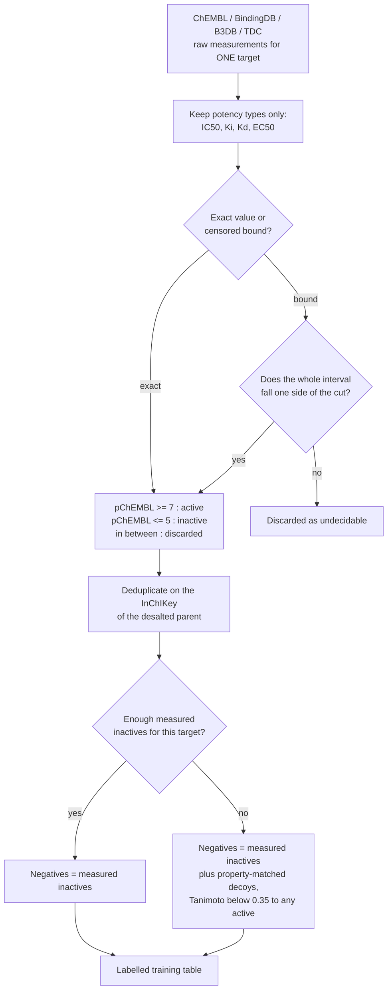
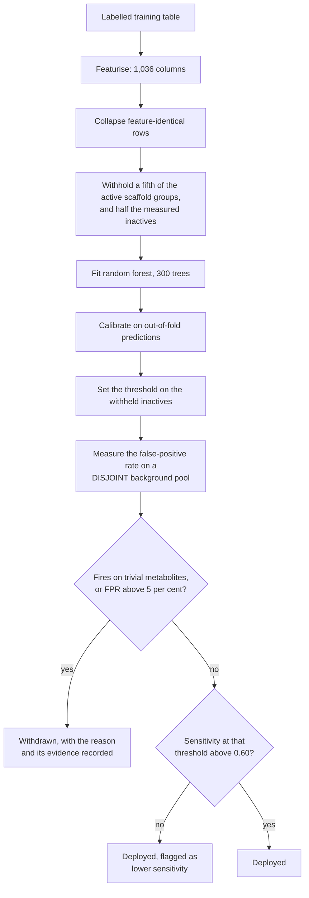
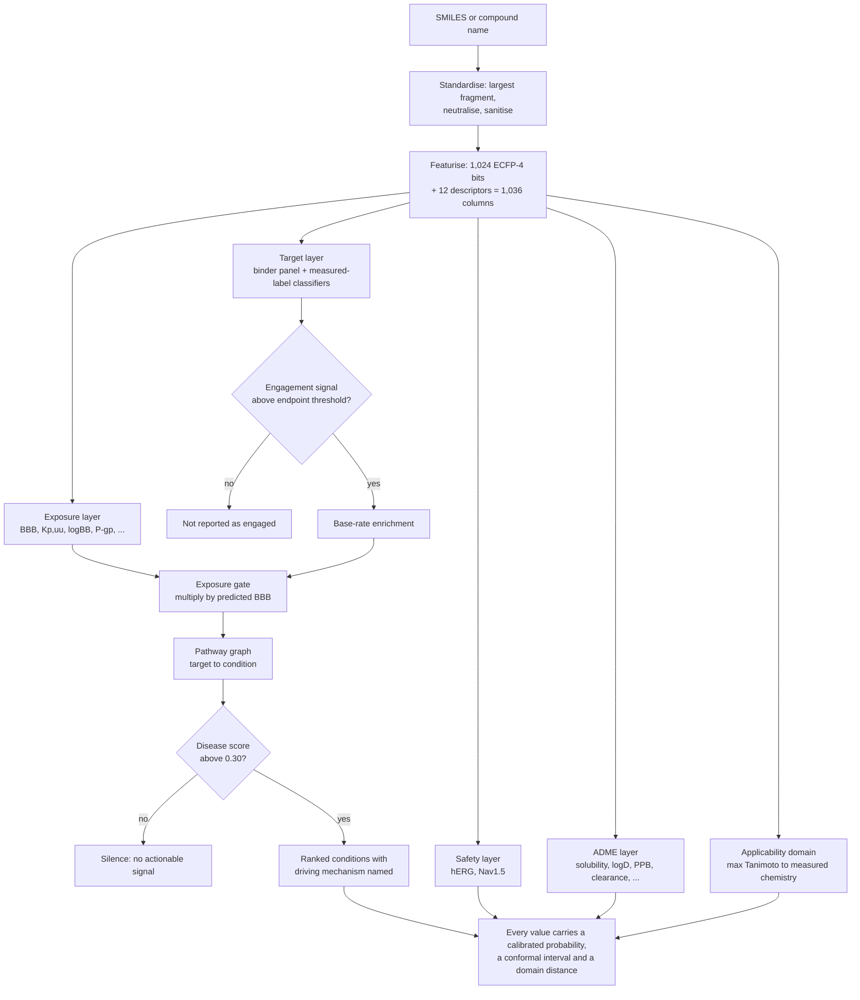
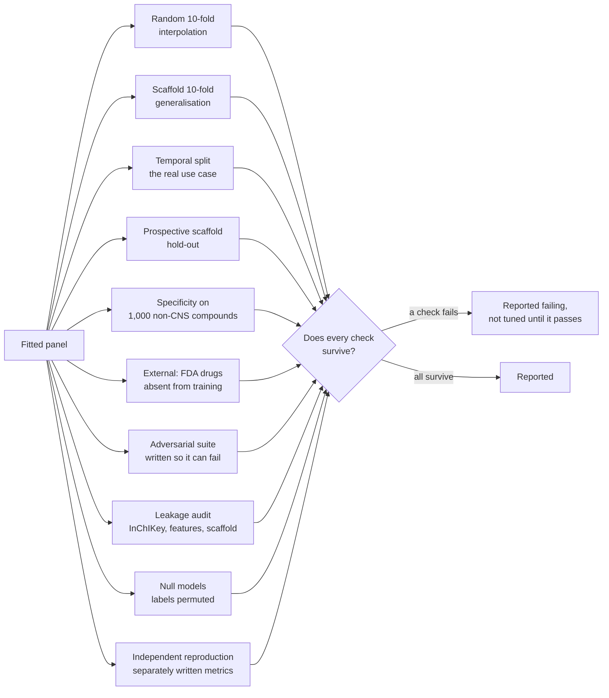

# BrainSafe AI: Technical Report

**Generated** 2026-08-20 from the deployed panel at commit `120f2c7`.
Every figure in this document is read from an artefact in this repository at generation time. None
is typed in. Regenerate with `python src/brainsafe/analysis/build_technical_report.py`.

---

## 1. What the system is

BrainSafe AI takes one small molecule, given as a SMILES string or a resolvable compound name, and
answers four questions about it in a single pass:

1. **Exposure.** Does it reach the brain, and at what free concentration?
2. **Engagement.** What does it bind there?
3. **Consequence.** What conditions does that mechanism touch?
4. **Developability.** What would stop it being a drug?

The system is **75 fitted estimators, 70 of them deployed**, trained
on **228,200 measured compound-endpoint records**. It is not one model. Section 4 explains why
that is a design decision rather than an accident, and section 5 explains how the pieces produce one
answer.

### 1.1 Composition

| family | task | estimators |
|---|---|---|
| binder | classification | 52 |
| exposure | classification | 3 |
| exposure | regression | 7 |
| safety | classification | 1 |
| target | classification | 6 |
| target | regression | 6 |

---

## 2. The endpoints

### 2.1 What each estimator predicts, and how well

Metrics are not comparable across the table. `AUROC` is used for classification, where 0.5 is
chance; `R²` for regression, where 0.5 is a respectable fit. The scaffold column is the honest one:
it is measured with whole Bemis-Murcko scaffold classes withheld from training, so it reports
generalisation to chemistry the model has not seen, while the random column reports interpolation
within chemistry it has.

<b>All 75 estimators (click to expand)</b>

| model | family | predicts | task | algorithm | n_train | n_positive | metric | random_split | scaffold_split | calibration | deployed |
|---|---|---|---|---|---|---|---|---|---|---|---|
| A2A | target | potency, pChEMBL | regression | RandomForest, 300 trees, min_samples_leaf=2, seed 42 | 6743 |  | R2 | 0.7231 | 0.6205 | none | True |
| AChE | target | probability of activity | classification | RandomForest, 300 trees, min_samples_leaf=2, seed 42 | 5125 | 3014.0 | AUROC | 0.9659 | 0.9212 | isotonic, out-of-fold | True |
| antioxidant_DPPH | target | potency, pChEMBL | regression | RandomForest, 300 trees, min_samples_leaf=2, seed 42 | 2782 |  | R2 | 0.6589 | 0.4153 | none | True |
| BACE1 | target | probability of activity | classification | RandomForest, 300 trees, min_samples_leaf=2, seed 42 | 8207 | 7096.0 | AUROC | 0.9764 | 0.9648 | isotonic, out-of-fold | True |
| BBB | exposure | probability of activity | classification | RandomForest, 300 trees, min_samples_leaf=2, seed 42 | 3901 | 2473.0 | AUROC | 0.899 | 0.8777 | isotonic, out-of-fold | True |
| BChE | target | probability of activity | classification | RandomForest, 300 trees, min_samples_leaf=2, seed 42 | 3278 | 1760.0 | AUROC | 0.9724 | 0.9451 | isotonic, out-of-fold | True |
| D2 | target | potency, pChEMBL | regression | RandomForest, 300 trees, min_samples_leaf=2, seed 42 | 7905 |  | R2 | 0.6403 | 0.5311 | none | True |
| GSK3B | target | probability of activity | classification | RandomForest, 300 trees, min_samples_leaf=2, seed 42 | 5439 | 4056.0 | AUROC | 0.9649 | 0.9425 | isotonic, out-of-fold | True |
| hERG | safety | probability of activity | classification | RandomForest, 300 trees, min_samples_leaf=2, seed 42 | 9933 | 2370.0 | AUROC | 0.9565 | 0.927 | isotonic, out-of-fold | True |
| HT2A | target | potency, pChEMBL | regression | RandomForest, 300 trees, min_samples_leaf=2, seed 42 | 6075 |  | R2 | 0.6996 | 0.556 | none | True |
| MAO_A | target | probability of activity | classification | RandomForest, 300 trees, min_samples_leaf=2, seed 42 | 3585 | 857.0 | AUROC | 0.9619 | 0.9059 | isotonic, out-of-fold | True |
| MAO_B | target | probability of activity | classification | RandomForest, 300 trees, min_samples_leaf=2, seed 42 | 4534 | 2299.0 | AUROC | 0.963 | 0.917 | isotonic, out-of-fold | True |
| pka_basic | target | pKa | regression | RandomForest, 300 trees, min_samples_leaf=2, seed 42 | 6384 |  | R2 |  |  | none | True |
| SERT | target | potency, pChEMBL | regression | RandomForest, 300 trees, min_samples_leaf=2, seed 42 | 4479 |  | R2 | 0.6897 | 0.4612 | none | True |
| A1_binder | binder | probability this compound binds this target | classification | RandomForest, 300 trees, min_samples_leaf=4, seed 42 | 7352 | 1523.0 | AUROC vs measured non-binders |  | 0.914 | sigmoid, prefit | True |
| A2A_binder | binder | probability this compound binds this target | classification | RandomForest, 300 trees, min_samples_leaf=4, seed 42 | 15636 | 3333.0 | AUROC vs measured non-binders |  | 0.949 | sigmoid, prefit | True |
| CB1_binder | binder | probability this compound binds this target | classification | RandomForest, 300 trees, min_samples_leaf=4, seed 42 | 10198 | 2158.0 | AUROC vs measured non-binders |  | 0.949 | sigmoid, prefit | True |
| CGRP_binder | binder | probability this compound binds this target | classification | RandomForest, 300 trees, min_samples_leaf=4, seed 42 | 2251 | 454.0 | AUROC vs measured non-binders |  | 0.985 | sigmoid, prefit | True |
| COX2_binder | binder | probability this compound binds this target | classification | RandomForest, 300 trees, min_samples_leaf=4, seed 42 | 4429 | 883.0 | AUROC vs measured non-binders |  | 0.783 | sigmoid, prefit | True |
| CSF1R_binder | binder | probability this compound binds this target | classification | RandomForest, 300 trees, min_samples_leaf=4, seed 42 | 6772 | 1420.0 | AUROC vs measured non-binders |  | 0.95 | sigmoid, prefit | True |
| Cav3_2_binder | binder | probability this compound binds this target | classification | RandomForest, 300 trees, min_samples_leaf=4, seed 42 | 1325 | 272.0 | AUROC vs measured non-binders |  | 0.982 | sigmoid, prefit | True |
| D2_binder | binder | probability this compound binds this target | classification | RandomForest, 300 trees, min_samples_leaf=4, seed 42 | 13861 | 2890.0 | AUROC vs measured non-binders |  | 0.872 | sigmoid, prefit | True |
| D3_binder | binder | probability this compound binds this target | classification | RandomForest, 300 trees, min_samples_leaf=4, seed 42 | 15831 | 3450.0 | AUROC vs measured non-binders |  | 0.956 | sigmoid, prefit | True |
| DAT_binder | binder | probability this compound binds this target | classification | RandomForest, 300 trees, min_samples_leaf=4, seed 42 | 5113 | 1102.0 | AUROC vs measured non-binders |  | 0.959 | sigmoid, prefit | True |
| DHODH_binder | binder | probability this compound binds this target | classification | RandomForest, 300 trees, min_samples_leaf=4, seed 42 | 3619 | 730.0 | AUROC vs measured non-binders |  | 0.966 | sigmoid, prefit | True |
| GABA_A_binder | binder | probability this compound binds this target | classification | RandomForest, 300 trees, min_samples_leaf=4, seed 42 | 771 | 168.0 | AUROC vs measured non-binders |  | 0.719 | sigmoid, prefit | True |
| GBA1_binder | binder | probability this compound binds this target | classification | RandomForest, 300 trees, min_samples_leaf=4, seed 42 | 441 | 81.0 | AUROC vs measured non-binders |  | 0.932 | sigmoid, prefit | True |
| GluA2_binder | binder | probability this compound binds this target | classification | RandomForest, 300 trees, min_samples_leaf=4, seed 42 | 68 | 68.0 | AUROC vs measured non-binders |  | 0.696 | sigmoid, prefit | False |
| GluN2B_binder | binder | probability this compound binds this target | classification | RandomForest, 300 trees, min_samples_leaf=4, seed 42 | 3461 | 749.0 | AUROC vs measured non-binders |  | 0.761 | sigmoid, prefit | True |
| H3_binder | binder | probability this compound binds this target | classification | RandomForest, 300 trees, min_samples_leaf=4, seed 42 | 12295 | 2659.0 | AUROC vs measured non-binders |  | 0.978 | sigmoid, prefit | True |
| HDAC1_binder | binder | probability this compound binds this target | classification | RandomForest, 300 trees, min_samples_leaf=4, seed 42 | 11728 | 2563.0 | AUROC vs measured non-binders |  | 0.96 | sigmoid, prefit | True |
| HDAC6_binder | binder | probability this compound binds this target | classification | RandomForest, 300 trees, min_samples_leaf=4, seed 42 | 14155 | 3010.0 | AUROC vs measured non-binders |  | 0.975 | sigmoid, prefit | True |
| HT1A_binder | binder | probability this compound binds this target | classification | RandomForest, 300 trees, min_samples_leaf=4, seed 42 | 14179 | 3070.0 | AUROC vs measured non-binders |  | 0.936 | sigmoid, prefit | True |
| HT2A_binder | binder | probability this compound binds this target | classification | RandomForest, 300 trees, min_samples_leaf=4, seed 42 | 14369 | 2918.0 | AUROC vs measured non-binders |  | 0.925 | sigmoid, prefit | True |
| HT6_binder | binder | probability this compound binds this target | classification | RandomForest, 300 trees, min_samples_leaf=4, seed 42 | 10532 | 2309.0 | AUROC vs measured non-binders |  | 0.96 | sigmoid, prefit | True |
| HT7_binder | binder | probability this compound binds this target | classification | RandomForest, 300 trees, min_samples_leaf=4, seed 42 | 5623 | 1189.0 | AUROC vs measured non-binders |  | 0.947 | sigmoid, prefit | True |
| KEAP1_binder | binder | probability this compound binds this target | classification | RandomForest, 300 trees, min_samples_leaf=4, seed 42 | 463 | 97.0 | AUROC vs measured non-binders |  | 0.88 | sigmoid, prefit | True |
| LRRK2_binder | binder | probability this compound binds this target | classification | RandomForest, 300 trees, min_samples_leaf=4, seed 42 | 4470 | 951.0 | AUROC vs measured non-binders |  | 0.968 | sigmoid, prefit | True |
| MT1_binder | binder | probability this compound binds this target | classification | RandomForest, 300 trees, min_samples_leaf=4, seed 42 | 2670 | 579.0 | AUROC vs measured non-binders |  | 0.896 | sigmoid, prefit | True |
| NET_binder | binder | probability this compound binds this target | classification | RandomForest, 300 trees, min_samples_leaf=4, seed 42 | 5933 | 1217.0 | AUROC vs measured non-binders |  | 0.92 | sigmoid, prefit | True |
| NFKB1_binder | binder | probability this compound binds this target | classification | RandomForest, 300 trees, min_samples_leaf=4, seed 42 | 102 | 39.0 | AUROC vs measured non-binders |  | 0.459 | sigmoid, prefit | False |
| NLRP3_binder | binder | probability this compound binds this target | classification | RandomForest, 300 trees, min_samples_leaf=4, seed 42 | 843 | 177.0 | AUROC vs measured non-binders |  | 0.93 | sigmoid, prefit | True |
| NR3C1_binder | binder | probability this compound binds this target | classification | RandomForest, 300 trees, min_samples_leaf=4, seed 42 | 37 | 60.0 | AUROC vs measured non-binders |  | 0.41 | sigmoid, prefit | False |
| NRF2_binder | binder | probability this compound binds this target | classification | RandomForest, 300 trees, min_samples_leaf=4, seed 42 | 285 | 70.0 | AUROC vs measured non-binders |  | 0.789 | sigmoid, prefit | False |
| Nav1_1_binder | binder | probability this compound binds this target | classification | RandomForest, 300 trees, min_samples_leaf=4, seed 42 | 227 | 40.0 | AUROC vs measured non-binders |  | 0.952 | sigmoid, prefit | False |
| Nav1_5_binder | binder | probability this compound binds this target | classification | RandomForest, 300 trees, min_samples_leaf=4, seed 42 | 870 | 207.0 | AUROC vs measured non-binders |  | 0.921 | sigmoid, prefit | True |
| Nav1_6_binder | binder | probability this compound binds this target | classification | RandomForest, 300 trees, min_samples_leaf=4, seed 42 | 1027 | 199.0 | AUROC vs measured non-binders |  | 0.862 | sigmoid, prefit | True |
| Nav1_7_binder | binder | probability this compound binds this target | classification | RandomForest, 300 trees, min_samples_leaf=4, seed 42 | 10397 | 2165.0 | AUROC vs measured non-binders |  | 0.957 | sigmoid, prefit | True |
| Nav1_8_binder | binder | probability this compound binds this target | classification | RandomForest, 300 trees, min_samples_leaf=4, seed 42 | 1030 | 181.0 | AUROC vs measured non-binders |  | 0.956 | sigmoid, prefit | True |
| OPRK1_binder | binder | probability this compound binds this target | classification | RandomForest, 300 trees, min_samples_leaf=4, seed 42 | 11642 | 2465.0 | AUROC vs measured non-binders |  | 0.945 | sigmoid, prefit | True |
| OPRM1_binder | binder | probability this compound binds this target | classification | RandomForest, 300 trees, min_samples_leaf=4, seed 42 | 14058 | 2904.0 | AUROC vs measured non-binders |  | 0.954 | sigmoid, prefit | True |
| OX1_binder | binder | probability this compound binds this target | classification | RandomForest, 300 trees, min_samples_leaf=4, seed 42 | 12724 | 2788.0 | AUROC vs measured non-binders |  | 0.964 | sigmoid, prefit | True |
| OX2_binder | binder | probability this compound binds this target | classification | RandomForest, 300 trees, min_samples_leaf=4, seed 42 | 14679 | 3123.0 | AUROC vs measured non-binders |  | 0.964 | sigmoid, prefit | True |
| P2X7_binder | binder | probability this compound binds this target | classification | RandomForest, 300 trees, min_samples_leaf=4, seed 42 | 11122 | 2308.0 | AUROC vs measured non-binders |  | 0.813 | sigmoid, prefit | True |
| PDE10A_binder | binder | probability this compound binds this target | classification | RandomForest, 300 trees, min_samples_leaf=4, seed 42 | 15463 | 3211.0 | AUROC vs measured non-binders |  | 0.962 | sigmoid, prefit | True |
| PDE4B_binder | binder | probability this compound binds this target | classification | RandomForest, 300 trees, min_samples_leaf=4, seed 42 | 4332 | 948.0 | AUROC vs measured non-binders |  | 0.966 | sigmoid, prefit | True |
| RIPK1_binder | binder | probability this compound binds this target | classification | RandomForest, 300 trees, min_samples_leaf=4, seed 42 | 5619 | 1149.0 | AUROC vs measured non-binders |  | 0.966 | sigmoid, prefit | True |
| SERT_binder | binder | probability this compound binds this target | classification | RandomForest, 300 trees, min_samples_leaf=4, seed 42 | 11429 | 2516.0 | AUROC vs measured non-binders |  | 0.945 | sigmoid, prefit | True |
| SIRT1_binder | binder | probability this compound binds this target | classification | RandomForest, 300 trees, min_samples_leaf=4, seed 42 | 276 | 125.0 | AUROC vs measured non-binders |  | 0.792 | sigmoid, prefit | True |
| Sigma1_binder | binder | probability this compound binds this target | classification | RandomForest, 300 trees, min_samples_leaf=4, seed 42 | 7427 | 1643.0 | AUROC vs measured non-binders |  | 0.881 | sigmoid, prefit | True |
| TAAR1_binder | binder | probability this compound binds this target | classification | RandomForest, 300 trees, min_samples_leaf=4, seed 42 | 82 | 162.0 | AUROC vs measured non-binders |  | 0.78 | sigmoid, prefit | True |
| a3b4nAChR_binder | binder | probability this compound binds this target | classification | RandomForest, 300 trees, min_samples_leaf=4, seed 42 | 760 | 166.0 | AUROC vs measured non-binders |  | 0.974 | sigmoid, prefit | True |
| a4b2nAChR_binder | binder | probability this compound binds this target | classification | RandomForest, 300 trees, min_samples_leaf=4, seed 42 | 1835 | 407.0 | AUROC vs measured non-binders |  | 0.923 | sigmoid, prefit | True |
| a7nAChR_binder | binder | probability this compound binds this target | classification | RandomForest, 300 trees, min_samples_leaf=4, seed 42 | 1285 | 274.0 | AUROC vs measured non-binders |  | 0.763 | sigmoid, prefit | True |
| mGluR5_binder | binder | probability this compound binds this target | classification | RandomForest, 300 trees, min_samples_leaf=4, seed 42 | 4511 | 911.0 | AUROC vs measured non-binders |  | 0.893 | sigmoid, prefit | True |
| mTOR_binder | binder | probability this compound binds this target | classification | RandomForest, 300 trees, min_samples_leaf=4, seed 42 | 11510 | 2558.0 | AUROC vs measured non-binders |  | 0.983 | sigmoid, prefit | True |
| adme_caco2_permeability | exposure | measured value | regression | RandomForest, 300 trees, min_samples_leaf=2, seed 42 | 897 |  | R2 | 0.7359 | 0.5818 | none | True |
| adme_clearance_hepatocyte | exposure | measured value | regression | RandomForest, 300 trees, min_samples_leaf=2, seed 42 | 1020 |  | R2 | 0.2302 | 0.2062 | none | True |
| adme_kpuu | exposure | measured value | regression | RandomForest, 300 trees, min_samples_leaf=2, seed 42 | 566 |  | R2 | 0.4056 | 0.3523 | none | True |
| adme_lipophilicity | exposure | measured value | regression | RandomForest, 300 trees, min_samples_leaf=2, seed 42 | 4200 |  | R2 | 0.6389 | 0.5659 | none | True |
| adme_logbb | exposure | measured value | regression | RandomForest, 300 trees, min_samples_leaf=2, seed 42 | 1058 |  | R2 | 0.5836 | 0.4131 | none | True |
| adme_pgp_inhibition | exposure | probability | classification | RandomForest, 300 trees, min_samples_leaf=2, seed 42 | 1212 |  | AUROC | 0.9549 | 0.9346 | none | True |
| adme_pgp_substrate | exposure | probability | classification | RandomForest, 300 trees, min_samples_leaf=2, seed 42 | 1371 |  | AUROC | 0.8561 | 0.807 | none | True |
| adme_plasma_protein_binding | exposure | measured value | regression | RandomForest, 300 trees, min_samples_leaf=2, seed 42 | 1797 |  | R2 | 0.4336 | 0.3645 | none | True |
| adme_solubility | exposure | measured value | regression | RandomForest, 300 trees, min_samples_leaf=2, seed 42 | 9573 |  | R2 | 0.8008 | 0.7263 | none | True |

### 2.2 Where the measurements came from

Every endpoint is trained on its own measured set. No value is imputed, no qualitative annotation is
used as a label, and nothing is shared between endpoints except the featurisation.

<b>Per-endpoint data provenance (click to expand)</b>

| endpoint | compounds | actives | inactives | sources |
|---|---|---|---|---|
| A1 | 4508 | 3788 | 720 | ChEMBL (4,007), ChEMBL_inactive (501) |
| A2A | 7001 | 6190 | 811 | ChEMBL (3,126), BindingDB+ChEMBL (2,420), BindingDB (875), ChEMBL_inactive (580) |
| AChE | 5318 | 3169 | 2149 | ChEMBL (2,924), BindingDB+ChEMBL (1,318), ChEMBL_inactive (938), BindingDB (138) |
| BACE1 | 8962 | 7726 | 1236 | ChEMBL (4,459), BindingDB+ChEMBL (3,642), ChEMBL_inactive (473), BindingDB (388) |
| BBB | 7807 | 4956 | 2851 |  |
| BChE | 3386 | 1840 | 1546 | ChEMBL (1,744), BindingDB+ChEMBL (798), ChEMBL_inactive (771), BindingDB (73) |
| CB1 | 7635 | 4404 | 3231 | ChEMBL (4,613), ChEMBL_inactive (3,022) |
| CGRP | 806 | 761 | 45 | ChEMBL (787), ChEMBL_inactive (19) |
| COX2 | 4031 | 2492 | 1539 | ChEMBL (3,185), ChEMBL_inactive (846) |
| CSF1R | 2598 | 2396 | 202 | ChEMBL (2,432), ChEMBL_inactive (166) |
| Cav3_2 | 772 | 633 | 139 | ChEMBL (666), ChEMBL_inactive (106) |
| D2 | 8548 | 7405 | 1143 | ChEMBL (4,080), BindingDB+ChEMBL (3,419), ChEMBL_inactive (877), BindingDB (172) |
| D3 | 5894 | 5462 | 432 | ChEMBL (5,647), ChEMBL_inactive (247) |
| DAT | 3173 | 2380 | 793 | ChEMBL (2,692), ChEMBL_inactive (481) |
| DHODH | 2079 | 1421 | 658 | ChEMBL (1,566), ChEMBL_inactive (513) |
| GABAA_a5 | 684 | 672 | 12 | ChEMBL (676), ChEMBL_inactive (8) |
| GABA_A | 399 | 326 | 73 | ChEMBL (348), ChEMBL_inactive (51) |
| GBA1 | 772 | 292 | 480 | ChEMBL (554), ChEMBL_inactive (218) |
| GSK3B | 5640 | 4232 | 1408 | ChEMBL (2,545), BindingDB+ChEMBL (1,505), ChEMBL_inactive (1,063), BindingDB (527) |
| GluA2 | 234 | 97 | 137 | ChEMBL (183), ChEMBL_inactive (51) |
| GluN2B | 1615 | 1548 | 67 | ChEMBL (1,580), ChEMBL_inactive (35) |
| H3 | 4405 | 4022 | 383 | ChEMBL (4,198), ChEMBL_inactive (207) |
| HDAC1 | 7415 | 5796 | 1619 | ChEMBL (6,367), ChEMBL_inactive (1,048) |
| HDAC6 | 6501 | 5366 | 1135 | ChEMBL (5,612), ChEMBL_inactive (889) |
| HT1A | 5742 | 5220 | 522 | ChEMBL (5,414), ChEMBL_inactive (328) |
| HT2A | 6393 | 5755 | 638 | ChEMBL (2,854), BindingDB+ChEMBL (2,359), BindingDB (623), ChEMBL_inactive (557) |
| HT6 | 3979 | 3766 | 213 | ChEMBL (3,823), ChEMBL_inactive (156) |
| HT7 | 2741 | 2441 | 300 | ChEMBL (2,556), ChEMBL_inactive (185) |
| KEAP1 | 387 | 216 | 171 | ChEMBL (323), ChEMBL_inactive (64) |
| LRRK2 | 1570 | 1460 | 110 | ChEMBL (1,478), ChEMBL_inactive (92) |
| MAO_A | 3789 | 903 | 2886 | ChEMBL (1,787), ChEMBL_inactive (1,565), BindingDB+ChEMBL (339), BindingDB (98) |
| MAO_B | 4806 | 2425 | 2381 | ChEMBL (2,511), ChEMBL_inactive (1,190), BindingDB+ChEMBL (941), BindingDB (164) |
| MT1 | 1020 | 939 | 81 | ChEMBL (969), ChEMBL_inactive (51) |
| NET | 3315 | 2801 | 514 | ChEMBL (3,067), ChEMBL_inactive (248) |
| NFKB1 | 263 | 58 | 205 | NPASS3.0 (263) |
| NLRP3 | 660 | 428 | 232 | ChEMBL (487), ChEMBL_inactive (173) |
| NR3C1 | 140 | 66 | 74 | NPASS3.0 (140) |
| NRF2 | 651 | 81 | 570 | NPASS3.0 (651) |
| Nav1_1 | 519 | 65 | 454 | ChEMBL (425), ChEMBL_inactive (94) |
| Nav1_5 | 1983 | 242 | 1741 | ChEMBL_inactive (1,150), ChEMBL (833) |
| Nav1_6 | 785 | 681 | 104 | ChEMBL (726), ChEMBL_inactive (59) |
| Nav1_7 | 6153 | 5415 | 738 | ChEMBL (5,752), ChEMBL_inactive (401) |
| Nav1_8 | 567 | 501 | 66 | ChEMBL (540), ChEMBL_inactive (27) |
| OPRK1 | 5855 | 4857 | 998 | ChEMBL (5,167), ChEMBL_inactive (688) |
| OPRM1 | 7086 | 5743 | 1343 | ChEMBL (6,109), ChEMBL_inactive (977) |
| OX1.chembl_only | 5240 | 5159 | 81 | ChEMBL (5,240) |
| OX1 | 5735 | 5159 | 576 | ChEMBL (5,240), ChEMBL_inactive (462), PubChem_HTS (33) |
| OX2.chembl_only | 6227 | 6207 | 20 | ChEMBL (6,227) |
| OX2 | 6894 | 6207 | 687 | ChEMBL (6,227), ChEMBL_inactive (663), PubChem_HTS (4) |
| P2X7 | 4528 | 4358 | 170 | ChEMBL (4,401), ChEMBL_inactive (127) |
| PDE10A | 5295 | 5052 | 243 | ChEMBL (5,112), ChEMBL_inactive (183) |
| PDE4B | 2044 | 1712 | 332 | ChEMBL (1,938), ChEMBL_inactive (106) |
| RIPK1 | 3251 | 2349 | 902 | ChEMBL (3,068), ChEMBL_inactive (183) |
| SERT | 4924 | 4362 | 562 | ChEMBL (2,611), BindingDB+ChEMBL (1,811), ChEMBL_inactive (417), BindingDB (85) |
| SIRT1 | 715 | 162 | 553 | ChEMBL (515), ChEMBL_inactive (200) |
| Sigma1 | 2905 | 2793 | 112 | ChEMBL (2,838), ChEMBL_inactive (67) |
| TAAR1 | 403 | 238 | 165 | ChEMBL (303), ChEMBL_inactive (100) |
| a3b4nAChR | 694 | 398 | 296 | ChEMBL (585), ChEMBL_inactive (109) |
| a4b2nAChR | 1150 | 796 | 354 | ChEMBL (942), ChEMBL_inactive (208) |
| a7nAChR | 1208 | 823 | 385 | ChEMBL (1,004), ChEMBL_inactive (204) |
| hERG | 10276 | 2428 | 7848 | ChEMBL (5,875), ChEMBL_inactive (4,401) |
| mGluR5 | 2902 | 2375 | 527 | ChEMBL (2,434), ChEMBL_inactive (468) |
| mTOR | 5222 | 4108 | 1114 | ChEMBL (4,484), ChEMBL_inactive (738) |

**Sources.** Protein-target activity is pooled at compound level from ChEMBL pChEMBL values and
BindingDB. Blood-brain-barrier labels come from B3DB augmented with FDA-curated approved drugs. The
ADME endpoints use measured sets from Therapeutics Data Commons, MoleculeNet, B3DB and ChEMBL.

**The negative class is recovered, not simulated.** A bioactivity record describes what was found to
bind. A compound assayed and found *inactive* is frequently deposited only as a censored bound,
`standard_relation` `>` with no pChEMBL value, and the conventional query, which filters on pChEMBL,
discards exactly those rows. Training on what survives that filter gives a positive class drawn from
measurement and a negative class drawn from property-matched decoys.

A censored bound settles a label whenever the entire interval it defines falls on one side of the
activity cut. `IC50 > 10 uM` places the true potency strictly below pChEMBL 5.0 and is a measured
non-binder. `IC50 > 100 nM` spans both classes and is discarded as undecidable rather than guessed
at. Recovering these added 21,994 measured non-binders across 57 endpoints.

### 2.3 Why these endpoints

The panel is organised around the four questions in section 1, in the order a candidate must satisfy
them. Exposure is modelled first, because a molecule that reaches no free concentration in brain
tissue cannot act centrally however potent it is.

| Axis | Targets | Why it is in a CNS panel |
|---|---|---|
| Cholinergic | AChE, BChE, α7-nAChR, α4β2-nAChR, α3β4-nAChR, H3, 5-HT6, PDE4B | Acetylcholinesterase inhibition remains the mainstay symptomatic treatment in Alzheimer's disease |
| Amyloid and tau | BACE1, GSK-3β | The two principal disease-modifying hypotheses, and the source of the field's most expensive failures |
| Parkinson's | MAO-B, LRRK2, GBA1, PDE10A | MAO-B inhibition is established symptomatic therapy; LRRK2 and GBA1 are the commonest genetic risk loci |
| Monoaminergic | D2, D3, DAT, NET, SERT, 5-HT1A, 5-HT2A, 5-HT7, TAAR1 | Depression, psychosis and ADHD pharmacology is almost entirely monoaminergic |
| Opioid, cannabinoid, sigma | μ-opioid, κ-opioid, CB1, Sigma-1 | Analgesia and addiction liability |
| Sleep and circadian | OX1, OX2, MT1 | The orexin receptors are the target of the newest approved insomnia class |
| Neuroinflammation | NLRP3, P2X7, COX-2, CSF1R, RIPK1 | Implicated across several neurodegenerative conditions rather than tied to one |
| Epigenetic, proteostasis | HDAC1, HDAC6, SIRT1, mTOR, KEAP1 | HDAC removal modifies pathology in Huntington's models; KEAP1-NRF2 is the antioxidant axis |
| Glutamate, GABA | GluN2B, mGluR5, GABA-A | Excitotoxicity and seizure control |
| Ion channels | Nav1.5, Nav1.6, Nav1.7, Nav1.8, Cav3.2 | Pain-selective channels, plus Nav1.5 as a cardiac safety readout |
| Migraine, MS | CGRP receptor, DHODH | Both have approved small-molecule agents acting on these targets |
| Safety | hERG | A leading cause of late-stage cardiovascular attrition through QT prolongation |

**Correlation to drug discovery.** The panel answers the triage question a medicinal chemist asks
before committing bench time: of a set of compounds, which are worth making. That question is not
"what is the affinity" but "is there a mechanism, does the compound arrive, and is there a liability
that will kill it later". Each of the four axes exists because attrition happens on it.

---

## 3. Algorithms and definitions

### 3.1 Representation

Each compound is reduced to its largest organic fragment, neutralised, sanitised, and represented as
a fixed **1,036-column vector**:

- **1,024 bits**: a folded ECFP-4 (Morgan, radius 2) fingerprint. Each bit records that *some*
  substructure environment hashing to that index is present. Folding means a set bit does not
  identify which environment, only that one collided there.
- **12 descriptors**: molecular weight, cLogP, TPSA, hydrogen-bond donors, hydrogen-bond acceptors,
  rotatable bonds, aromatic rings, fraction sp3, ring count, heavy atoms, formal charge, QED.

Chirality is excluded, so two enantiomers produce byte-identical rows. Rows identical in feature
space are therefore collapsed before any split; leaving them in place would put copies of one
compound on both sides of a fold.

**Neutralisation is part of the representation, not a detail.** Removing a counter-ion without it
leaves the parent carrying the charge the salt gave it. Measured on the models this server
previously deployed, haloperidol hydrochloride returned a barrier probability of 0.613 against 0.993
for the free base, and an hERG probability of 0.295 against 0.914 — a user who pasted the salt form
lost a cardiac liability flag on a compound that has one. Only protonation states are undone; a
permanent charge, such as a quaternary ammonium, is kept, because that charge is precisely what
stops such compounds crossing the barrier.

### 3.1.1 How one endpoint is trained

The pipeline is one chain, shown in two halves because it is fifteen steps long. The first half
turns raw deposited measurements into a labelled training table; the second turns that table into a
deployed endpoint, or withholds it.

**Stage 1: from deposited measurements to a labelled table.**

**Stage 2: from the table to a deployed endpoint, or not.**

Every endpoint goes through this independently. Nothing crosses between them except the
featurisation, which is identical by construction.

### 3.2 The estimator

A **random forest** of 300 trees per endpoint, `min_samples_leaf` 2 for the core classifiers and 4
for the binder panel, `class_weight="balanced"`, `random_state=42`.

A random forest is an ensemble of decision trees, each grown on a bootstrap resample of the training
rows and, at each split, choosing among a random subset of features. Averaging their votes reduces
the variance a single deep tree would have. It suits this problem for three reasons: it handles a
sparse binary fingerprint beside twelve continuous descriptors without scaling; it does not
extrapolate, which is the correct behaviour when a query is unlike anything measured; and it is
exactly explainable by TreeSHAP rather than approximately.

### 3.3 Calibration

A forest's vote share is not a probability. Calibration maps it to one.

- **Core classifiers** use **isotonic regression** fitted on out-of-fold predictions, so no compound
  contributes to the calibrator that scores it. Isotonic fits a free monotonic step function.
- **Binder models** use **Platt scaling** (a logistic fit), because the withheld set for one target
  is often too small to fit a step function without overfitting it.

Measured over the 8 measured-label classifiers, mean expected calibration error falls
from **0.0801** raw to **0.0147** after isotonic
calibration.

| endpoint | brier_raw | brier_calibrated | ece_raw | ece_calibrated |
|---|---|---|---|---|
| BBB | 0.1289 | 0.1358 | 0.0657 | 0.0412 |
| AChE | 0.081 | 0.0702 | 0.0942 | 0.011 |
| BChE | 0.0708 | 0.0647 | 0.0735 | 0.0127 |
| BACE1 | 0.0397 | 0.0358 | 0.0497 | 0.0049 |
| GSK3B | 0.0734 | 0.0669 | 0.0847 | 0.0175 |
| MAO_A | 0.0709 | 0.0609 | 0.094 | 0.0089 |
| MAO_B | 0.0848 | 0.077 | 0.0881 | 0.0148 |
| hERG | 0.0717 | 0.0632 | 0.0911 | 0.0069 |

### 3.4 Conformal prediction

A calibrated probability still says nothing about how confident the model is *for this compound*. A
**Mondrian conformal predictor** converts the applicability domain from a caveat into a coverage
statement: at a 0.90 target, the prediction set contains the truth about 90 per cent of the time,
and it is measured rather than assumed.

Empirical coverage runs **0.889 to
0.921** against the 0.90 target.

| endpoint | n_test | target_coverage | empirical_coverage | avg_set_size |
|---|---|---|---|---|
| BBB | 1561 | 0.9 | 0.904 | 1.013 |
| AChE | 1064 | 0.9 | 0.921 | 1.019 |
| BChE | 678 | 0.9 | 0.917 | 1.009 |
| BACE1 | 1793 | 0.9 | 0.906 | 1.007 |
| GSK3B | 1128 | 0.9 | 0.908 | 1.03 |
| MAO_A | 758 | 0.9 | 0.889 | 1.012 |
| MAO_B | 962 | 0.9 | 0.899 | 1.025 |
| hERG | 2056 | 0.9 | 0.904 | 1.079 |

### 3.5 Applicability domain

The maximum ECFP-4 Tanimoto similarity of the query to that endpoint's own measured chemistry,
reported with the nearest measured analogue and its structure.

- **In domain**, T ≥ 0.50: the query sits among measured chemistry.
- **Near domain**, 0.30 ≤ T < 0.50.
- **Out of domain**, T < 0.30: predictive power falls close to chance and the server says so.

### 3.6 Thresholds, and why they are measured on a different sample

A binder model returns a probability; a call requires a cut. Choosing that cut as a quantile of a
sample and then measuring the false-positive rate on the *same* sample cannot fail: the rate
restates the quantile.

The background library of 158,890 compounds is therefore partitioned into three disjoint pools by a
stable hash of the canonical structure, so a compound's pool is a property of the molecule and never
depends on run order:

| Pool | Compounds | Purpose |
|---|---|---|
| Decoy | 95,515 | supply property-matched negatives during training |
| Threshold | 31,694 | set the decision cut |
| Evaluation | 31,681 | measure the false-positive rate the cut actually achieves |

That the measured rate can now disagree with its target is the evidence that it is a measurement.

---

## 4. Why 70 models and not one

This is the question most often asked of the design, and it has a specific answer.

### 4.1 The alternative, and why it fails

The obvious alternative is one multi-task model: a single network with one output per endpoint,
trained on all the data at once. It is rejected here for reasons that are about the data, not about
preference.

**The label matrix is almost entirely missing.** 228,200 measurements spread over
63 endpoints and roughly 169,000 unique compounds would fill under two per cent of a
compound-by-endpoint matrix. A compound measured at AChE has almost never been measured at OX2.
Multi-task learning shares strength across tasks; with a matrix this sparse it mostly shares
*absence*, and a missing measurement is not a negative result.

**The negative class means different things per endpoint.** For a target with recovered censored
bounds, a negative is a compound *measured and found inactive*. For a target without them, a
negative is a property-matched decoy, which is an assumption. Pooling those into one loss silently
averages a measurement with an assumption.

**The endpoints have incompatible base rates.** Some sets are 90 per cent active, an artefact of the
deposition query rather than of the chemistry. A shared output layer propagates one endpoint's class
imbalance into another's decision boundary.

**A per-endpoint threshold is required and could not be honest otherwise.** Each endpoint's cut is
set on held-out measured inactives *for that endpoint* and verified on a disjoint background pool.
That is only definable per endpoint.

**Failure stays local.** Five endpoints were trained, tested and withdrawn. In an independent panel a
withdrawal removes one output. In a shared-weight model the same data would have influenced every
other endpoint's representation, and withdrawing it cleanly would not be possible.

### 4.2 What independence costs

It is not free, and the honest statement of the cost is this: a multi-task model can borrow
statistical strength for a small endpoint from a large related one. The smallest deployed set here
has 387 compounds and would plausibly benefit. That benefit is forgone deliberately, because the
price is a shared representation in which no endpoint's threshold, negative class or withdrawal is
independently defensible.

---

## 5. How 70 independent models answer one question

The estimators are independent in *fitting*. They are not independent in *use*: the output is
assembled in a fixed order, and each stage constrains the next.

**The logic, stated plainly.**

1. **Each model answers only its own question.** The AChE model knows nothing about hERG.
2. **Engagement is put on a common scale.** A calibrated probability is not comparable between
   targets, because each has its own threshold and its own base rate. Each target's probability is
   converted to an *engagement signal*: distance above that target's own reporting threshold,
   rescaled to 0–1. That is the only quantity compared across targets.
3. **Base-rate enrichment, not raw probability.** Several training sets are active-heavy, so a high
   probability may say more about the endpoint than about the compound. A target is scored by how far
   it sits above its own base rate.
4. **Exposure gates everything.** Each target's contribution is multiplied by predicted
   blood-brain-barrier penetration. A potent binder that does not reach the brain contributes
   nothing. This is the one place where the models are combined multiplicatively, and it encodes a
   pharmacological fact: potency at an unreachable target is not activity.
5. **The pathway graph maps mechanism to condition.** A curated, versioned graph anchored to KEGG,
   Reactome and IUPHAR maps each target to the conditions it informs. A disease score is the
   **strongest** engaged mechanism for that condition scaled by exposure, not a sum, so one target
   explains the score and can be named.
6. **Silence is a result.** Below a disease score of 0.30 nothing is reported. Silence means no
   modelled mechanism cleared its threshold; it is not a claim of inactivity.

The models are therefore combined by a **stated rule**, not by a learned one. Nothing is fitted on
top of the panel. That is deliberate: a meta-model over seventy outputs would need its own training
set of compounds labelled with ground-truth disease relevance, which does not exist.

---

## 6. Validation: everything that was done

Validation here is arranged so that each test answers a question the previous one cannot.

### 6.1 Cross-validation, two regimes

Every endpoint is cross-validated ten-fold in two regimes, and the distance between them is the
honest statement of how far a model travels.

- **Random 10-fold** splits compounds at random. It measures interpolation within known chemistry.
- **Scaffold-grouped 10-fold** withholds entire Bemis-Murcko scaffold classes. A held-out compound is
  therefore structurally distinct from everything trained on, which is the situation a user is
  actually in.

Across the measured-label classifiers: mean AUROC **0.9575**
random and **0.9252** scaffold.

| endpoint | task | split | n | roc_auc_mean | roc_auc_sd | pr_auc_mean | pr_auc_sd | mcc_mean | mcc_sd | f1_mean | f1_sd | balanced_acc_mean | balanced_acc_sd | r2_mean | r2_sd | rmse_mean | rmse_sd | mae_mean | mae_sd | spearman_mean | spearman_sd |
|---|---|---|---|---|---|---|---|---|---|---|---|---|---|---|---|---|---|---|---|---|---|
| BBB | classification | random | 3901 | 0.899 | 0.0161 | 0.9389 | 0.0107 | 0.608 | 0.0504 | 0.8633 | 0.0168 | 0.7956 | 0.0266 |  |  |  |  |  |  |  |  |
| BBB | classification | scaffold | 3901 | 0.8777 | 0.0336 | 0.9219 | 0.0281 | 0.5699 | 0.0786 | 0.8502 | 0.0369 | 0.7748 | 0.0426 |  |  |  |  |  |  |  |  |
| AChE | classification | random | 5125 | 0.9659 | 0.0057 | 0.975 | 0.0045 | 0.8084 | 0.0262 | 0.9202 | 0.011 | 0.9051 | 0.0135 |  |  |  |  |  |  |  |  |
| AChE | classification | scaffold | 5125 | 0.9212 | 0.0206 | 0.9463 | 0.0131 | 0.6631 | 0.0476 | 0.8567 | 0.0249 | 0.8332 | 0.0246 |  |  |  |  |  |  |  |  |
| BChE | classification | random | 3278 | 0.9724 | 0.008 | 0.9776 | 0.0075 | 0.8228 | 0.0313 | 0.9154 | 0.015 | 0.9119 | 0.0159 |  |  |  |  |  |  |  |  |
| BChE | classification | scaffold | 3278 | 0.9451 | 0.0155 | 0.9578 | 0.0167 | 0.7454 | 0.0655 | 0.875 | 0.0386 | 0.8752 | 0.0328 |  |  |  |  |  |  |  |  |
| BACE1 | classification | random | 8207 | 0.9764 | 0.0104 | 0.9959 | 0.0021 | 0.7923 | 0.0445 | 0.972 | 0.0058 | 0.8953 | 0.0258 |  |  |  |  |  |  |  |  |
| BACE1 | classification | scaffold | 8207 | 0.9648 | 0.0093 | 0.9941 | 0.0015 | 0.736 | 0.0675 | 0.965 | 0.0094 | 0.8688 | 0.0375 |  |  |  |  |  |  |  |  |
| GSK3B | classification | random | 5439 | 0.9649 | 0.0065 | 0.9878 | 0.0027 | 0.7618 | 0.0185 | 0.9405 | 0.0047 | 0.8755 | 0.0118 |  |  |  |  |  |  |  |  |
| GSK3B | classification | scaffold | 5439 | 0.9425 | 0.0236 | 0.9784 | 0.0116 | 0.6993 | 0.0561 | 0.925 | 0.0193 | 0.8428 | 0.0269 |  |  |  |  |  |  |  |  |
| MAO_A | classification | random | 3585 | 0.9619 | 0.0124 | 0.9096 | 0.0214 | 0.7826 | 0.0547 | 0.8296 | 0.0442 | 0.877 | 0.0328 |  |  |  |  |  |  |  |  |
| MAO_A | classification | scaffold | 3585 | 0.9059 | 0.0303 | 0.7908 | 0.0737 | 0.6268 | 0.0867 | 0.685 | 0.0888 | 0.7767 | 0.0541 |  |  |  |  |  |  |  |  |
| MAO_B | classification | random | 4534 | 0.963 | 0.0075 | 0.9634 | 0.008 | 0.7923 | 0.0284 | 0.899 | 0.014 | 0.8957 | 0.0142 |  |  |  |  |  |  |  |  |
| MAO_B | classification | scaffold | 4534 | 0.917 | 0.0294 | 0.9068 | 0.05 | 0.6728 | 0.0668 | 0.8357 | 0.0523 | 0.8346 | 0.0345 |  |  |  |  |  |  |  |  |
| hERG | classification | random | 9933 | 0.9565 | 0.0077 | 0.9037 | 0.0155 | 0.7702 | 0.0169 | 0.8151 | 0.0138 | 0.8593 | 0.0107 |  |  |  |  |  |  |  |  |
| hERG | classification | scaffold | 9933 | 0.927 | 0.0271 | 0.8453 | 0.0393 | 0.6805 | 0.0518 | 0.7321 | 0.0502 | 0.8019 | 0.0337 |  |  |  |  |  |  |  |  |
| D2 | regression | random | 7905 |  |  |  |  |  |  |  |  |  |  | 0.6403 | 0.0243 | 0.6796 | 0.0257 | 0.4837 | 0.0145 | 0.7979 | 0.0128 |
| D2 | regression | scaffold | 7905 |  |  |  |  |  |  |  |  |  |  | 0.5311 | 0.0287 | 0.773 | 0.0481 | 0.5631 | 0.0433 | 0.7237 | 0.0365 |
| A2A | regression | random | 6743 |  |  |  |  |  |  |  |  |  |  | 0.7231 | 0.0255 | 0.6882 | 0.0262 | 0.4956 | 0.0164 | 0.8421 | 0.017 |
| A2A | regression | scaffold | 6743 |  |  |  |  |  |  |  |  |  |  | 0.6205 | 0.0485 | 0.7995 | 0.0341 | 0.5929 | 0.0233 | 0.7827 | 0.0376 |
| HT2A | regression | random | 6075 |  |  |  |  |  |  |  |  |  |  | 0.6996 | 0.0166 | 0.6727 | 0.0209 | 0.4859 | 0.0167 | 0.8401 | 0.0104 |
| HT2A | regression | scaffold | 6075 |  |  |  |  |  |  |  |  |  |  | 0.556 | 0.0656 | 0.8091 | 0.0685 | 0.5997 | 0.0533 | 0.7465 | 0.0546 |
| SERT | regression | random | 4479 |  |  |  |  |  |  |  |  |  |  | 0.6897 | 0.0273 | 0.7064 | 0.0294 | 0.5139 | 0.0181 | 0.8179 | 0.0159 |
| SERT | regression | scaffold | 4479 |  |  |  |  |  |  |  |  |  |  | 0.4612 | 0.0987 | 0.9143 | 0.102 | 0.6733 | 0.0591 | 0.6969 | 0.0763 |
| antioxidant_DPPH | regression | random | 2782 |  |  |  |  |  |  |  |  |  |  | 0.6589 | 0.0508 | 0.4608 | 0.0184 | 0.309 | 0.0132 | 0.8064 | 0.0286 |
| antioxidant_DPPH | regression | scaffold | 2782 |  |  |  |  |  |  |  |  |  |  | 0.4153 | 0.1491 | 0.5865 | 0.0789 | 0.4188 | 0.0519 | 0.64 | 0.1059 |

### 6.2 Temporal validation

The hardest realistic test: train on compounds published before a cut-off year, test on those
published after it. This reproduces the actual use case, predicting chemistry that did not exist
when the model was fitted.

AUROC **0.720 to 0.910** across 7 endpoints.

| endpoint | task | cutoff_year | n_train | n_test | metric | score |
|---|---|---|---|---|---|---|
| AChE | classification | 2020 | 4141 | 1028 | auroc | 0.761 |
| BChE | classification | 2021 | 2696 | 617 | auroc | 0.801 |
| BACE1 | classification | 2017 | 6901 | 1673 | auroc | 0.91 |
| GSK3B | classification | 2021 | 4205 | 546 | auroc | 0.764 |
| MAO_A | classification | 2020 | 2859 | 819 | auroc | 0.727 |
| MAO_B | classification | 2020 | 3719 | 923 | auroc | 0.843 |
| hERG | classification | 2020 | 8158 | 2059 | auroc | 0.72 |

### 6.3 Prospective scaffold hold-out

Whole scaffold classes withheld *before* training, then recall measured on them at the deployed
threshold. Median per-target recall **0.815** across 39 targets whose
decision threshold did not collapse. Targets are excluded only for a degenerate threshold, never for
poor recall.

### 6.4 Specificity: does it stay quiet when it should?

1,000 compounds with no recorded activity at any modelled target were scored through the
deployed pipeline. **949** returned no actionable disease signal: specificity
**0.949** (95% CI 0.934 to 0.961).

These compounds are *presumed* inactive because nothing is recorded about them, not proven inactive,
so this is a lower bound.

### 6.5 External validation

The barrier model tested on FDA-curated approved drugs absent from the training source by InChIKey.

| set | n | n_permeable | auroc | accuracy | balanced_accuracy | sensitivity | specificity |
|---|---|---|---|---|---|---|---|
| FDA-curated, not in B3DB by InChIKey | 306 | 203 | 0.7645 | 0.732 | 0.7119 | 0.7734 | 0.6505 |
| FDA-curated, also distinguishable from training in feature space | 241 | 171 | 0.7934 | 0.7344 | 0.7116 | 0.7661 | 0.6571 |
| of which: feature-identical to a training compound | 65 | 32 | 0.7102 | 0.7231 | 0.7244 | 0.8125 | 0.6364 |

The row that supports an external claim is the second: compounds absent by InChIKey *and*
distinguishable from training in feature space. The third row is the memorisation the first contains.

### 6.6 Adversarial checks

Each written so that it could fail. **5 of 6 pass.**

| check | result | detail |
|---|---|---|
| No test compound is feature-identical to a training compound (MAO_A, BBB) | PASS | worst fold shares 0 compound(s) with its training set (want 0); before deduplication the same folds would share 4, which is the leak deduplication exists to remove |
| No duplicate compound survives into training | PASS | 0 duplicate rows reach a model; 15,104 exist in the tables before deduplication (worst BBB at 3,773), which is correct chemistry, since stereoisomers are distinct compounds the stereo-blind featuriser cannot separate |
| Reproducible retrain (MAO_A scaffold AUROC) | PASS | retrained 0.906 vs reported 0.906 |
| Predictions are not constant (BBB over 200 drugs) | PASS | probability std 0.293, range 0.01-0.99 |
| BBB ranks permeable drugs above non-permeable ones (external, unseen) | PASS | n=241 (171 permeable), AUROC 0.793, Mann-Whitney p=4.43e-13 |
| The domain flag separates non-drug-like chemistry from unseen drugs | FAIL | median max-similarity: unseen drugs 0.44 vs non-drug-like 0.48 (n=32), Mann-Whitney p=8.75e-01; only 22% of non-drug-like structures fall below the AD_THRESHOLD of 0.3 |

The failing check is reported at the same size as the others and is not tuned until it passes. It is
a finding about the applicability-domain flag: the conformal interval and the nearest-analogue
distance, rather than the flag, should be read as the statement of confidence.

### 6.7 Leakage and null models

**Leakage.** Folds were rebuilt and the index sets interrogated directly. On the deduplicated matrix
the pipeline fits, no InChIKey, no feature vector and no scaffold appears on both sides of any fold.
On the raw table the feature-vector overlap reaches 544, which is precisely what deduplication
removes.

**Null models.** With labels permuted, the same pipeline on the same folds returns mean AUROC 0.4938
random and 0.4921 scaffold, worst single endpoint 0.5174. Whole scaffold classes do not carry enough
class-frequency information for a label-free model to beat chance, so the scaffold figures are not
inflated by that route.

**Independent reproduction.** The entire cross-validation was re-run from the endpoint tables and
scored with separately written metric code. All 26 core values reproduced, maximum deviation
4.7 × 10⁻⁵.

---

## 7. What if we had done it differently

Honest comparison requires measuring the alternatives rather than asserting that the choice was
right.

### 7.1 Other model families

Five families were compared under identical cross-validation on both split regimes. Two are
baselines a reader is entitled to demand.

| endpoint | HistGradientBoosting | LogisticRegression | RandomForest | XGBoost | kNN read-across |
|---|---|---|---|---|---|
| AChE | 0.9241 | 0.8397 | 0.9148 | 0.9129 | 0.8804 |
| BACE1 | 0.9609 | 0.9123 | 0.9635 | 0.9597 | 0.9194 |
| BBB | 0.8564 | 0.7435 | 0.8756 | 0.8683 | 0.8264 |
| BChE | 0.9319 | 0.8694 | 0.9426 | 0.9317 | 0.9047 |
| GSK3B | 0.931 | 0.8387 | 0.9368 | 0.931 | 0.8986 |
| MAO_A | 0.8791 | 0.8058 | 0.8943 | 0.8857 | 0.8752 |
| MAO_B | 0.9092 | 0.8094 | 0.9124 | 0.9088 | 0.866 |
| hERG | 0.9268 | 0.863 | 0.9299 | 0.9266 | 0.8922 |

**Random forest was selected**, and the margin over the read-across baseline is
+0.0384 mean AUROC on the scaffold split
across 8 classification endpoints.

**What each alternative would have cost:**

- **k-nearest-neighbour read-across** is what a medicinal chemist does by eye: find the most similar
  measured compounds and assume the query behaves like them. It is the most important baseline,
  because if the model cannot beat it the model is an expensive lookup table. It loses on every
  endpoint, but not by a large margin, which is itself informative: much of the signal *is*
  similarity.
- **L2 logistic regression** is linear in the fingerprint. It loses most where activity depends on
  combinations of substructures rather than their presence, which is most targets.
- **XGBoost and histogram gradient boosting** are genuinely close, and the honest statement is that
  the forest does not sweep them. Histogram gradient boosting is ahead of the forest on 3 of 8
  endpoints on the random split and on 1 of 8 on the scaffold split; the forest's mean margin over
  it is +0.0023 random and +0.0063 scaffold, which is inside the fold-to-fold spread. XGBoost is
  behind on every endpoint but only by +0.0046 and +0.0056 on average. The forest was selected on
  three grounds that are not about the mean: it is the most stable of the three under
  hyperparameters, it does not extrapolate, which is the behaviour wanted at the edge of the
  applicability domain, and TreeSHAP is exact for it rather than approximate. On this evidence a
  reader is entitled to say that boosting would have served about as well.
- **A graph neural network** was benchmarked separately and did not outperform the random forest on
  any tested endpoint, which is consistent with the fingerprint-plus-descriptor representation being
  sufficient at this data scale. Deep models need far more data per task than these endpoints have.

### 7.2 Would a simpler representation have done?

> **Note.** This table was computed on 2026-07-21, before the current panel was refitted, so its absolute values describe the previous estimators. It is retained because the comparison it makes is between *methods* on identical data, which the refit does not change, and it is marked rather than silently reprinted.

The 1,036-column vector is two blocks. Each was tested alone.

| endpoint | task | block | metric | mean | sd |
|---|---|---|---|---|---|
| BBB | classification | fingerprint_only | roc_auc | 0.9556 | 0.0057 |
| BBB | classification | descriptors_only | roc_auc | 0.9498 | 0.0092 |
| BBB | classification | combined | roc_auc | 0.9586 | 0.0068 |
| AChE | classification | fingerprint_only | roc_auc | 0.9568 | 0.0106 |
| AChE | classification | descriptors_only | roc_auc | 0.8987 | 0.0089 |
| AChE | classification | combined | roc_auc | 0.9599 | 0.0084 |
| BChE | classification | fingerprint_only | roc_auc | 0.9579 | 0.0091 |
| BChE | classification | descriptors_only | roc_auc | 0.9173 | 0.0193 |
| BChE | classification | combined | roc_auc | 0.9632 | 0.0089 |
| BACE1 | classification | fingerprint_only | roc_auc | 0.9637 | 0.0068 |
| BACE1 | classification | descriptors_only | roc_auc | 0.9149 | 0.0168 |
| BACE1 | classification | combined | roc_auc | 0.9653 | 0.0067 |
| GSK3B | classification | fingerprint_only | roc_auc | 0.9656 | 0.0065 |
| GSK3B | classification | descriptors_only | roc_auc | 0.9089 | 0.0197 |
| GSK3B | classification | combined | roc_auc | 0.9676 | 0.0069 |
| MAO_A | classification | fingerprint_only | roc_auc | 0.9417 | 0.0106 |
| MAO_A | classification | descriptors_only | roc_auc | 0.8747 | 0.0208 |
| MAO_A | classification | combined | roc_auc | 0.9457 | 0.0128 |
| MAO_B | classification | fingerprint_only | roc_auc | 0.9466 | 0.0039 |
| MAO_B | classification | descriptors_only | roc_auc | 0.9007 | 0.0109 |
| MAO_B | classification | combined | roc_auc | 0.9507 | 0.0036 |
| hERG | classification | fingerprint_only | roc_auc | 0.9455 | 0.0032 |
| hERG | classification | descriptors_only | roc_auc | 0.8923 | 0.0096 |
| hERG | classification | combined | roc_auc | 0.9523 | 0.0035 |
| D2 | regression | fingerprint_only | r2 | 0.5838 | 0.0227 |
| D2 | regression | descriptors_only | r2 | 0.356 | 0.0211 |
| D2 | regression | combined | r2 | 0.5856 | 0.0172 |
| A2A | regression | fingerprint_only | r2 | 0.6728 | 0.0173 |
| A2A | regression | descriptors_only | r2 | 0.4797 | 0.0052 |
| A2A | regression | combined | r2 | 0.6742 | 0.0173 |
| HT2A | regression | fingerprint_only | r2 | 0.615 | 0.0221 |
| HT2A | regression | descriptors_only | r2 | 0.448 | 0.0163 |
| HT2A | regression | combined | r2 | 0.6241 | 0.0197 |
| SERT | regression | fingerprint_only | r2 | 0.5843 | 0.0252 |
| SERT | regression | descriptors_only | r2 | 0.4293 | 0.0421 |
| SERT | regression | combined | r2 | 0.595 | 0.0229 |
| antioxidant_DPPH | regression | fingerprint_only | r2 | 0.6563 | 0.0544 |
| antioxidant_DPPH | regression | descriptors_only | r2 | 0.4152 | 0.0411 |
| antioxidant_DPPH | regression | combined | r2 | 0.6544 | 0.0526 |

The combination beats either block alone on most endpoints, but the margin over the fingerprint
alone is small. The twelve descriptors earn their place mainly on the exposure endpoints, where
physicochemistry is the mechanism, and contribute least where binding is substructure-driven.

### 7.3 Would more data have helped?

> **Note.** This table was computed on 2026-07-21, before the current panel was refitted, so its absolute values describe the previous estimators. It is retained because the comparison it makes is between *methods* on identical data, which the refit does not change, and it is marked rather than silently reprinted.

Performance against training-set fraction.

| endpoint | task | train_fraction | n_train | n_test | metric | score |
|---|---|---|---|---|---|---|
| BBB | classification | 0.1 | 955 | 1269 | roc_auc | 0.8473 |
| BBB | classification | 0.25 | 1877 | 1269 | roc_auc | 0.9023 |
| BBB | classification | 0.5 | 3205 | 1269 | roc_auc | 0.9166 |
| BBB | classification | 0.75 | 4776 | 1269 | roc_auc | 0.922 |
| BBB | classification | 1.0 | 6536 | 1269 | roc_auc | 0.9213 |
| MAO_A | classification | 0.1 | 187 | 541 | roc_auc | 0.5063 |
| MAO_A | classification | 0.25 | 505 | 541 | roc_auc | 0.5918 |
| MAO_A | classification | 0.5 | 940 | 541 | roc_auc | 0.7846 |
| MAO_A | classification | 0.75 | 1310 | 541 | roc_auc | 0.7792 |
| MAO_A | classification | 1.0 | 1687 | 541 | roc_auc | 0.8005 |
| BACE1 | classification | 0.1 | 788 | 1604 | roc_auc | 0.8845 |
| BACE1 | classification | 0.25 | 1880 | 1604 | roc_auc | 0.9072 |
| BACE1 | classification | 0.5 | 3466 | 1604 | roc_auc | 0.9248 |
| BACE1 | classification | 0.75 | 5213 | 1604 | roc_auc | 0.934 |
| BACE1 | classification | 1.0 | 6897 | 1604 | roc_auc | 0.9417 |
| A2A | regression | 0.1 | 481 | 1207 | r2 | 0.3449 |
| A2A | regression | 0.25 | 1292 | 1207 | r2 | 0.3921 |
| A2A | regression | 0.5 | 3013 | 1207 | r2 | 0.4523 |
| A2A | regression | 0.75 | 4367 | 1207 | r2 | 0.4853 |
| A2A | regression | 1.0 | 5578 | 1207 | r2 | 0.4895 |

The curves flatten well before the full training set, which is the argument against expecting a
larger pull to change the result, and the argument for the effort having gone into the *negative
class* instead.

### 7.4 Approaches deliberately not taken

- **Docking or physics-based scoring.** Requires a structure per target, is orders of magnitude
  slower, and does not produce a calibrated probability. It answers a different question.
- **Training on qualitative annotation.** ChEMBL carries curator-assigned activity comments. Using
  them would multiply the training data, and would make the model a restatement of a curator's
  opinion rather than of a measurement.
- **A learned meta-model over the panel.** Would need compounds labelled with ground-truth disease
  relevance. That set does not exist, so the combination rule is stated rather than fitted.
- **Fine-tuning a pretrained chemical language model.** Plausible, and untested here. It is the most
  defensible thing an unconvinced reader could ask for next.

---

## 8. Known limitations

Stated because a tool that reports only what works cannot be checked.

1. **The applicability-domain flag fails its own adversarial test.** It does not separate
   non-drug-like chemistry from unseen drugs. Read the conformal interval and the nearest-analogue
   distance instead.
2. **Specificity is a lower bound.** It rests on compounds presumed inactive because nothing is
   recorded about them, drawn from within the reference library, so it does not bound behaviour on
   genuinely distant chemistry.
3. **Natural-product chemistry is largely outside the training library**, whose median fraction-sp3
   is 0.36. Extending the panel to targets natural products are actually assayed against was
   attempted, and the three endpoints added all failed and were withdrawn.
4. **The disease layer does not predict indication.** 27 of the 52 targets in the pathway graph drive
   more than one condition. It does not beat a frequency baseline at any reporting depth, and
   reporting more conditions widens the gap rather than closing it. It is a route from a mechanism to
   the conditions that mechanism touches.
5. **Chirality is not represented.** Two enantiomers give identical predictions.
6. **Agonism and antagonism are not distinguished.** Both bind, and the models are trained on binding.

### 8.1 Endpoints trained and withdrawn

| endpoint | AUROC vs measured inactives | sensitivity | why withdrawn |
|---|---|---|---|
| GluA2 | 0.696 | 0.103 | fires on glucose and atenolol at its calibrated threshold of 0.629, reaching 0.719 on a trivial molecule, with a random-chemistry false-positive rate of 0.072 and a sensitivity of  |
| Nav1_1 | 0.952 | 0.12 | fires on glucose, urea, glycine, lactate and atenolol at its calibrated threshold of 0.571, with a random-chemistry false-positive rate of 0.080. Holding 5 per cent on random chemi |
| NRF2 | 0.789 | 0.545 | added to test natural-product coverage. Its random-chemistry false-positive rate is 0.057, above the 5 per cent the panel holds to, and reaching that rate would need a threshold of |
| NFKB1 | 0.459 | 0.0 | added to test natural-product coverage. Fires on glucose, urea, acetate, glycine and lactate at its calibrated threshold of 0.416, and scores AUROC 0.459 against its own held-out m |
| NR3C1 | 0.41 | 0.167 | added to test natural-product coverage. It passes the specificity audit, firing on no trivial molecule, and fails on discrimination instead: AUROC 0.410 against its own held-out me |

Withdrawal is re-derived whenever the panel is refitted rather than carried forward, because it is a
claim about a particular fit. When the panel was last retrained, Cav3.2 stopped failing and was
reinstated while GluA2 began failing and was withdrawn.

---

## 9. Glossary

### 9.1 Quantities the server reports

| Term | Definition |
|---|---|
| **BBB penetration** | Calibrated probability that the compound crosses the blood-brain barrier, from measured brain-to-blood partition data |
| **Kp,uu** | Ratio of *unbound* drug in brain to unbound drug in plasma. Above ~0.3 a meaningful free concentration reaches the target; below 0.1 it does not, whatever the total brain level |
| **logBB** | Total brain-to-plasma ratio. Less informative than Kp,uu because it counts drug bound to tissue, which cannot engage a target |
| **Binder probability** | Calibrated probability that the compound binds the named target at pChEMBL ≥ 7 (~100 nM). Not comparable between targets: each has its own threshold |
| **Engagement signal** | Distance above a target's own reporting threshold, rescaled to 0–1. The only engagement quantity comparable across targets, and what the disease layer consumes |
| **Base-rate enrichment** | How far a prediction sits above what the training set would give by chance. Zero means the prediction is no better than the base rate |
| **Disease relevance score** | Strongest engaged mechanism for that condition, multiplied by predicted barrier penetration. Ranks conditions by mechanism; not a probability of clinical efficacy |
| **Applicability domain** | Maximum Tanimoto similarity to the nearest measured training compound |
| **CNS MPO** | A desirability score over six physicochemical properties associated with central exposure. A drug-likeness heuristic, not a model of activity |

### 9.2 Statistics and methods

| Term | Definition and how it is calculated |
|---|---|
| **AUROC** | Area under the receiver-operating characteristic curve. The probability that a randomly chosen active is ranked above a randomly chosen inactive. 0.5 is chance, 1.0 is perfect. Threshold-free |
| **R²** | Coefficient of determination: the fraction of variance in the measured value explained by the prediction. 0 means no better than predicting the mean; can be negative |
| **Sensitivity (recall)** | TP / (TP + FN). Of the compounds that truly bind, the fraction the model calls |
| **Specificity** | TN / (TN + FP). Of the compounds that truly do not bind, the fraction the model correctly stays quiet about |
| **PPV (precision)** | TP / (TP + FP). Of the compounds the model calls, the fraction that truly bind. Depends on prevalence, which is why it is quoted at stated prevalences |
| **MCC** | Matthews correlation coefficient. A balanced single number for a confusion matrix that stays honest under class imbalance, unlike accuracy |
| **ECE** | Expected calibration error. Predictions are binned by confidence; ECE is the average absolute gap between confidence and observed accuracy in each bin, weighted by bin size. 0 means a stated 80 per cent is right 80 per cent of the time |
| **Brier score** | Mean squared difference between predicted probability and outcome. Lower is better; combines calibration and discrimination |
| **Conformal coverage** | The fraction of held-out compounds whose true label falls in the prediction set. At a 0.90 target, coverage near 0.90 means the uncertainty statement is honest |
| **Tanimoto similarity** | Intersection over union of two fingerprints' set bits. 1.0 is identical bit patterns; ~0.3 is the point where predictive power approaches chance here |
| **pChEMBL** | −log₁₀ of a molar potency (IC50, Ki, Kd, EC50). pChEMBL 7 = 100 nM; 6 = 1 µM; 5 = 10 µM. Higher is more potent |
| **Bemis-Murcko scaffold** | A molecule reduced to its ring systems and the linkers between them, with side chains stripped. Grouping by this is what makes a scaffold split withhold a structural *class* |
| **ECFP-4** | Extended-connectivity fingerprint, diameter 4 (Morgan radius 2). Each atom's circular environment is hashed to a bit |
| **Folding** | Hashing a large bit space into a fixed 1,024. Two different environments can collide on one bit, so a set bit means "some environment hashing here is present" |
| **Out-of-fold prediction** | A prediction for a compound made by a model that did not see it during fitting. Calibrating on these is what stops a compound contributing to the calibrator that scores it |
| **Censored bound** | A measurement recorded as an inequality (`> 10 µM`) rather than a value. It settles a label only when the whole interval it defines falls on one side of the activity cut |
| **Decoy** | A compound property-matched to the actives but assumed inactive. An assumption, not a measurement, which is why measured inactives are preferred wherever they exist |
| **Class weight balanced** | Each class is weighted inversely to its frequency, so a 90-per-cent-active endpoint does not train a model that simply says "active" |

---

## 10. Reproducing this

| What | Command |
|---|---|
| Everything downstream of the models | `python tools/reproduce.py` |
| Refit the whole panel (hours) | `make train` |
| Check every artefact is newer than its inputs | `python tools/check_freshness.py` |
| Check the panel is self-consistent | `python src/brainsafe/panel.py` |
| Regenerate this document | `python src/brainsafe/analysis/build_technical_report.py` |

Random seed is 42 throughout. The panel registry at `models_rf/binder_modes.json` is the single
definition of what the system consists of; every script reads it rather than carrying its own list.
