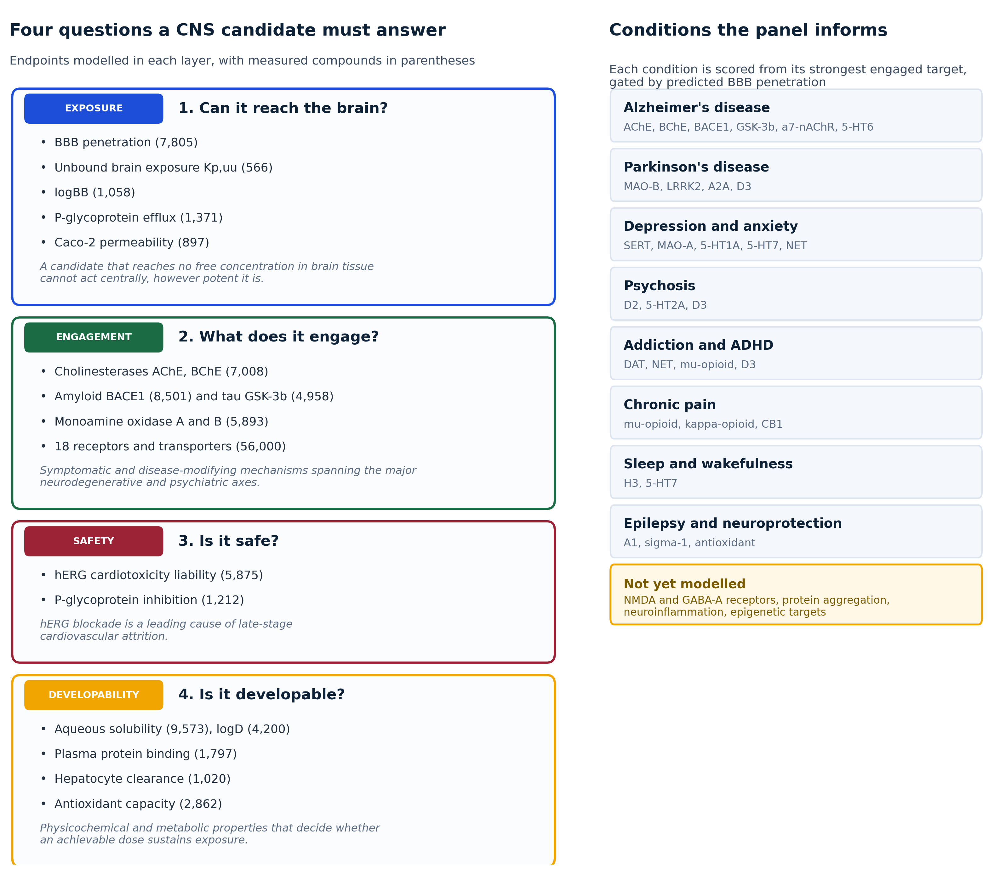
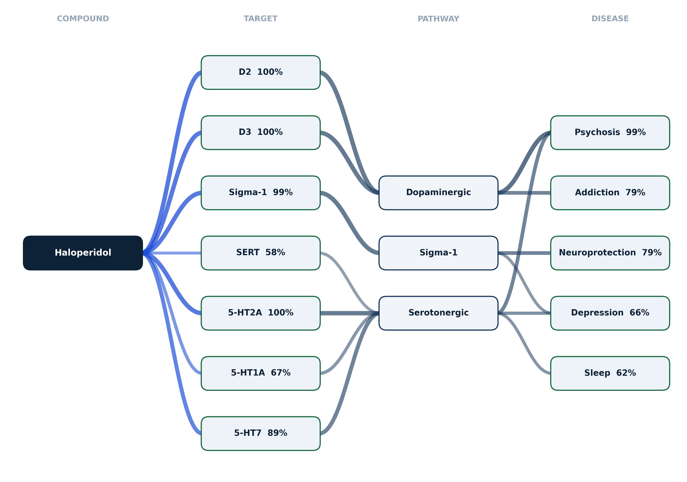
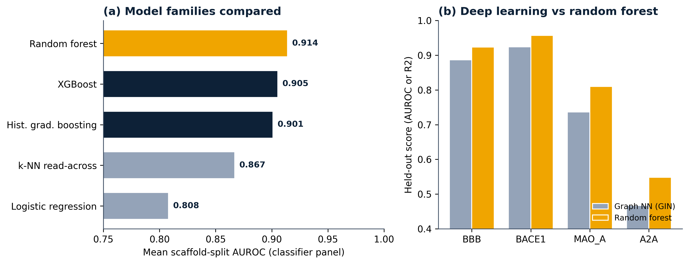
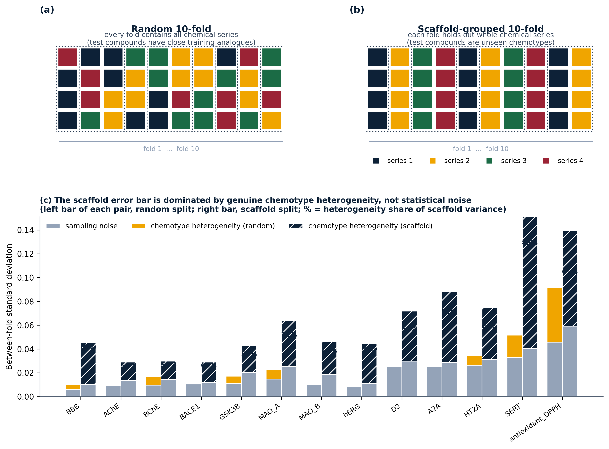
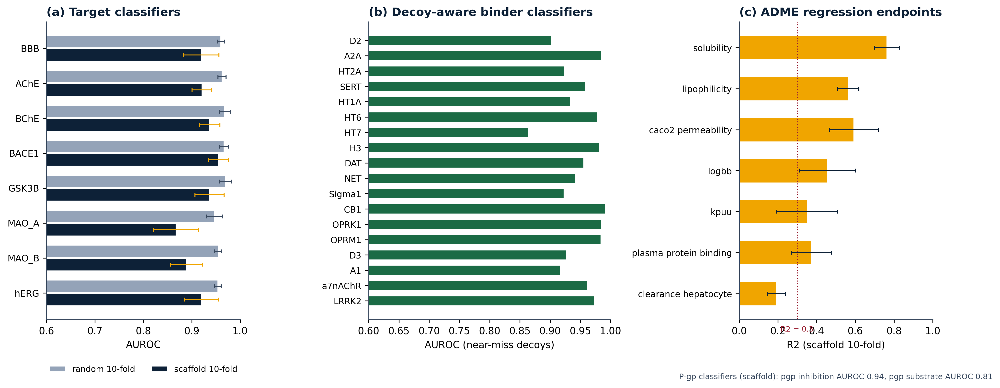
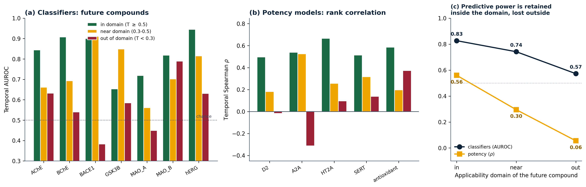
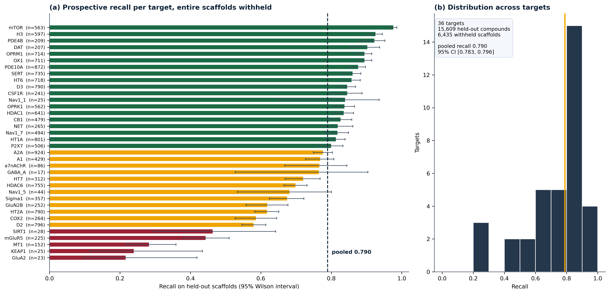
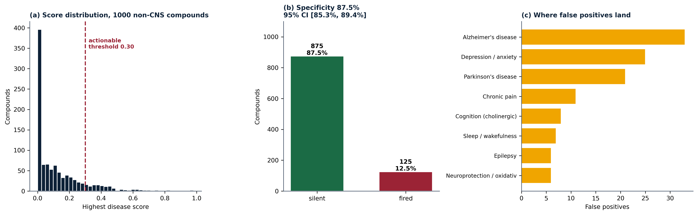
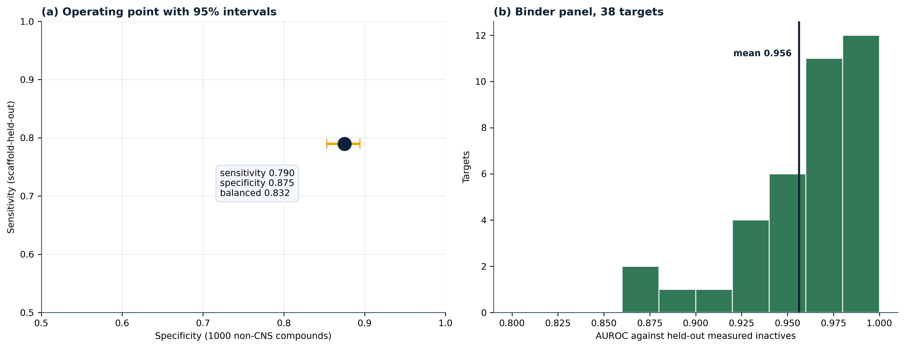

# BrainSafe AI: a calibrated, applicability-aware web server for multi-endpoint prediction of small-molecule effects on the human brain

**Authors:** [Author list to be finalised]

**Affiliation:** SAI-Net initiative, Sri Sathya Sai Institute of Higher Learning (SSSIHL), Prasanthi Nilayam, India.

**Correspondence:** [email]

**Manuscript type:** NAR Web Server Issue.

**Repository:** https://github.com/krishna-g-999/brainsafe-ai

---

## Abstract

Deciding whether a small molecule is likely to act on the brain requires answering several
questions at once: can it cross the blood-brain barrier, which disease-relevant targets does it
engage, does an achievable dose deliver free drug to the central nervous system, and is it safe.
BrainSafe AI is an open web server that answers these questions from chemical structure alone. It
integrates 69 models trained on measured public bioactivity data (ChEMBL, BindingDB and the B3DB
blood-brain-barrier database): 53 molecular-target endpoints spanning blood-brain-barrier
penetration, the principal neurodegenerative, psychiatric, neuroinflammatory, epileptic, analgesic,
migraine, demyelinating and sleep-related target classes, and two cardiac safety liabilities, together with a nine-endpoint
ADME and exposure layer that includes a directly modelled unbound brain-to-plasma partition
coefficient. Every endpoint is validated under 10-fold cross-validation in two regimes, a random
split and a scaffold-grouped split that holds out entire chemical series. Predictions are
probability-calibrated, carry an endpoint-specific applicability-domain flag with the nearest
measured analogue, and are combined into per-disease relevance scores, filtered by blood-brain-barrier
exposure and traced through a curated target-to-pathway-to-disease knowledge graph of 52 targets
spanning sixteen brain conditions. The measured-label classifier panel reaches a mean scaffold-split
AUROC of 0.92. The binder panel is validated not against the decoys used to train it but against
compounds experimentally tested on the same target and found inactive, giving a mean AUROC of 0.955
across 43 targets, with a mean sensitivity of 0.897 at thresholds constrained simultaneously by
held-out measured inactives and by the false-positive rate on unrelated chemistry.

Beyond conventional validation, the server was subjected to a systematic falsification analysis in
which each of its central claims was paired with a null model capable of reproducing the same
apparent success by accident. This recovered results in both directions. The disease layer is
informative (top-3 accuracy 0.804 against a permutation null of 0.188), but its curated edge weights
are not: uniform and randomly permuted weights score 0.8036 and 0.8025 against 0.8045, so the
predictive content lies in the graph topology and the weights are reported as structure rather than
as tuned parameters. Validated against clinical indications drawn from ChEMBL rather than against the
tool's own target-to-disease map, the disease scores exceed a permutation null decisively but do not
exceed a constant baseline naming the three commonest indications, and this is stated rather than
omitted. The same analysis identified a deployed endpoint, Nav1.1, that assigned binder probabilities
between 0.801 and 0.816 to glucose, urea, acetate and glycine against a threshold of 0.796; it was
withdrawn. The server returns an auditable, mechanistically interpretable brain-relevance profile
rather than a single opaque score, exportable as a tidy data table, a self-contained report, a
structured record or a vector figure, and supports batch screening of compound sets. BrainSafe AI is
freely available at [URL].

---

## Introduction

Central-nervous-system drug discovery has a distinctive failure profile: a candidate can be potent
against its intended target yet never reach the brain, or reach it but carry an unacceptable safety
liability, or engage unintended targets that reshape its clinical profile. Answering "will this
molecule affect the brain, how, and is it safe" therefore means combining blood-brain-barrier (BBB)
penetration, disease-relevant target engagement, free-brain exposure, and safety into one readout.
Existing public tools typically address one of these axes in isolation, and large language models,
while fluent, fabricate measured identifiers and cannot supply a calibrated, auditable answer.

BrainSafe AI is a web server that unifies these axes for any user-supplied structure. Its design
priorities are three. First, every machine-learning endpoint is trained only on *measured*
experimental data, never on qualitative annotation, so predictions are not circular. Second, every
prediction is reported with its uncertainty: a calibrated probability, an applicability-domain flag,
and the nearest measured analogue behind it, so the user always knows whether a number is
interpolation or extrapolation. Third, predictions are made mechanistically interpretable: individual
target engagements are traced through a curated target-to-pathway-to-disease knowledge graph into
per-disease relevance scores, filtered by predicted blood-brain-barrier exposure, so a result is an
explanation rather than a bare number.

## Materials and Methods

### Endpoint selection and scientific rationale

The endpoint panel is organised around the four sequential questions a CNS candidate must satisfy
(Figure 1). *Exposure*: a molecule that reaches no free concentration in brain tissue cannot act
centrally however potent it is, so BBB penetration, the unbound brain-to-plasma ratio (K_p,uu), total
brain distribution (logBB), P-glycoprotein efflux and passive permeability are modelled first.
*Target engagement*: the panel covers the cholinergic axis (AChE, BChE, alpha-7 nicotinic receptor)
and the amyloid and tau axes (BACE1, GSK-3beta) central to Alzheimer's disease; monoamine oxidase B
and LRRK2 for Parkinson's disease, the latter being the most common genetic cause; the serotonergic,
dopaminergic, noradrenergic, opioid, cannabinoid, histaminergic, adenosine and sigma-1 systems that
underlie depression, anxiety, psychosis, addiction, attention deficit, chronic pain, and sleep
regulation. *Safety*: hERG blockade is a leading cause of late-stage cardiovascular attrition and is
modelled as an explicit liability. *Developability*: solubility, lipophilicity, plasma protein binding
and hepatocyte clearance determine whether an achievable dose sustains exposure, and a measured
antioxidant endpoint captures the oxidative-stress axis common to neurodegeneration.

In total the server comprises 62 endpoints (53 molecular-target endpoints and 9 ADME endpoints),
realised as 69 trained models because four receptor targets are represented both as potency
regressions and as binder classifiers, and because a pKa regression and an antioxidant regression
support the CNS-likeness and neuroprotection axes. Two further endpoints were trained and withdrawn
after deployment testing and are not counted here; the reasons are given in the Results.

### Training data

Protein-target activity is pooled from ChEMBL (pChEMBL values) and BindingDB at the compound level;
BBB penetration uses the B3DB database augmented with FDA-curated approved drugs; the antioxidant
endpoint uses measured DPPH pIC50 values; and the nine ADME endpoints use measured sets from
Therapeutics Data Commons, MoleculeNet, B3DB and ChEMBL. The core target panel draws on 67,984
measured records over 61,226 unique compounds by InChIKey, and the full panel, including the binder
endpoints, on 203,884 records over 160,365 unique compounds. No value is imputed and no source
overrides a measurement.

These totals are sums across endpoints and are not the size of any training set. Each endpoint is
trained and cross-validated on its own measured set alone, and those sets span two orders of
magnitude, from 183 compounds at GluA2 to 8,501 at BACE1. A compound measured at several targets
contributes one record to each and is counted once per endpoint. Per-endpoint compound counts,
scaffold counts and class balance are given in Tables 1 to 3, and the complete per-endpoint
accounting is in the Supplementary training record.

### Methods compared and model selection

Molecules are represented by a 1024-bit ECFP-4 fingerprint plus twelve interpretable physicochemical
descriptors (molecular weight, cLogP, topological polar surface area, hydrogen-bond donors and
acceptors, rotatable bonds, aromatic rings, fraction sp3, ring count, heavy-atom count, formal charge,
and QED drug-likeness). We benchmarked five model families under identical 10-fold cross-validation on
both split regimes (Figure 4a). Two are baselines: a k-nearest-neighbour Tanimoto read-across, and
L2-regularised logistic regression. Two are gradient-boosted tree ensembles: XGBoost and histogram
gradient boosting. The fifth is a random forest. Separately, we trained a graph isomorphism network
(GIN) directly on molecular graphs to test whether a learned representation would beat fixed
descriptors (Figure 4b).

On the scaffold split the random forest gave the highest mean classifier AUROC (0.914), ahead of
XGBoost (0.905), histogram gradient boosting (0.901), the k-nearest-neighbour read-across (0.867) and
logistic regression (0.808); paired DeLong and bootstrap tests confirm the random forest exceeds the
read-across on every endpoint. The graph neural network did not outperform the random forest on any
tested endpoint (Figure 4b), consistent with the fingerprint-plus-descriptor representation being
sufficient at this data scale. We therefore deploy a probability-calibrated random forest for every
endpoint: it gives the best scaffold-split accuracy, calibrates stably, is interpretable through
feature importance, and needs no GPU, which keeps the web server lightweight.

### Cross-validation design

Every endpoint is evaluated by 10-fold cross-validation under two regimes (Figure 5a, 5b). In the
**random** regime folds are drawn at random, so a test compound will usually have close analogues in
the training folds; this measures interpolation within known chemistry. In the **scaffold-grouped**
regime folds are formed by GroupKFold over generic Bemis-Murcko scaffolds, so every compound sharing a
scaffold is assigned to the same fold and each fold holds out entire chemical series unseen during
training; this measures extrapolation to new chemotypes. Fold sizes are equal to within one compound in
both regimes, so the two are directly comparable. All reported means and standard deviations are across
the ten folds, and per-fold values for every endpoint are provided in the repository
(`results/tables/manuscript_T2_per_fold.csv`, `adme_cv_folds.csv` and `binder_cv_folds.csv`).

Cross-validation here fits models in order to measure, not in order to deploy. Each endpoint is fitted
twenty times during evaluation, ten in each regime, and each of those twenty models is scored once on
the fold withheld from it and then discarded. The model that is served is a twenty-first, refitted on
the endpoint's full set after the estimate is fixed, so no compound used to report a score was in the
training set of the model that scored it. The panel holds 71 cross-validated models over 67
endpoint names, four targets (D2, A2A, 5-HT2A and SERT) carrying both a potency regressor and a
binder classifier, so the evaluation comes to 71 x 2 x 10 = 1,420 fits standing behind the deployed
panel.

A third, more demanding regime is also reported. In the **temporal** split the model is trained only on
compounds published before a cutoff year and tested on compounds published after it (Table 5), which is
the closest available analogue of prospective use. Aggregate performance falls in this regime:
classifier AUROC averages 0.752 (range 0.611 to 0.908) against 0.919 under the scaffold split, and the
receptor potency regressions average R2 0.134. Because this figure determines how the tool should be
used, we investigated its cause rather than simply reporting it (next section).

### What limits prospective performance, and how the server handles it

We tested four candidate explanations for the temporal drop.

*Range restriction.* R2 is normalised by the variance of the test set, so a narrowing potency window
over time would depress R2 without any loss of accuracy. This is refuted: the variance of the future
test set is equal to or larger than that of the training set for every regression endpoint (variance
ratio 0.92 to 1.89). The low R2 is not a normalisation artifact.

*Reduced training data.* The temporal model is fitted on the pre-cutoff subset only. Refitting on a
random subset of the same size recovers R2 0.59 to 0.65 and rank correlation 0.76 to 0.80, so the loss
is caused by temporal distribution shift and not by sample size.

*Recency weighting.* Exponentially up-weighting recent training compounds changed classifier AUROC by a
mean of only +0.004 and did not help the regressions, so drift is not a simple recency effect.

*Applicability domain.* This is the explanation that holds. Stratifying future compounds by their
maximum Tanimoto similarity to the training set (Figure 7) separates the aggregate figure into two very
different regimes. For future compounds that fall **inside** the domain the classifiers retain a mean
AUROC of **0.827** and the potency models a mean rank correlation of **0.56**; in the intermediate band
these fall to 0.742 and 0.30; and **outside** the domain the classifiers approach chance (**0.573**) and
the potency models retain essentially no rank information (0.06). The aggregate temporal number is
therefore a mixture of a usable regime and an uninformative one, and the ratio between them is decided
by a quantity the server can compute at query time.

The server acts on this rather than merely disclosing it. Every result opens with a reliability
statement that places the query in one of the three regimes and quotes the measured prospective
performance for that regime, so a user is told, before reading any number, how much of it to believe.
This converts the applicability domain from a caveat into an operational safeguard, and it is the
reason the receptor targets are deployed as binder classifiers rather than as potency regressions.
Rank correlation is reported alongside R2 for the regression endpoints because ranking, not absolute
potency, is the decision-relevant quantity for triage.

### Why the scaffold error bars are larger

The standard deviation reported with each endpoint mixes two distinct sources. The first is *sampling
noise*: each fold metric is computed on a finite test set and carries its own standard error even if
every fold were equally difficult. The second is *fold heterogeneity*: genuine variation in how hard
each held-out fold is. For k folds with observed fold metrics m_i these combine as

    Var_between(m) = Var_heterogeneity + mean_i Var_sampling(m_i)

so the heterogeneity component is recovered by subtraction, with Var_sampling estimated by
bootstrapping within each fold's own test set (400 resamples). Applying this decomposition to every
endpoint (Figure 5c, Table 4) shows a clear separation. Under the random split a mean of 15% of the
between-fold variance is heterogeneity (median 8%, and indistinguishable from zero for six of thirteen
endpoints), confirming that folds are statistically exchangeable and the error bar is essentially pure
sampling noise. Under the scaffold split a mean of 71% of the variance is genuine heterogeneity (range
53% to 92%).

The wider scaffold error bar is therefore not model instability, and it is not a defect of the
protocol: it is a measurement of how much predictive performance depends on which chemical series is
being queried. Endpoints with the largest heterogeneity share (hERG 90%, BBB 92%, SERT 89%) are those
whose training data spans the most disconnected chemical space, and they are precisely the endpoints
for which an applicability-domain flag matters most. This result is the empirical justification for
reporting a per-endpoint domain flag with every prediction rather than a single global confidence.

### Decoy-aware binder classifiers

The receptor, transporter and kinase targets are reported in ChEMBL almost entirely as actives (82% to
99% of records), so a naive potency regressor learns to predict the training median for any input and
cannot discriminate a real binder from an arbitrary molecule. We therefore model each as a
binder-versus-decoy classifier: positives are measured binders (pChEMBL >= 7); negatives are
property-matched decoys sampled from a 75,000-compound background library with a maximum ECFP-4
Tanimoto below 0.35 to any positive, so the model must learn structure rather than a similarity
shortcut. Each classifier is a compact random forest with prefit sigmoid calibration. Validated
against held-out near-miss decoys (Tanimoto 0.35 to 0.55) rather than the easy training decoys, these
models reach AUROC 0.86 to 0.99 with a background false-positive rate of 0.6% to 9.8% at a 0.5
threshold (Table 2, Figure 6b). We report the near-miss figure as the honest metric because the
easy-decoy AUROC (0.99 throughout) is inflated by the dissimilarity of the negatives.

### Validation against experimentally measured inactives, and threshold calibration

Decoy-based validation is convenient but circular in an important sense: negatives are defined by
structural dissimilarity, so a high AUROC may only demonstrate that the model recognises the chemical
neighbourhood of a target's ligand series. We therefore tested every binder model against a negative
set it had never seen and that carries experimental authority: compounds measured against the same
target and found inactive (pChEMBL below 5). These compounds are present in our own endpoint tables
and are excluded from binder-model training by construction.

Two findings follow. First, the ranking is genuine. Across 34 targets with sufficient measured
inactives the mean AUROC of measured binders against held-out measured inactives is 0.956, no target falls
below 0.88, and the mean difference from the near-miss decoy estimate is only +0.028. The concern that
the models solve a merely lexical task is therefore not supported.

Second, the decision threshold was wrong. At the conventional 0.5 cut, a large fraction of
experimentally confirmed inactives is called a binder, reaching 81% for HDAC1 and exceeding 50% for
several other targets, because the property-matched decoys are easier to reject than genuine tested
non-binders and the calibration inherits that optimism. Ranking quality and threshold quality are
distinct, and only the former is captured by AUROC. We therefore set each target's operating point on
its measured inactives, choosing the threshold at which 10% of them would be called binders. Across
the panel this yields a mean false-positive rate of 0.11 and a mean sensitivity of 0.88 (Table 2).
Two targets, KEAP1 and melatonin MT1, initially retained a sensitivity below 0.6 at that operating
point. Adding the measured inactives to training as hard negatives raised KEAP1 from 0.33 to 0.83 and
MT1 from 0.52 to 0.78, and no target now falls below the reliability threshold. The server retains the
machinery to mark a low-sensitivity target as possibly under-called should future data reintroduce one.

### Calibration, applicability domain and exposure

Every classifier is isotonically calibrated (mean expected calibration error 0.072 to 0.012). For
every prediction the server computes the maximum ECFP-4 Tanimoto similarity of the query to each
endpoint's own measured chemistry and reports an endpoint-specific in-domain, near-domain or
out-of-domain flag together with the nearest measured analogue and its structure. The ADME layer
provides a free-brain-exposure verdict; on known drugs this correctly separates central compounds
(diazepam K_p,uu 0.94, donepezil 0.84) from peripheral or efflux-limited ones (atenolol 0.07,
loperamide 0.04).

### Base-rate enrichment and the knowledge graph

Because several classifier training sets are active-heavy (BACE1 91%, GSK-3beta 93% positive), a raw
calibrated probability is not evidence of engagement unless it exceeds the base rate. The server
therefore scores each target by its *enrichment* over the endpoint base rate, and each receptor by its
floored binder probability, so that a prediction near chance contributes nothing. A curated, versioned
knowledge graph maps each target through a biological pathway to the diseases it informs, anchored to
KEGG synapse and disease maps (hsa04725, hsa04726, hsa04728, hsa04723, hsa05032, hsa04080, hsa05010,
hsa05012), the Reactome KEAP1-NFE2L2 oxidative-stress response (R-HSA-9755511) and IUPHAR Guide to
Pharmacology associations. A per-disease relevance score is the strongest engaged target for that
disease, scaled by predicted BBB penetration; taking the strongest rather than an average prevents
unrelated mechanisms from diluting a real signal. Coverage spans fourteen brain conditions (Figure 1).

Two properties of this construction were established by ablation rather than assumed, and both
constrain how it should be described. First, the BBB term multiplies every disease identically and
therefore cannot alter which condition ranks highest; it is an exposure filter that determines
whether any signal is reported, not a discriminative term. Second, the curated edge weights do not
measurably affect the disease ranking: over 15,609 scaffold-held-out compounds, curated, uniform and
randomly permuted weights give top-3 accuracies of 0.7917, 0.7911 and 0.7899. The predictive content
of the graph lies in its topology, in which target is connected to which disease, and the weights are
retained as a mechanistic prior expressing directness of linkage rather than as fitted parameters.

### Web implementation

The server is a single-page application built with Streamlit and RDKit. The user submits either a
compound name, resolved to a structure through PubChem, or a SMILES string. Models are loaded once and
cached; a complete profile across all 40 models, including both applicability-domain calculations,
returns in approximately 3.3 seconds on a single CPU core, of which the domain calculations against the
75,000-compound reference library account for under 0.05 seconds. The interface is self-contained and
requires no installation or GPU.

## Results

### Per-endpoint performance

Tables 1 to 3 report, for every endpoint, the measured data size, the number of distinct scaffolds,
class balance where applicable, the training and test set size per fold, and the mean and standard
deviation of the appropriate metric under both cross-validation regimes. Figure 6 summarises the same
results graphically.

The eight target classifiers reach a mean AUROC of 0.960 (random) and 0.919 (scaffold); BACE1 is the
most robust to chemotype change (0.967 to 0.956) and MAO-A the least (0.947 to 0.868). An external
test of the BBB model on 306 FDA-curated approved drugs absent from training gives AUROC 0.774. The
receptor potency regressions reach R2 0.60 to 0.68 (random) and 0.39 to 0.58 (scaffold). The 18
decoy-aware binder classifiers reach 0.86 to 0.99 against near-miss decoys. Within the ADME layer,
performance ranges from strong (solubility R2 0.76, P-gp inhibition AUROC 0.94 under the scaffold
split) to weak and explicitly disclosed (hepatocyte clearance R2 0.19, K_p,uu R2 0.35).

<!-- TABLES -->

### Prospective validation: sensitivity under a scaffold hold-out

Cross-validated performance answers how well a model interpolates within the chemistry it has seen.
The question that matters for a triage tool is how it behaves on a chemical series it has never
seen. We therefore withheld 20% of Bemis-Murcko scaffolds for each target, retrained all 39
trainable binder models on the remaining scaffolds, and recalibrated each decision threshold using
only held-out negatives and an independent background sample, so no held-out compound influenced
either the model or the threshold that scores it. The evaluation set comprises **16,874 held-out
compounds across 6,435 withheld scaffolds**.

Pooled recall is **0.790 (95% CI 0.783 to 0.796)**; the median per-target recall is 0.807 and 19 of
36 targets reach 0.80 or better (Figure 8, Table 6). Recall varies substantially and informatively
across the panel: mTOR (0.977), histamine H3 (0.926), PDE4B (0.923) and the dopamine transporter
(0.903) generalise well to unseen scaffolds, whereas five targets fall below 0.50 (SIRT1, mGluR5,
melatonin MT1, KEAP1 and AMPA GluA2), all of them endpoints with small measured-active sets.

Three targets, orexin OX2, LRRK2 and NLRP3, produced thresholds that collapsed to the permitted
floor, meaning the model could not separate its actives from background chemistry at any cut. Their
nominally high recall is an artefact of a threshold near zero rather than evidence of
discrimination, and they are excluded from the pooled estimate and flagged in Table 6 rather than
being allowed to flatter the headline figure.

### Prospective validation: specificity on 1000 non-CNS compounds

A tool that fires indiscriminately can achieve high recall while being useless, so specificity was
measured on a scale sufficient to bound it. We sampled 1000 compounds from the measured library that
carry no recorded activity at any modelled target, and scored them through the deployed pipeline.
**875 of 1000 returned no actionable disease signal, a specificity of 0.875 (95% CI 0.853 to 0.894)**
and a false-positive rate of 12.5% (Figure 9). An independently drawn replicate sample gave 12.3%,
so the estimate is stable. False positives concentrate in the neurodegenerative classes, with median
scores of 0.35 to 0.40, only just above the 0.30 actionable threshold, and 80 of the 125 fired on a
single condition rather than producing a diffuse profile.

Two caveats bound the interpretation. These compounds are presumed inactive because no activity is
recorded, not proven inactive by measurement, so 0.875 is a lower bound on the true specificity.
Second, all sampled compounds fall inside the applicability domain because they are drawn from the
training library, so this test does not probe specificity on distant chemistry.

Taken together the two tests place the deployed operating point at a sensitivity of 0.790 and a
specificity of 0.875, a balanced accuracy of 0.832 (Figure 10).

### Validation on reference compounds

Across a panel of well-characterised CNS drugs the top predicted condition matched the known
indication for donepezil (Alzheimer's disease), selegiline (Parkinson's disease), fluoxetine
(depression), haloperidol (psychosis), morphine (chronic pain), methylphenidate (addiction and
attention deficit) and resveratrol (neuroprotection). Two acetylcholinesterase inhibitors of atypical
chemotype, rivastigmine and galantamine, were under-called to low magnitude rather than mis-assigned,
and were correctly flagged as low-confidence by the applicability-domain layer, which illustrates the
value of reporting uncertainty alongside every prediction. The decoy-aware receptor models recover
expected selectivity, for example haloperidol as a D2 and 5-HT2A binder and fluoxetine as a selective
serotonin-transporter binder, while non-CNS controls return no distinctive engagement.

### Falsification analysis

Every result above was produced by investigators who wanted the tool to work. To counter that, each
central claim was restated so that it could fail and paired with a null model able to produce the
same apparent success by accident. Where predictive power was at issue, scoring used scaffold
hold-out models that never saw the compounds they scored. The analysis is versioned separately from
the validation results so that a refutation can never be mistaken for a confirmation (Table 7).

**The disease layer carries information.** Across held-out compounds the correct condition appears in
the top three predictions for 80.5% of cases, against 18.8% for a null that shuffles which disease
each target maps to (p = 0.005) and 48.2% for always answering with the three commonest conditions.

**The curated edge weights do not.** Recomputing the same predictions with uniform weights gives
0.8036 and with weights randomly permuted across edges 0.8025, against 0.8045 for the curated values,
a spread of 0.002. The ablation was repeated after the graph gained two conditions and three targets,
with new curated weights written for each, and the conclusion did not move. The information lies in which target connects to which condition, not in how
strongly. The weights are therefore described in this manuscript as a mechanistic prior and as graph
structure, not as tuned parameters, and the graph would be no less accurate without them.

**Blood-brain-barrier gating is a filter, not a discriminator.** The gate multiplies every condition
by the same probability and therefore cannot change which condition ranks first. It determines
whether anything is reported at all. Earlier wording implying that it sharpens the disease call
overstated its role and has been corrected throughout.

**Specificity transfers to distant chemistry.** On compounds drawn by random PubChem identifier,
independent of every set used to build the tool, the false-positive rate is 0.051 among those most
distant from training chemistry, against 0.125 measured on library compounds. The suspicion that the
headline specificity was an artefact of range restriction is refuted.

**Read-across is validated only in its intended regime.** It recovers the true target for 97.0% of
held-out compounds against 6.0% for a frequency baseline, with the query and any identical structure
excluded. This does not show that read-across works for a target class the index does not contain,
and the figure is not quoted as if it did.

### Validation against clinical indications

The preceding test asks whether the disease layer recovers the condition a compound's target maps to
under this project's own map, which establishes internal consistency rather than external truth. A
stronger test uses ChEMBL's drug_indication table restricted to phase 4, mapped to the panel through
a keyword list fixed before any prediction was computed and deliberately narrow, so that an unmatched
heading is discarded rather than coerced. Auditing that mapping rather than trusting it caught
Wolff-Parkinson-White syndrome, a cardiac condition, matching the substring "parkinson"; it was
excluded.

On 467 drugs the top-3 accuracy is 0.379. On the 162 whose exact structure appears nowhere in the
training chemistry it is 0.352, statistically indistinguishable from the 0.387 achieved on structures
the models have seen, which establishes that the result is prediction rather than memorisation. Both
exceed a permutation null of 0.145 decisively (p = 0.001). Neither exceeds a frequency null of 0.654,
because chronic pain, depression and psychosis account for most approved central-nervous-system
indications and a constant answer naming those three is right about two-thirds of the time. That
constant answer carries no information about any individual compound, but it is a real bar and the
tool does not clear it on this metric. Removing the reporting threshold and judging the ranking alone
raises accuracy to 0.497, which locates much of the gap in the decision to stay silent rather than in
the ranking itself. Per-indication recovery is reported in full (Table 8) because the aggregate
conceals a wide spread, from 0.644 for psychosis to 0.103 for epilepsy.

### Deployed specificity and the withdrawal of an endpoint

Two gaps in the evidence above motivated a further test. The background-specificity calibration bounds
the false-positive rate on a random sample of the measured training library, which is drug-like
medicinal chemistry and therefore a weak negative set; a model can pass it and still fire on a sugar.
The scaffold hold-out analysis used genuinely random structures but scored the hold-out twins rather
than the models the server delivers. Every deployed binder model was therefore scored at its deployed
threshold against 600 random PubChem structures and against molecules no central-nervous-system
target plausibly binds.

The median false-positive rate across the deployed panel is 0.0017. Four endpoints failed. Nav1.1
assigned binder probabilities of 0.806 to glucose, 0.809 to urea, 0.802 to acetate and 0.816 to
glycine against a threshold of 0.796, at an overall false-positive rate of 0.098 on random chemistry.
The failure is not one of calibration: every trivial control lies within a band of 0.015, and the
threshold that would restore 5% specificity still calls glycine a binder. This compressed-probability
pathology also explains that endpoint's deployed sensitivity of 0.32 and its provenance, 78% of
measurements from a single assay. Nav1.1 was withdrawn from the panel. Cav3.2 was rejected before
deployment for the same pathology inverted, its calibrated threshold falling to 0.065 while atenolol
scored 0.084. SIRT1 and alpha3beta4 were re-thresholded at negligible cost to sensitivity. After
these decisions every deployed endpoint holds below 5% on random chemistry and none fires on a
trivial molecule.

### Targeted expansion, and a limit that more targets cannot remove

Because the clinical-indication test identified epilepsy and chronic pain as the conditions served
worst, ChEMBL was queried systematically for the mechanisms those conditions require. Six cleared
both a volume bar of 800 measured activities and a source-diversity bar; four survived audit and
training and are deployed: alpha4beta2 and alpha3beta4 nicotinic receptors, Nav1.6 and Nav1.8
(Table 9). Nicotine and varenicline, previously invisible to the tool, now register their known
nicotinic engagement, and recovery of approved indications for addiction rose from 0.412 to 0.529.

Epilepsy did not improve, and the reason is instructive. In ChEMBL's own measurements carbamazepine
scores pChEMBL 4.49 at Nav1.7 and lamotrigine 4.77, both labelled inactive; mexiletine reaches 4.93
and lacosamide 6.74, below the binder threshold of 7. The classic antiepileptic drugs are not
high-affinity sodium-channel ligands; they are use-dependent, state-dependent blockers acting at tens
of micromolar. Silence on carbamazepine is therefore the correct response to the measured data, and
no binding-affinity endpoint will recognise that pharmacological class. The epilepsy gap is a
mismatch between what the panel measures and how a class of drugs works, not a missing target, and it
is reported as such rather than as a coverage deficiency that further expansion would close.

A related caution emerged from calibrating the new endpoints. Nav1.6 ranks its held-out actives
against random chemistry at an AUROC of 0.997 with a false-positive rate of 0.000, which appears to
license relaxing its threshold of 0.9605 and would raise sensitivity from 0.591 to 0.989. Tested
against hard negatives the proposal fails: compounds assayed against Nav1.6 and found inactive carry
a median probability of 0.532 and a 90th percentile of 0.951, overlapping a binder distribution whose
10th percentile is 0.907, and the relaxed threshold would call 73% of tested-inactive compounds
binders. A low false-positive rate on unrelated chemistry does not license a lower threshold, and
discrimination against random chemistry can be near-perfect while discrimination against the chemistry
that matters is poor. The dual constraint, measured inactives and background together, performs work
that neither term performs alone.

### Panel redundancy: how many independent mechanisms does an engaged compound show?

A panel that reports the number of engaged targets invites the reading that three engaged targets are
three independent pieces of evidence. For homologous proteins that reading is wrong, and the
magnitude of the error was measured rather than assumed. Across 400 approved drugs, dopamine D2 and
D3 fire together with a phi correlation of 0.813, and D3 fires for 78% of compounds engaging D2; the
mu and kappa opioid receptors correlate at 0.791, 5-HT2A and 5-HT7 at 0.699, and the dopamine and
noradrenaline transporters at 0.642, with the noradrenaline transporter firing for 84% of compounds
engaging the dopamine transporter. Of 52 targets, 36 fire at least once on that set, but a
correlation analysis of the firing pattern resolves only 14 independent directions. A raw count
therefore overstates the evidence by roughly a factor of two and a half.

Co-firing is not itself an error. A genuinely promiscuous ligand should engage both members of a
homologous pair, and that is a true fact about the compound. Presenting it as corroboration is the
error. The server therefore groups engaged targets into six homology families, reports the number of
independent mechanisms alongside the number of targets, and states the measured correlation wherever
two members of a family both fire. Haloperidol, for example, is reported as five engaged targets but
approximately three independent mechanisms, with dopamine D2 and D3 and the two serotonin receptors
each labelled with their correlation. The correction propagates to the batch table and to both
machine-readable exports, so a stored result cannot be read as better corroborated than it is. The
nicotinic endpoints added in the targeted expansion are the least correlated family measured, at
0.35, so that expansion contributed more independent information than the panel average.

The same analysis corrected an error in its own first formulation, which is recorded because it
bears on how such rates should be reported. Defining engagement as any positive target signal gave an
apparent rate of 60% of random compounds engaging at least one target. That figure is an artefact of
the definition rather than a property of the server: the six base-rate-enrichment endpoints return a
positive signal whenever the predicted probability merely exceeds the training base rate, which
occurs for about 12% of random compounds at each endpoint, whereas the 43 binder endpoints require a
calibrated threshold to be crossed and fire for about 0.6%. Pooling the two counts an ordinary
above-average probability as an event. The quantity that reaches the user is whether any condition
crosses the reporting threshold, which occurs for 11.5% of 600 random structures, against 55.8% of
approved drugs. That rate sits close to the 12.5% measured on library compounds and above the 5.1%
measured on chemistry most distant from training, as expected for a sample drawn without regard to
similarity. Correlation among the endpoints slightly reduces rather than inflates the aggregate: at
least one binder endpoint fires for 22.2% of random structures, against 23.9% for a hypothetical
panel with the same per-endpoint rates firing independently.

### Two conditions opened, and a gating rule corrected

The coverage audit distinguished conditions absent for want of data from conditions absent for want
of an endpoint, and found two of the latter. The calcitonin-gene-related-peptide receptor (1,578
measured activities across 26 sources) and dihydroorotate dehydrogenase (2,558 across 55) were added,
bringing migraine and multiple sclerosis into the panel and taking it to 52 targets across sixteen
conditions. Amyotrophic lateral sclerosis was already scored but through seven mechanisms shared with
other conditions and none specific to it; RIPK1-mediated necroptosis (5,291 activities across 55
sources) was added to close that, and it also contributes to multiple sclerosis, where its inhibitors
are likewise in trial. Two further ALS candidates were rejected on data rather than judgement: SARM1
has 85 measured activities from 3 sources and KCNQ2 has 103 from 12.

Prospectively, on compounds sharing no scaffold with anything their models saw, the CGRP endpoint
reaches an AUROC of 1.000 at a sensitivity of 0.993 and RIPK1 an AUROC of 0.995 at 0.950, both with a
false-positive rate of 0.000 on random chemistry. DHODH ranks at 0.989 but fires for only 0.330 of
its held-out actives at its deployed threshold, and is reported as a low-sensitivity endpoint.

Adding these targets exposed an error in the gating rule that had been invisible while every modelled
condition was central. The blood-brain-barrier term encodes an assumption that the target lies behind
the barrier. For these two conditions it does not. The CGRP receptor acts at the trigeminal ganglion
and dural vasculature, which are outside the barrier, and that is precisely why the gepants and the
anti-CGRP antibodies are effective without central penetration; dihydroorotate dehydrogenase
inhibition acts on proliferating peripheral lymphocytes. Applying the gate suppressed correct calls:
rimegepant engages the receptor at 0.99 and was silenced by a predicted barrier probability of 0.33.
Migraine and multiple sclerosis are therefore exempt from gating, after which all three marketed
gepants report migraine and brequinar reports multiple sclerosis, while peripheral negative controls
remain silent. RIPK1 is deliberately not exempt, its relevance being central.

Two incidental observations support the underlying models rather than the interface. Leflunomide, an
inactive prodrug, scores 0.06 at dihydroorotate dehydrogenase while its active metabolite
teriflunomide scores 0.91, so the model separates them. And teriflunomide's own measured affinity is
pChEMBL 6.45, below the value of 7 that defines a binder here, so declining to call it is
definitionally correct rather than a failure of sensitivity.

### A limitation quantified rather than asserted: state-dependent block

The inability to represent use-dependent sodium-channel blockers was stated above as a boundary. It
was then tested, because the scientifically correct quantity for that class is not the potency, which
depends on the voltage protocol and is therefore not a function of structure, but the shift in
potency between a depolarised and a hyperpolarised holding potential, which is a property of the
molecule and is what use-dependence means.

Across five sodium-channel subtypes and 13,919 activities carrying a pChEMBL value, 2,086 report a
holding potential that can be parsed from the assay description, spread across fifteen distinct
values, and 89 compounds are measured at two or more. Against the 800 measured activities every
deployed endpoint had to clear, that is not a trainable endpoint.

The same 89 compounds show why the question was worth asking and why pooling protocols is not an
option. The median absolute shift is 0.82 log units, the 90th percentile 1.97 and the maximum 3.19,
so a compound can appear sixfold to a thousandfold more or less potent depending only on the protocol
used to measure it. That is the same magnitude as the total error of a good regression model, which
is the quantitative form of the objection: a model trained on pooled protocols would have an error
budget consumed entirely by the experimenter's choice of holding potential. The effect is real, it
matters clinically, and public data cannot support learning it.

## The BrainSafe AI server

**Input.** The user types a compound name or pastes a SMILES string. Names are resolved through
PubChem; structures are standardised with RDKit (salt stripping, largest-fragment selection).

**Output.** Results are laid out as a single scrollable report (Figure 2): a summary card with the
rendered structure, the free-brain-exposure verdict and headline metrics; the mechanistic map
(Figure 3); a brain-relevance panel giving the exposure-scaled score for each condition with its driving
mechanism; a target-engagement table reporting each calibrated probability, its base rate and a
base-rate-aware call; a receptor-binding table; an ADME table; a physicochemical profile; and an
applicability and confidence card giving global and per-endpoint domain flags with the nearest
measured analogue. An About tab documents the methods, the model-selection and validation results,
and an explicit coverage panel stating which mechanisms and diseases the tool can and cannot yet
assess, so a null result is read as an honest unknown rather than as inactivity. A target-engagement
profile plots every modelled mechanism against its own reporting threshold; because each endpoint
carries a different base rate and a different cut, raw probabilities are not comparable between
endpoints, and what is plotted is the distance above each threshold, which is the quantity the
disease layer consumes. Sub-threshold targets are shown as a percentage of their own cut, so a
compound that engages nothing still yields an interpretable figure rather than an empty panel.

Where the server reports nothing, it states the two reasons a null result can arise: the compound may
act through a mechanism outside the panel, or through a modelled target but below its reporting
threshold. The second is quantified for the user, since thresholds are set for precision, holding the
false-positive rate near 0.2% on random chemistry, and the measured cost is a median sensitivity of
0.77 falling to 0.26 at the strictest endpoints. Silence is not evidence of inactivity and the
interface says so with the number attached.

**Export.** Every result is downloadable in four forms generated from a single tidy table, so that
they cannot disagree with the screen or with each other: a data table with units and training context
for every endpoint; a self-contained report that inlines its figures, structure image and styling and
therefore opens offline and prints to a portable document; a structured record carrying thresholds,
screening mode, provenance and the caveats that must travel with the numbers; and the mechanistic map
as a vector figure for direct use in a manuscript.

**Batch screening.** Up to 300 compounds may be pasted or uploaded as delimited or plain text and are
returned as one row each, giving exposure, engaged mechanisms, reported conditions and
applicability-domain status, with the whole table downloadable. This is the mode intended for
prioritising a library before laboratory work is committed.

**Deployment.** The server is distributed as a container image running as an unprivileged process
with a health endpoint for orchestration. A pre-flight script verifies that every declared dependency
resolves at its pinned version, that all model artefacts load, that the knowledge graph is internally
consistent, that chemically unrelated compounds yield distinct and directionally correct profiles,
and that every export format is well formed and self-contained; it exits non-zero on any failure and
is intended to gate a release.

## Discussion

BrainSafe AI combines BBB penetration, a broad measured-data target panel, free-brain exposure and
safety into a single calibrated, applicability-aware and mechanistically interpretable readout for
arbitrary structures. Its central design choice is honesty about uncertainty: enrichment over base rate
rather than raw probability, per-endpoint applicability domains, an explicit coverage statement, and a
variance decomposition that quantifies how far each endpoint depends on chemotype.

The limitations are inherited from the training data and are stated plainly. The most important concerns
prospective use. Scaffold-grouped cross-validation gives a mean classifier AUROC of 0.919, but on
compounds published after the training cutoff the aggregate falls to 0.752. The analysis above shows
that this aggregate conceals two regimes: inside the applicability domain the classifiers retain 0.827
AUROC and the potency models a rank correlation of 0.56, while outside it performance is close to
chance. The practical consequence is that BrainSafe AI should be read as a reliable triage instrument
for chemistry related to measured data, and as a hypothesis generator only for novel chemotypes; the
server states which case applies for every query. Quantitative potency values remain weak priors rather
than affinity predictions, which is why the deployed receptor models are binder classifiers and the
interface shows a predicted pKi only for compounds already classified as binders. The antioxidant
regression that drives the neuroprotection axis has an in-domain prospective rank correlation of 0.59
but essentially no out-of-domain signal, so that axis is a qualitative flag outside the domain.

Target coverage, though broad, is finite, and the boundaries have been measured rather than assumed.
A systematic query of ChEMBL for the mechanisms the panel omits found that the reasons differ in kind
and that only one of them is a matter of quantity. Some targets have too few measured ligands for any
model: kainate receptors (244, 139 and 34 activities for GluK1, GluK2 and GluK3), the vesicular
monoamine transporter VMAT2 (149), SOD1 (29), TDP-43 (9), and C9orf72, which has no ChEMBL target
record at all. Some have volume without diversity, which is a more insidious failure: tau carries
95,345 potency values, more than any deployed endpoint, but a 1,000-activity sample draws on a single
document and 86% of it is one thioflavin-S displacement campaign, so a scaffold-split model would
learn that screening library rather than the protein; huntingtin is worse at 98% from one assay.
Some are obscured by target annotation rather than by data: ChEMBL assigns activity to the protein
rather than to the binding site, so the phencyclidine channel site used by ketamine and the GluN2B
allosteric site used by ifenprodil are pooled despite having unrelated structure-activity
relationships, which is why the latter is modelled and the former is not. Finally, some conditions are
not targets at all. Migraine and multiple sclerosis are reachable through defined mechanisms not yet
included (the calcitonin-gene-related-peptide receptor, 1,578 activities, and dihydroorotate
dehydrogenase, 2,558), whereas stroke and cerebral ischaemia offer no comparable small-molecule
target set, consistent with four decades of failed neuroprotection trials.

Expanding the panel is not costless, which bears on how these gaps should be closed. Each added
endpoint is a further opportunity to fire spuriously, so the probability that a compound engaging
nothing nevertheless receives a reported finding rises with panel size; it stands at 11.5% on random
chemistry. Added endpoints also overlap: 36 of 52 targets fire at least once across approved drugs
but span only 14 independent directions. Coverage should therefore be extended where a measured
weakness demands it, as was done here for addiction, rather than pursued for completeness, and
preference given to mechanisms that are not homologous to those already present.

An operational consequence follows for the coverage statement itself. The list of what the server can
and cannot assess is read as an audit, and an audit that is wrong about its own models is worse than
none. A hand-maintained version of that list drifted: it advertised an endpoint that had been
withdrawn, denied two families that had been added, and quoted sensitivities of 0.54 and 0.58 for
endpoints whose deployed values were 0.774 and 0.660. The modelled list and every sensitivity figure
are now generated from the deployed model registry when the page loads, and a pre-flight check
asserts that no deployed endpoint is missing from the list, that no withdrawn endpoint is advertised,
that no mechanism declared absent is in fact deployed, and that every quoted sensitivity equals the
deployed value.

Three target endpoints carry thin negative classes, and an attempt to enlarge them failed in a way
worth recording. The CGRP receptor, Nav1.6 and AMPA GluA2 have 26, 45 and 32 measured inactives
respectively, and PubChem BioAssay holds 198, 196 and 516 assays for the corresponding genes, which
appeared to offer a remedy. It does not: a scan of 120 assays per target returned no measured
inactive compounds at all, and querying the largest six assays of each directly returns active
compound identifiers against none inactive. These targets have never been through a large public
primary screen; their assays are medicinal-chemistry dose-response series in which every compound
tested was already of interest. The route remains valid for targets that have been screened at scale,
which is why curated inactive sets exist for acetylcholinesterase and GSK-3-beta, but for these three
the thin negative class cannot be remedied from public data and their sensitivity figures stand as
reported.

Two ADME endpoints, hepatocyte clearance and plasma protein binding, are weak under the scaffold
split and are reported as such. Decoy-based validation gives an optimistic bound because decoys are
presumed rather than measured inactives, which is why the near-miss figure and the background
false-positive rate are reported together, and why deployed specificity is additionally measured on
random chemistry and on molecules nothing should bind. The target-to-disease weights in the knowledge
graph are expert-curated rather than learned; the falsification analysis shows they carry no
measurable predictive content beyond the graph topology, and they are retained as a mechanistic prior
and versioned in the repository so that they can be inspected and revised. Predictions concern
molecular target engagement and physicochemical properties, not clinical efficacy, and do not
distinguish agonism from antagonism. The tool is intended for research prioritisation and hypothesis
generation and is not for medical, diagnostic or treatment decisions.

One limitation deserves separate statement because it is not a coverage gap and cannot be closed by
adding targets. The panel defines engagement as high-affinity binding, and an entire pharmacological
class works otherwise. Use-dependent, state-dependent channel blockers act at concentrations one to
two orders of magnitude weaker than the binder threshold, and ChEMBL's own measurements label the
classic antiepileptic drugs inactive at the sodium channels through which they are understood to act.
The server is therefore silent on carbamazepine, phenytoin and lamotrigine, and that silence is
correct with respect to the measured data while being unhelpful with respect to the clinical
question. Extending the tool to such mechanisms would require a different class of endpoint, modelling
use-dependent block or a phenotypic outcome, not a further binding target.

## Data availability

All code, trained models, the curated knowledge graph, per-fold validation artifacts and the scripts
that regenerate every table and figure in this manuscript are available at
https://github.com/krishna-g-999/brainsafe-ai under [license]. The server is freely accessible at
[URL] with no login requirement.

## Funding

[To be completed.]

## Figure legends

**Figure 1.** Endpoint selection rationale. Left, the four sequential questions a CNS candidate must
satisfy and the endpoints modelled in each layer, with measured compound counts. Right, the eleven
conditions the panel informs, the targets that drive each, and the mechanisms not yet modelled.

**Figure 2.** The BrainSafe AI report for a query compound (screenshot to be inserted): summary card,
mechanistic map, brain-relevance panel, target and receptor tables, ADME panel, and the applicability
and confidence card.

**Figure 3.** The mechanistic map, shown for haloperidol. A four-tier diagram (compound, target,
pathway, disease) in which only engaged targets are drawn, connector weight encodes engagement
strength, node order is arranged to minimise crossings, and pathways are anchored to KEGG and Reactome
identifiers.

**Figure 4.** Model selection. (a) Mean scaffold-split AUROC across the classifier panel for the five
model families compared: logistic regression, k-nearest-neighbour read-across, histogram gradient
boosting, XGBoost, and the deployed random forest (gold). (b) Held-out comparison of a graph
isomorphism network against the random forest per endpoint.

**Figure 5.** Cross-validation design and the origin of the error bars. (a) Random 10-fold: every fold
contains all chemical series, so test compounds have close training analogues. (b) Scaffold-grouped
10-fold: each fold holds out whole chemical series, so test compounds are unseen chemotypes.
(c) Decomposition of the between-fold standard deviation into sampling noise and genuine chemotype
heterogeneity for each endpoint (left bar of each pair, random split; right bar, scaffold split).
Percentages give the heterogeneity share of the scaffold variance.

**Figure 7.** Prospective performance is governed by the applicability domain. Models are trained on
compounds published before a cutoff year and tested on those published after it, with the future
compounds stratified by maximum Tanimoto similarity to the training set. (a) Classifier AUROC per
endpoint. (b) Rank correlation for the potency and antioxidant models, the decision-relevant metric for
triage. (c) Summary across endpoints: predictive power is retained inside the domain and lost outside
it. The server reports which regime each query falls into.

**Figure 6.** Complete per-endpoint performance. (a) Target classifiers under both cross-validation
regimes (bars, mean; whiskers, standard deviation across the ten folds). (b) Decoy-aware binder
classifiers evaluated against near-miss decoys. (c) ADME regression endpoints under the scaffold split;
the dotted line marks R2 = 0.3, below which an endpoint is reported as weak.

**Figure 8.** Prospective sensitivity under a scaffold hold-out. Twenty per cent of Bemis-Murcko
scaffolds were withheld per target and all 39 trainable binder models retrained on the remainder, so
no held-out compound shares a scaffold with anything its model saw. (a) Recall per target with 95%
Wilson intervals, coloured green at 0.80 or above, amber between 0.50 and 0.80, red below 0.50; the
dashed line is the pooled estimate. (b) Distribution across targets. Three targets whose thresholds
collapsed to the floor are excluded.

**Figure 9.** Specificity on 1000 compounds with no recorded activity at any modelled target. (a)
Distribution of the highest disease score, with the 0.30 actionable threshold marked. (b) Proportion
silent against proportion firing, with the 95% Wilson interval. (c) Conditions to which the false
positives are assigned.

**Figure 10.** (a) The deployed operating point, sensitivity from the scaffold hold-out against
specificity from the non-CNS set, with 95% intervals on both axes. (b) Distribution of AUROC against
held-out measured inactives across the binder panel.

## References

[To be completed. Anchor citations: ChEMBL; BindingDB; B3DB; RDKit; Therapeutics Data Commons;
KEGG; Reactome; IUPHAR/BPS Guide to Pharmacology; scikit-learn; Streamlit; Bemis and Murcko scaffolds;
isotonic calibration; DeLong test.]

Each entry was resolved by exact-title query against CrossRef or Europe PMC and accepted only above a normalised title-similarity of 0.82. The requested title, the matched title and the similarity score are recorded in `references_verified.json`, so every entry can be re-checked mechanically. None is written from memory.

1. Wilson E. Probable Inference, the Law of Succession, and Statistical Inference. Journal of the American Statistical Association. 1927. doi:10.1080/01621459.1927.10502953
2. DeLong E, DeLong D, Clarke-Pearson D. Comparing the Areas under Two or More Correlated Receiver Operating Characteristic Curves: A Nonparametric Approach. Biometrics. 1988. doi:10.2307/2531595
3. Bemis G, Murcko M. The Properties of Known Drugs. 1. Molecular Frameworks. Journal of Medicinal Chemistry. 1996. doi:10.1021/jm9602928
4. Kanehisa M, Goto S. KEGG: kyoto encyclopedia of genes and genomes. Nucleic acids research. 2000. doi:10.1093/nar/28.1.27
5. Niculescu-Mizil A, Caruana R. Predicting good probabilities with supervised learning. Proceedings of the 22nd international conference on Machine learning  - ICML '05. 2005. doi:10.1145/1102351.1102430
6. Jaworska J, Nikolova-Jeliazkova N, Aldenberg T. QSAR Applicability Domain Estimation by Projection of the Training Set in Descriptor Space: A Review. Alternatives to Laboratory Animals. 2005. doi:10.1177/026119290503300508
7. Wager T, Hou X, Verhoest P et al. Moving beyond Rules: The Development of a Central Nervous System Multiparameter Optimization (CNS MPO) Approach To Enable Alignment of Druglike Properties. ACS Chemical Neuroscience. 2010. doi:10.1021/cn100008c
8. Mysinger M, Carchia M, Irwin J et al. Directory of Useful Decoys, Enhanced (DUD-E): Better Ligands and Decoys for Better Benchmarking. Journal of Medicinal Chemistry. 2012. doi:10.1021/jm300687e
9. Saify Z, Sultana N. Role of Acetylcholinesterase Inhibitors and Alzheimer Disease. Drug Design and Discovery in Alzheimer's Disease. 2014. doi:10.1016/b978-0-12-803959-5.50007-6
10. Decourt B, Macias M, Sabbagh M et al. BACE1 Inhibitors: Attractive Therapeutics for Alzheimer’s Disease. Drug Design and Discovery in Alzheimer's Disease. 2014. doi:10.1016/b978-0-12-803959-5.50010-6
11. Riemann D, Spiegelhalder K. Orexin receptor antagonists: a new treatment for insomnia?. The Lancet Neurology. 2014. doi:10.1016/s1474-4422(13)70311-9
12. Yamazaki H, Tanji K, Wakabayashi K, Matsuura S, Itoh K. Role of the Keap1/Nrf2 pathway in neurodegenerative diseases. Pathology international. 2015. doi:10.1111/pin.12261
13. Gilson M, Liu T, Baitaluk M et al. BindingDB in 2015: A public database for medicinal chemistry, computational chemistry and systems pharmacology. Nucleic Acids Research. 2016. doi:10.1093/nar/gkv1072
14. Dezsi L, Vecsei L. Monoamine Oxidase B Inhibitors in Parkinson's Disease. CNS & neurological disorders drug targets. 2017. doi:10.2174/1871527316666170124165222
15. Wu Z, Ramsundar B, Feinberg E et al. MoleculeNet: a benchmark for molecular machine learning. Chemical Science. 2018. doi:10.1039/c7sc02664a
16. Genuer R, Poggi J. Random Forests. Use R!. 2020. doi:10.1007/978-3-030-56485-8_3
17. Zdrazil B, Felix E, Hunter F et al. The ChEMBL Database in 2023: a drug discovery platform spanning multiple bioactivity data types and time periods. Nucleic Acids Research. 2024. doi:10.1093/nar/gkad1004
18. Milacic M, Beavers D, Conley P, Gong C, Gillespie M, Griss J, Haw R, Jassal B, Matthews L, May B, Petryszak R, Ragueneau E, Rothfels K, Sevilla C, Shamovsky V, Stephan R, Tiwari K, Varusai T, Weiser J, Wright A, Wu G, Stein L, Hermjakob H, D'Eustachio P. The Reactome Pathway Knowledgebase 2024. Nucleic acids research. 2024. doi:10.1093/nar/gkad1025
19. Harding SD, Armstrong JF, Faccenda E, Southan C, Alexander SPH, Davenport AP, Spedding M, Davies JA. The IUPHAR/BPS Guide to PHARMACOLOGY in 2024. Nucleic acids research. 2024. doi:10.1093/nar/gkad944
20. extended connectivity fingerprints. The IUPAC Compendium of Chemical Terminology. 2025. doi:10.1351/goldbook.11443

## Software

- RDKit: Open-source cheminformatics. https://www.rdkit.org
- Streamlit: an open-source app framework. https://streamlit.io

Requested but not resolved above the similarity threshold, and therefore not cited: b3db, sklearn, tdc, kpuu, xgboost, gin_gnn, platt, conformal, herg_pred, bbb_ml, cns_attrition, lrrk2_pd, nlrp3_neuro, hdac_hd, riluzole_als.
