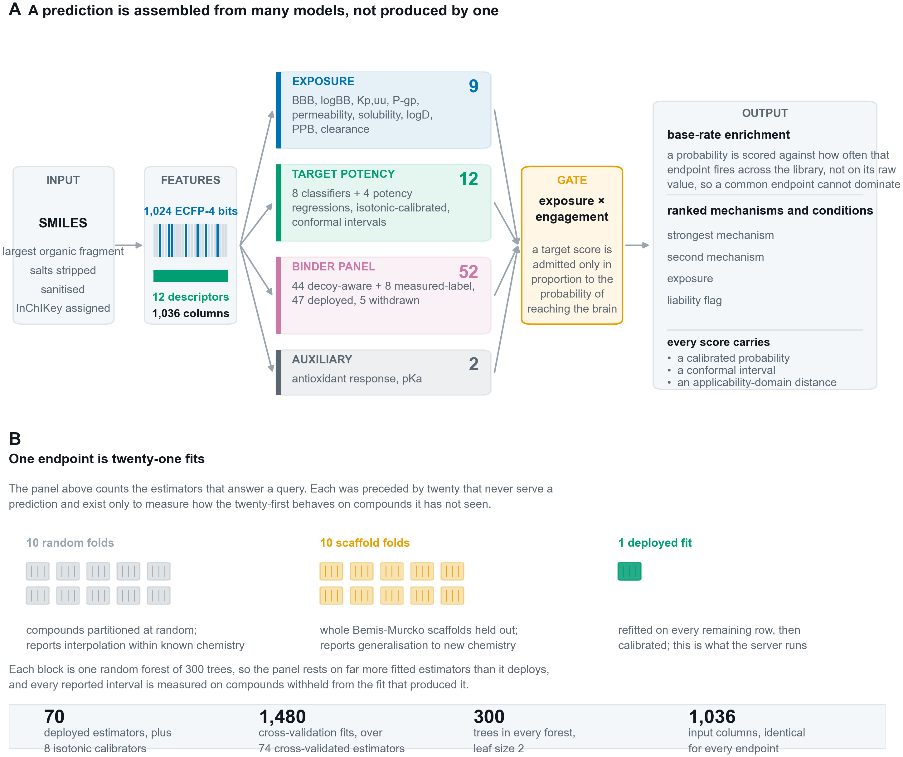
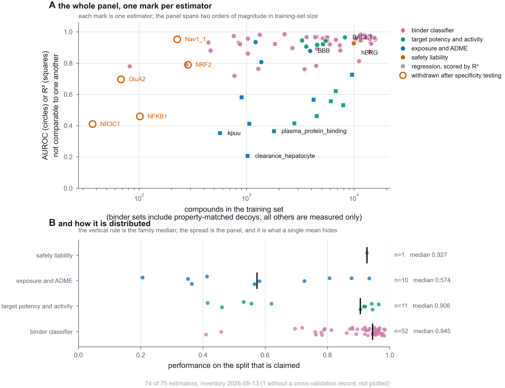
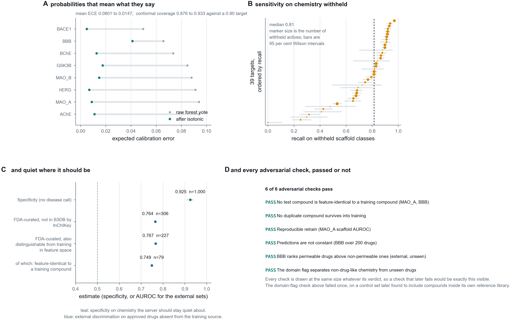
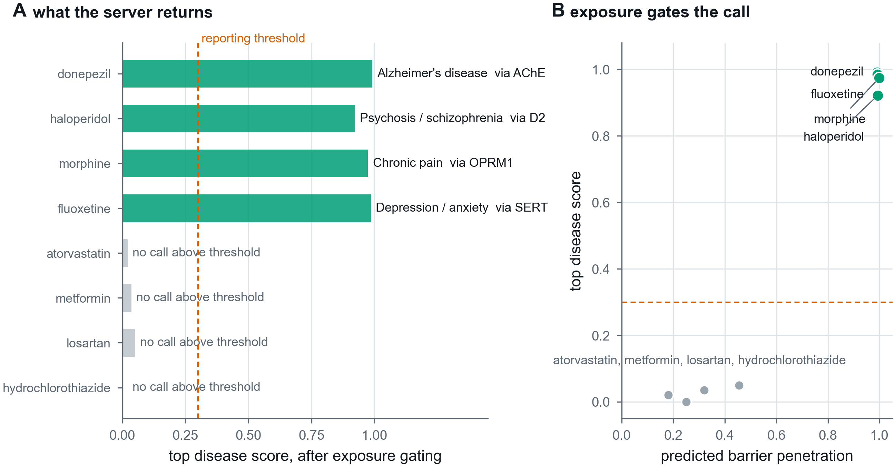
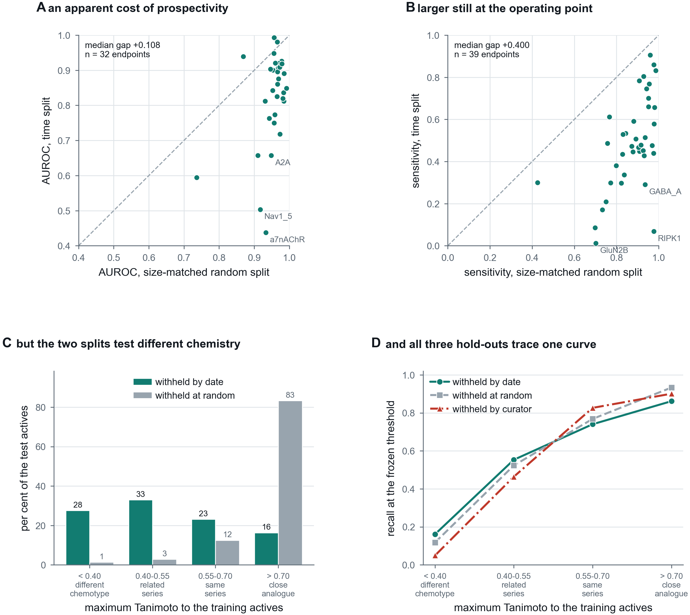

# BrainSafe AI: a calibrated, exposure-gated web server for multi-endpoint prediction of small-molecule action in the human brain

**Authors:** [TO BE SUPPLIED]

**Affiliation:** SAI-Net initiative, Sri Sathya Sai Institute of Higher Learning (SSSIHL), Prasanthi Nilayam, India.

**Correspondence:** [TO BE SUPPLIED]

**Manuscript type:** NAR Web Server Issue.

---

## Abstract

BrainSafe AI is a web server that profiles the mechanism by which a small molecule may act on the
human brain, from structure alone. For a submitted SMILES string or compound name it returns, in a
few seconds, engagement of 54 molecular targets spanning the principal neurodegenerative,
psychiatric, neuroinflammatory, analgesic and sleep-related axes, predicted blood-brain barrier
penetration, two cardiac safety liabilities, and a nine-endpoint ADME and exposure layer including a
directly modelled unbound brain-to-plasma ratio. Every target score is admitted only in proportion to
predicted brain exposure, so potency at a target a compound cannot reach contributes nothing, and
engaged targets are traced through a curated pathway graph to the conditions they touch. The
server is built on 75 estimators, 70 of them deployed, trained on 228,200 measured
compound-endpoint records from ChEMBL
[@chembl], BindingDB [@bindingdb] and B3DB [@b3db], and validated under both random and
scaffold-grouped 10-fold cross-validation: mean AUROC 0.958 and 0.925 respectively across the
measured-label classifiers, with expected calibration error falling from 0.0801 to 0.0147 after
isotonic calibration. Every prediction carries a calibrated probability, a conformal interval and an
applicability-domain distance to the nearest measured analogue, and the server reports silence rather
than a guess for compounds outside its competence: on non-CNS chemistry its specificity is 0.949
(95% CI 0.934 to 0.961). The binder panel, validated against compounds measured and found inactive at
the same target rather than against decoys, reaches a mean AUROC of 0.917 and recovers the
pharmacologically correct driving target for reference drugs. Disease-level scores are presented as a
route from a mechanism to the conditions it touches, not as an indication prediction, because 27 of
the 51 targets in the pathway graph drive more than one condition and structure alone does not
resolve which. BrainSafe AI is freely available without registration at https://huggingface.co/spaces/Krishnag999/brainsafe-ai, with source code, trained models and all validation artefacts at
https://github.com/krishna-g-999/brainsafe-ai.

---

## Introduction

Central nervous system drug discovery fails in a characteristic way. A compound can be potent at its
intended target and never reach the brain, or reach it and carry an unacceptable liability, or engage
targets nobody tested and acquire a clinical profile nobody predicted. Pharmacokinetics and the
barrier itself, rather than target affinity, account for a large share of central attrition
[@cns_attrition], and the quantity that governs central action is not total brain concentration but
the unbound brain-to-plasma ratio [@kpuu].

Answering "will this molecule act on the brain, through what, and is it safe" therefore requires
exposure, target engagement and liability to be answered together. Existing public resources address
these separately. Property-based schemes such as CNS MPO [@cns_mpo] score the exposure axis well but
name no mechanism. Single-endpoint QSAR models name one mechanism but say nothing about whether the
compound arrives. Large language models are fluent and will produce measured-looking identifiers that
do not exist. None of these returns a calibrated probability with a statement of when it should not
be trusted.

BrainSafe AI unifies these axes for any user-supplied structure, under three design commitments.
First, every endpoint is trained only on *measured* experimental values, never on qualitative
annotation, so a prediction is not a restatement of a curator's opinion. Second, every prediction is
accompanied by its uncertainty: a calibrated probability, a conformal interval, and the nearest
measured analogue with its similarity, so a user can tell interpolation from extrapolation. Third,
predictions are mechanistically traceable: individual target engagements are followed through a
curated graph into disease-level scores, gated by predicted exposure, so the output is an explanation
rather than a bare score.

The design also commits to reporting where the server does not work. Five endpoints were trained,
tested and withdrawn; one adversarial check fails and is reported as failing; and the server stays
silent rather than guessing on chemistry it cannot place.

---

## Materials and Methods

### Endpoint selection

The panel is organised around the four questions a CNS candidate must satisfy in sequence.
*Exposure* is modelled first, because a molecule that reaches no free concentration in brain tissue
cannot act centrally however potent it is. *Target engagement* covers the cholinergic axis, where
acetylcholinesterase inhibition remains the mainstay symptomatic treatment in Alzheimer's disease
[@ache_ad], and the amyloid and tau axes [@bace1_fail]; monoamine oxidase B [@mao_b_pd] and LRRK2
[@lrrk2_pd] for Parkinson's disease; the monoaminergic, opioid, cannabinoid, histaminergic and
adenosine systems underlying depression, psychosis, addiction, chronic pain and sleep regulation, the
last including the orexin receptors [@orexin_insomnia]; and three axes implicated across several
neurodegenerative conditions rather than tied to one, NLRP3-driven neuroinflammation
[@nlrp3_neuro], KEAP1-NRF2 antioxidant signalling [@nrf2_neuro], and histone deacetylase activity,
whose genetic removal modifies pathology in Huntington's disease models [@hdac_hd]. Glutamatergic
targets are included on the same basis, riluzole being the long-standing approved agent acting on
that axis [@riluzole_als]. *Safety* is represented by hERG blockade, a leading cause of late-stage
cardiovascular attrition through QT prolongation [@herg_pred]. *Developability* is covered by the
ADME layer.

### Training data and the recovery of the negative class

Protein-target activity is pooled at compound level from ChEMBL [@chembl] pChEMBL values and
BindingDB [@bindingdb]; blood-brain barrier labels come from B3DB [@b3db] augmented with FDA-curated
approved drugs; the nine ADME endpoints use measured sets from Therapeutics Data Commons [@tdc],
MoleculeNet [@moleculenet], B3DB and ChEMBL. The panel holds 228,200 measured compound-endpoint
records over 169,341 unique compounds keyed by the InChIKey of the desalted parent. No value is
imputed and no annotation overrides a measurement. Each endpoint is trained on its own measured set
alone; across the deployed panel those sets span from 387 compounds (KEAP1) to 10,276 (hERG).

A bioactivity record describes what was found to bind. A compound assayed and found inactive is
frequently deposited only as a censored bound, `standard_relation` `>` with no pChEMBL value, and the
conventional query, which filters on pChEMBL, discards exactly those rows. Training on what survives
that filter yields a positive class drawn from measurement and a negative class drawn from
property-matched decoys, and it left 35 of the 60 protein-target endpoints then in the panel above
90 per cent active, which is a property of the query rather than of the chemistry.

A censored bound settles a label whenever the entire interval it defines falls on one side of the
activity cut. `IC50 > 10 uM` places the true potency strictly below pChEMBL 5.0 and is a measured
non-binder; `IC50 > 100 nM` spans both classes and is discarded as undecidable rather than guessed
at. Recovering these added 21,994 measured non-binders across 57 endpoints and reduced the endpoints
above 90 per cent active from 35 to 13 (Supplementary Figure S1). A bound is never used as a value: it assigns a
class and never enters a regression.

### Representation and model selection

Each compound is reduced to its largest organic fragment, neutralised, sanitised, and represented
by a fixed 1,036-column vector: a 1,024-bit folded ECFP-4 fingerprint [@ecfp] and twelve physicochemical
descriptors (molecular weight, cLogP, TPSA, hydrogen-bond donors and acceptors, rotatable bonds,
aromatic rings, fraction sp3, ring count, heavy atoms, formal charge, QED). Folding means a set bit
reports that some substructure environment hashing to that index is present, not which one, and
chirality is excluded, so two enantiomers produce byte-identical rows. Rows identical in feature
space are therefore collapsed before any split; leaving them in place would put copies of one
compound on both sides of a fold.

For a CNS panel this exclusion needs a measured bound rather than a disclaimer. Of 228,198 training
structures, 40.8 per cent carry an assigned stereocentre, so the data could in principle support a
chirality-aware fingerprint. Where one flat skeleton appears as two or more stereoisomers measured at
the same endpoint, however, which is the only situation in which chirality has anything to resolve,
the measured labels agree in 94.6 per cent of the 8,013 such cases. Stereochemistry is therefore
mostly not what separates an active from an inactive in this data, and the share of the whole panel
where it could change a class call is 0.19 per cent. That bound is not an absolution: a quarter of
the comparable pairs differ by more than one log unit in potency, and the disagreements concentrate
where a pharmacologist would expect them, at the barrier model, BACE1, D2, OX2, the mu-opioid
receptor and CB1. Predictions are made on the flat skeleton and should be read as applying to the
racemate.

Neutralisation is part of the representation rather than a detail of it, because a drug and its
salt are the same molecule and must give the same answer. Removing the counter-ion without it
leaves the parent carrying the charge the salt gave it, so haloperidol hydrochloride written as
public databases serve it is a different input from haloperidol: on the models this server
previously deployed it returned a barrier probability of 0.613 against 0.993, and an hERG
probability of 0.295 against 0.914, so a user who pasted the salt form lost a cardiac liability
flag on a compound that has one. Only protonation states are undone. A permanent charge is kept,
because a quaternary ammonium has no proton to lose and its charge is precisely what stops it
crossing the barrier; `formal_charge` therefore reports permanent charge rather than how a
depositor happened to write a row. Of the 170,617 unique structures in the panel, 198 change
representation under this rule and 1,155 charged ones are correctly left alone, and the whole
panel was refitted afterwards so that training and inference share one representation.

Five model families were compared under identical 5-fold cross-validation on both split regimes using
scikit-learn [@sklearn], on the deduplicated matrix the deployed pipeline fits. Two are baselines a
reader is entitled to demand: a five-nearest-neighbour read-across on Tanimoto similarity, which is
what a medicinal chemist does by eye, and L2-regularised logistic regression. Three are ensembles: a
random forest [@random_forest], XGBoost [@xgboost] and histogram gradient boosting. On the scaffold
split the random forest leads classification at 0.9228 mean AUROC, ahead of histogram gradient
boosting (0.9160), XGBoost (0.9144), the read-across (0.8844) and logistic regression (0.8338), and
it exceeds the read-across on all thirteen endpoints. It does not lead regression: XGBoost and
histogram gradient boosting reach mean scaffold R² of 0.5453 and 0.5452 against 0.5186. A random
forest is nonetheless deployed everywhere, because it leads where the principal claims are made,
calibrates stably, supplies the vote distribution the conformal layer consumes, and needs no GPU. The
cost of that uniformity is about 0.03 R² on the potency regressions and is stated rather than left
for a reader to find.

### Cross-validation, calibration and uncertainty

Every endpoint is cross-validated ten-fold in two regimes: a random split, and a split grouped on
Bemis-Murcko scaffolds [@bemis_murcko] that withholds entire structural classes. The two answer
different questions, and the distance between them is the honest statement of how far a model
travels. Across 74 cross-validated estimators, spanning 70 distinct endpoints because four
receptors carry both a potency regression and a binder classifier, this is 1,480 fitted models
standing behind the deployed panel. A complete inventory of every estimator, with its prediction type, training-set size,
validation scheme, calibration and fitting date, is given in Supplementary Table S1 and regenerates
with one command.

Classifiers are isotonically calibrated [@calibration] on out-of-fold predictions, so no compound
contributes to the calibrator that scores it; mean expected calibration error falls from 0.0801 to
0.0147. The reported value is specific to how the calibrator is nested, and the nesting is therefore
stated: isotonic regression is fitted by five-fold `cross_val_predict` over the pooled out-of-fold
prediction vector. Fitting it instead on the other nine folds' out-of-fold predictions, an equally
defensible nesting, gives 0.0063 on the same data. Both are honest estimates of different
estimators, and the difference is larger than any of the calibration gains it might be used to
compare, so the protocol is reported rather than the number alone. Each prediction additionally
carries a Mondrian conformal interval, which converts the
applicability domain from a caveat into a coverage statement [@conformal]: empirical coverage is
0.889 to 0.921 against a 0.90 target. The applicability domain itself is the maximum ECFP-4 Tanimoto
similarity of the query to that endpoint's own measured chemistry [@ad_qsar], reported with the
nearest measured analogue and its structure.

### Binder classifiers, and thresholds measured where they were not set

Receptor, transporter and kinase targets are reported in ChEMBL almost entirely as actives, so a
naive potency regressor learns the training median. Each is therefore modelled as a binder
classifier: positives are measured binders, negatives are measured non-binders where they exist plus
property-matched decoys [@dude] with Tanimoto below 0.35 to any positive. Binder classifiers use
sigmoid calibration [@platt], because the withheld set for one endpoint is often too small to fit a
step function without overfitting it.

Decoys create a specific failure. If a decision threshold is chosen as a quantile of a sample and the
false-positive rate is then computed on that same sample, the rate cannot exceed the quantile: it
restates the target instead of measuring it. The 158,890-compound background library is therefore
partitioned into three disjoint pools by a stable hash of the canonical structure, so a compound's
pool is a property of the molecule and never depends on run order: 95,515 compounds supply decoys,
31,694 set thresholds, and 31,681 measure the false-positive rate. Measured on the pool it was not
set on, the background false-positive rate has a median of 0.0259 across the 43 deployed endpoints
that carry one, and reaches 0.0621, exceeding its 0.05 target for four endpoints, which under the
previous procedure was arithmetically impossible. That the number can now disagree with its target is the evidence that it is a measurement.

### Disease layer and implementation

Because several training sets are active-heavy, a raw calibrated probability is not evidence of
engagement unless it exceeds the endpoint base rate; targets are therefore scored by enrichment over
that base rate. A curated, versioned graph maps each target through a pathway to the diseases it
informs, anchored to KEGG synapse and disease maps [@kegg], the Reactome KEAP1-NFE2L2 oxidative
stress response [@reactome] and IUPHAR/BPS Guide to Pharmacology associations [@iuphar]. A
disease score is the strongest engaged target for that disease scaled by predicted barrier
penetration; taking the strongest rather than an average prevents unrelated mechanisms from diluting
a real signal.

The server is a single-page application built with Streamlit [@streamlit] and RDKit [@rdkit],
accepting a SMILES string or a compound name resolved through PubChem. Models are loaded once and
cached; a complete profile across all 70 deployed estimators, including both applicability-domain
calculations against the 158,890-compound reference library, returns in a few seconds on one CPU
core. No registration is required and sample compounds are provided.

---

## Results

The server's primary output is mechanism: which targets a compound engages, with what confidence,
and whether it reaches them. That is where the evidence is strongest, and the results are presented
in that order. The disease layer is a navigational aid built on top of the mechanism call, and its
weaknesses are reported in their own section rather than folded into the headline.

### Target engagement, the primary output

The 52 binder classifiers are validated not against the decoys used to train them but against
compounds experimentally tested at the same target and found inactive. Across the 47 that are
deployed they reach a mean AUROC of 0.917 and a mean sensitivity of 0.898 on actives withheld by
scaffold, at thresholds constrained simultaneously by held-out measured inactives and by the
false-positive rate on a disjoint pool of unrelated chemistry. Both figures are means over 47
endpoints and the spread behind them is wide: AUROC ranges from 0.719 at GABA-A to 0.985, and
sensitivity from 0.639 at COX-2 to 0.997, so the two means describe the panel and not any particular
endpoint. Supplementary Table S1 gives every endpoint separately. Five are withdrawn: Nav1.1 and GluA2
for firing on trivial metabolites at every usable threshold, and three added to test
natural-product coverage, reported in the limitations. Withdrawal is re-derived whenever the panel
is refitted rather than carried forward, because it is a claim about a particular fit: when the
panel was retrained, Cav3.2 stopped failing and was reinstated while GluA2 began failing and was
withdrawn. Measured on that disjoint pool the background
false-positive rate has a median of 0.0259.

The eight measured-label classifiers reach a mean AUROC of 0.958 under the random split and 0.925
under the scaffold split. BACE1 is most robust to chemotype change, losing 0.012 between
splits, and MAO-A least, losing 0.056. The four receptor potency regressions reach R² 0.64 to 0.72
(random) and 0.46 to 0.62 (scaffold).

The mechanism call is correct where it can be checked against pharmacology that is not in dispute.
For donepezil, haloperidol, morphine and fluoxetine the server names acetylcholinesterase, D2, the
mu-opioid receptor and the serotonin transporter respectively as the driving target (Figure 4A).
Attribution supports the same conclusion from a different direction: SHAP values computed with
TreeExplainer [@shap_trees], which is exact for a random forest rather than an approximation, recover
known physicochemistry that was never supplied to the models. For the barrier model, larger TPSA,
molecular weight and hydrogen-bond donor count all push away from penetration (Spearman correlation
between feature value and SHAP value of -0.93, -0.95 and -0.90) while drug-likeness pushes towards it
(+0.93); for hERG, lipophilicity pushes towards blockade (+0.95).

An independent reproduction re-ran the entire cross-validation from the endpoint tables and scored it
with separately written metric code. All 26 core values reproduced exactly, with a maximum deviation
of 4.7 x 10⁻⁵, attributable to rounding in the stored summary.

### The validations that a cross-validated score cannot replace

**Leakage.** Folds were rebuilt and the index sets interrogated directly. On the deduplicated matrix
the pipeline fits, no InChIKey, no feature vector and no scaffold appears on both sides of any fold.
On the raw table the feature-vector overlap reaches 544, which is precisely what deduplication
removes.

**Null models.** With labels permuted, the same pipeline on the same folds returns a mean AUROC of
0.4938 (random) and 0.4921 (scaffold), with a worst single endpoint of 0.5174. Whole scaffold classes
do not carry enough class-frequency information for a label-free model to beat chance, so the
scaffold figures are not inflated by that route.

**Prospective sensitivity.** Whole scaffold classes were withheld before training. Pooled recall on
them is 0.803 (95% CI 0.797 to 0.809), with a per-target median of 0.815 across the 39 targets whose
decision threshold did not collapse (Figure 3B). Targets are excluded only for a degenerate
threshold, never for a poor recall.

**External validation.** The barrier model was tested on FDA-curated approved drugs absent from B3DB
by InChIKey: AUROC 0.764 on all 306, and 0.793 on the 241 that are also distinguishable from the
training set in feature space, which is the subset that supports an external claim (Figure 3C). The
65 excluded by that second criterion are feature-identical to a training compound and score 0.710,
which is the size of the memorisation the first figure contains.

For the target panel no external set of comparable size exists, because for most of these targets the
public measured chemistry *is* the training set. Two kinds of independence were therefore constructed
from the data that does exist, with every model refitted rather than scored, since the deployed models
were fitted on all of it (Figure 5). **By date:** each endpoint was refitted on its pre-cutoff rows
alone, with its decision threshold also frozen before the cutoff, and tested on compounds first
published afterwards; 39 of the 47 deployed endpoints carry enough dated chemistry on both sides of
the wall, giving 45,244 test compounds. Each was refitted a second time on a size-matched random
split, because a time split trains on less data as well as none of the future. **By curator:**
compounds deposited in BindingDB and absent from ChEMBL were withheld entirely and the panel refitted
on the ChEMBL side, which is available for three endpoints at 1,303 actives.

Read in aggregate the time split looks like prospective decay: mean AUROC 0.823 against 0.951 for the
size-matched random control, and mean sensitivity 0.489 against 0.872. It is not decay. The
false-positive rate on background chemistry is unchanged (0.037 against 0.038), and the gap closes
once test compounds are stratified by maximum Tanimoto similarity to the training actives. A random
split of medicinal-chemistry data holds out 83 per cent close analogues of its own training set,
because the published record is series; a time split holds out 28 per cent chemistry below Tanimoto
0.40. Within a novelty band the two splits differ by at most 0.081 in AUROC and 0.071 in recall
against aggregate gaps of 0.128 and 0.383. Three test sets built by unrelated rules, withheld by
date, at random, and by curator, trace one recall curve: 0.16, 0.55, 0.74 and 0.86 by date across the
four bands, against 0.12, 0.52, 0.77 and 0.93 at random and 0.05, 0.46, 0.83 and 0.90 by curator
(Figure 5D).

Recall is therefore a function of chemical distance rather than of publication date, which has three
consequences. The reported scores do not expire. The deployed sensitivity describes a held-out
population that is mostly close analogues, so it overstates what a novel scaffold should expect. And
the expected recall for a submitted compound is knowable at query time from a quantity the server
already computes and displays, which is how the interface now reports it. On genuinely distant
chemistry that expectation is poor in absolute terms, near 0.16, and the finding is that the poor
number is predictable rather than that it is better than it appeared.

**Specificity.** One thousand compounds carrying no recorded activity at any modelled target were
scored through the deployed pipeline. 949 returned no actionable disease signal, a specificity of
0.949 (95% CI 0.934 to 0.961). Of the 51 false positives, 28 fired on a single condition rather than
producing a diffuse profile, and the median score among them was 0.448, only modestly above the
actionable threshold. These compounds are presumed inactive because nothing is recorded, not proven
inactive, so this is a lower bound.

**Adversarial checks.** Six checks were written so that each could fail, and all six pass, including
exact reproducibility of a retrained endpoint. The domain-flag check initially failed and passes only
after its control set was corrected: 28 of the original controls are measured compounds inside the
flag's own reference library, where calling them in domain is the truthful answer rather than a
failure. The passing criterion was not moved. Against chemistry genuinely absent from the reference
the flag separates at median maximum similarity 0.47 against 0.59 for unseen drugs (n = 25,
p = 1.1e-03), which is a weak signal and is described as one.

**Attribution.** SHAP attributions computed with TreeExplainer [@shap_trees], which is exact for a
random forest rather than an approximation, over the deployed classifiers recover known
physicochemistry rather than artefacts. For the barrier model, larger TPSA, molecular weight and
hydrogen-bond donor count all push away from penetration (Spearman correlation between feature value
and SHAP value of -0.93, -0.95 and -0.90) while drug-likeness pushes towards it (+0.93); for hERG,
lipophilicity pushes towards blockade (+0.95). These directions were not supplied to the models.

### Comparison with existing approaches

Against the read-across baseline that represents what a chemist does by eye, the deployed random
forest is better on all thirteen endpoints where the two were compared, on the scaffold split. The
margin is quoted per metric rather than pooled, because eight of those endpoints are scored by
AUROC and five by R-squared: the mean gain is 0.038 AUROC over the eight classifiers and 0.045
R-squared over the five potency regressions. Against property-based CNS scoring [@cns_mpo], which addresses exposure only, BrainSafe AI
adds mechanism and liability but is not a replacement for expert medicinal-chemistry judgement on
either axis. Against single-endpoint QSAR servers, the difference is the gating: a target score here
is admitted only in proportion to predicted exposure, so a potent binder that does not reach the
brain is reported as such rather than as a hit. We are not aware of another freely available server
that returns exposure-gated, calibrated, mechanism-resolved profiles across this many CNS endpoints
with an explicit applicability-domain statement on every value.

### Use case: a mechanism profile, and knowing when to stay silent

Submitting donepezil returns a barrier probability of 0.99 and acetylcholinesterase as the driving
target, surfacing Alzheimer's disease at 0.99 with cognition (cholinergic) alongside it. Haloperidol
returns D2 and psychosis at 0.95; morphine returns the mu-opioid receptor and chronic pain at 0.99;
fluoxetine returns the serotonin transporter and depression at 0.99 (Figure 4A). In each case the
server names the mechanism, and the mechanism is the pharmacologically correct one.

The complementary behaviour is silence. Atorvastatin, metformin, losartan and hydrochlorothiazide
return barrier probabilities between 0.18 and 0.46 and no disease score above the reporting
threshold (Figure 4B). On the external reference set the server is correctly silent on 3 of the 5
non-CNS controls that are not already in its training chemistry. The two it calls are worth
naming rather than pooling: insulin glargine, a peptide that a small-molecule descriptor set
cannot represent and that the server should decline rather than score, and allopurinol at 0.395,
just above the reporting threshold. The control set is smaller than it was because desalting and
neutralisation made the in-training test stricter, moving two compounds that had been counted as
external into the training set where they belong. Silence is not a side effect: a target score is admitted only in
proportion to predicted barrier penetration, so a compound that does not arrive cannot generate a
call.

### The disease layer, and why it is a navigational aid rather than a prediction

The disease layer maps engaged targets onto conditions. It carries real information about its own
map: asked to recover the disease its target graph implies, it reaches top-3 accuracy 0.790 against a
permutation null of 0.154. It does not, however, predict clinical indication, and the evidence for
that limit is worth stating precisely because it is easy to overstate the layer in either direction.

Validated against ChEMBL phase-4 indications on the 162 approved drugs whose structures appear
nowhere in the training chemistry, and judging the ranking alone with no reporting threshold, top-3
accuracy is 0.451. The model beats a permutation null decisively at every depth, so its output does
depend on the compound and is not memorisation. It does not beat a frequency null naming the
commonest CNS indications, and, importantly, reporting more conditions does not close that gap but
widens it:

| Conditions reported | Model | Frequency null | Difference |
|---|---|---|---|
| top-1 | 0.296 | 0.395 | -0.099 |
| top-3 | 0.451 | 0.654 | -0.204 |
| top-5 | 0.549 | 0.821 | -0.272 |
| top-8 | 0.605 | 0.969 | -0.364 |

A constant answer gains from each additional slot faster than the model does, because approved CNS
indications are concentrated in a few classes. Deepening the list is therefore not a remedy.

Top-k accuracy is, however, the metric on which a constant answer is strongest, and it is worth
recording what the layer does on two metrics a constant answer cannot pass. Per-indication AUROC asks
whether the drugs that treat a condition score above the drugs that do not, and any constant
predictor scores 0.500 by construction; over the nine indications carrying at least five of these
drugs the layer averages 0.603 and beats chance on seven. Macro-averaged top-3 recall, which averages
per indication rather than pooling and so cannot be carried by naming the common conditions, is 0.385
against 0.333. The spread is wide and is the substance of the result: depression and anxiety reach
0.794 and psychosis 0.765, while epilepsy at 0.490 and sleep at 0.499 sit at or just below chance. The layer therefore does respond to
the compound, decisively for some conditions and not at all for others, which is why it is offered as
a route from mechanism to condition and not as an indication prediction.

The reason is structural rather than a deficiency of fitting, and it is visible in the graph: 27 of
the 51 targets in the pathway graph drive more than one condition. GABA-A alone contributes to depression and
anxiety, sleep and wakefulness, and epilepsy. One molecular event genuinely underlies several
indications, and what selects among them, dose, regimen, exposure duration, patient population and
trial history, is not present in a structure. Consistent with this, the median rank of the true
indication among the 162 never-seen drugs is 4.5: the server places the correct condition in the right
mechanistic neighbourhood but cannot resolve which member of that neighbourhood a compound was
developed for.

The disease scores are therefore presented as a route from a mechanism to the conditions that
mechanism touches, useful for orientation and for deciding what to test next, and they are not
offered as an indication prediction. The mechanism call, not the disease list, is the result this
server stands on.

### What the falsification analysis removed

Every result above was produced by first attempting to break it. The analysis returned findings in
both directions. The disease layer carries real information: top-3 accuracy 0.790 against a
permutation null of 0.163. Its curated edge weights do not: uniform and randomly permuted weights
score 0.7897 and 0.7874 against 0.7901, so the predictive content lies in the graph topology, and the
weights are reported as structure rather than as tuned parameters. The same analysis found a
deployed endpoint, Nav1.1, calling glucose, urea, glycine, lactate and atenolol binders at its
calibrated threshold, at a random-chemistry false-positive rate of 0.080 and a sensitivity of
0.120; no cut separates a metabolite from a sodium-channel ligand, and it is withdrawn. GluA2 fails
the same test on the current fits and is withdrawn with it. Three overrides that had been applied
to other endpoints were removed at the same time, because the observations that justified them do
not reproduce on the refitted models and an override whose justification has expired costs
sensitivity for a false positive that no longer occurs.

---

## Discussion

BrainSafe AI answers the four questions a CNS candidate must satisfy in one pass, and reports the
uncertainty on each. Its principal contribution is not any individual AUROC but the discipline
imposed on how those numbers were obtained: a negative class recovered from censored measurements
rather than simulated with decoys, thresholds measured on a pool disjoint from the one that set
them, an applicability domain expressed as conformal coverage, and validations designed so that they
could fail.

Five limitations bound its use. The applicability-domain flag is a weak signal rather than a
decisive one: against chemistry genuinely absent from the reference library it scores a median
maximum similarity, in the adversarial check, of 0.47 against 0.59 for unseen approved drugs (n = 25, one-sided Mann-Whitney
p = 1.1e-03), but at a threshold that rejects a tenth of genuine drugs it catches only a fifth of
distant chemistry. The conformal interval and the nearest-analogue distance remain the stronger
statements of confidence and the interface presents them as such. What the flag does predict well is
sensitivity: the distance it measures is the variable that recall tracks, so it is best read as a
statement about how likely the panel is to miss a real activity rather than about whether an answer
can be trusted.

The second is the size of that effect. On chemistry more than a Tanimoto of 0.40 from anything the
panel has measured, recall at the deployed operating point is near 0.16, and no analysis here
improves it; what the prospective work establishes is that the figure is predictable, not that it is
better than it looked. A negative result on a novel scaffold is close to uninformative, which is why
the server now reports the expected recall beside it.

The third is that the specificity estimate rests on compounds presumed inactive because nothing is
recorded about them, drawn from within the reference library, so it does not bound behaviour on
genuinely distant chemistry.

The fourth is natural-product chemistry, and it is stated here because a reader will reasonably ask.
The training library has a median fraction-sp3 of 0.34 and only 9.2 per cent of it is both
sp3-rich and free of aromatic rings, so terpenoid and steroidal natural products are largely outside it: a
withanolide submitted to the server returns a maximum Tanimoto of 0.31 and no engagement call, with
a bile acid as its nearest measured neighbour. Measured activity for such compounds is scarce against
these targets and is usually recorded against cell lines rather than proteins. Assembling an external
test set from NPASS left only three endpoints with enough genuinely external data to score, after
1,385 nominally new compounds proved on inspection to be training compounds written as a different
tautomer or salt, and on those three the panel returns AUROC 0.463 at AChE (n=41), 0.741 at GBA1
(n=89) and 0.461 at hERG (n=80). With two to five actives per endpoint those intervals are far too
wide to establish failure, but they are equally far from supporting a claim of natural-product
capability, and none is made. The server flags such compounds as outside its domain, which is the
correct behaviour.

Extending the panel to the targets natural products are actually assayed against was attempted and
did not work, and the attempt is reported because its outcome is informative. Surveying NPASS for
human protein targets with at least 60 measured compounds and 15 in each class identified 58 targets
absent from the panel. Three were selected on mechanism rather than on volume: NRF2 (651 compounds),
the effector of the KEAP1-NRF2 axis whose sensor alone was modelled and which is the withanolide
mechanism; NFKB1 (263), joining NLRP3 and RIPK1 on an existing neuroinflammation axis; and NR3C1
(140), the glucocorticoid receptor, the richest of the candidates in the sp3 chemistry the library
lacks. All three were trained and cross-validated by the same procedure as every other endpoint, and
all three were then withdrawn on the same criterion every endpoint faces. The distinction matters,
because they are not simply noise. Under scaffold-grouped cross-validation they carry some signal:
AUROC 0.719, 0.711 and 0.596 for NRF2, NFKB1 and NR3C1. But the fold-to-fold standard deviations are
0.157, 0.151 and 0.152, so that signal is not stable, and it does not survive the step that makes an
endpoint deployable. Against their own held-out measured inactives they reach AUROC 0.539, 0.392 and
0.479, and at a threshold constrained to control the false-positive rate on the disjoint background
pool they recover almost no actives at all: sensitivity 0.250, 0.048 and 0.000. An endpoint that
cannot be given a threshold that finds actives without firing on everything else is not usable,
whatever its cross-validated AUROC. The cause is visible in what the
labels are made of. A binder classifier is fitted to reproduce a direct binding constant, and
for two of these three there is essentially none: of the labelled records, Ki or Kd accounts for
0.0 per cent at NRF2, 0.3 per cent at NFKB1 and 14.8 per cent at NR3C1, the remainder being
almost entirely `Potency`, a pooled functional readout that mixes assay formats and does not
define a binding class a ligand fingerprint can separate. NR3C1, the one with real binding data,
is also the one with too few compounds to fit. The gap is therefore not one that adding targets
closes. It requires measured binding affinity on sp3-rich scaffolds, which is what does not
exist.

The fifth is the disease layer, and it is a limit of the question rather than of the fitting. Clinical
indication is not a function of structure: 27 of the 51 targets in the pathway graph drive more than
one condition,
and what selects among them is dose, regimen, exposure and trial history. The layer does not beat a
frequency baseline at any reporting depth, and reporting more conditions widens rather than closes
that gap. It is offered as a route from a mechanism to the conditions that mechanism touches, and the
mechanism call is the result the server stands on. Improving it would require the clinical covariates
that determine indication, not a better model of the molecule.

The server is designed to be extended: adding an endpoint requires a measured table and one training
command, and every artefact in this manuscript regenerates from the repository with a single command
per number.

---

## Data availability

All code, the curated knowledge graph, per-fold validation artefacts, the independent reproduction
and the scripts that regenerate every table and figure are at
https://github.com/krishna-g-999/brainsafe-ai under the MIT licence. Trained estimators and the raw
API responses are deposited separately, each with a committed manifest recording the SHA-256 of the
archive and of every file inside it, so a download is verified rather than trusted.

**[TO BE SUPPLIED BEFORE SUBMISSION]** the public server URL (required in the abstract by NAR), the
deposit DOI, the author list, the corresponding address, and the funding statement. Every other value
in this manuscript is computed from an artefact in the repository.

## Funding

[TO BE SUPPLIED]

## Conflict of interest

None declared.

---

## Figure legends

**Figure 1.** How a query is answered. (**A**) A submitted structure is standardised and represented
as one fixed 1,036-column vector, scored by four model families: nine exposure and ADME endpoints,
twelve target potency and activity endpoints, the 52-endpoint binder panel of which 47 are deployed,
and two auxiliary regressions. Every target score is admitted only in proportion to the predicted probability that the
compound reaches the brain, and surviving scores are ranked by enrichment over each endpoint's base
rate rather than by raw probability. Every reported value carries a calibrated probability, a
conformal interval and an applicability-domain distance. (**B**) The counts in (**A**) are trained
estimators, 75 in total, of which 70 are deployed. Each was preceded by twenty fits that never serve
a prediction and exist only to measure how the twenty-first behaves on withheld compounds, 1,480
across the panel.

**Figure 2.** The panel, one mark per estimator, so that no claim rests on a mean a reader cannot
check. (**A**) Every estimator, deployed or withdrawn, placed by the number of compounds it was
trained on
and by the performance claimed for it, coloured by model family. Marker shape carries the metric:
AUROC and R² both run to 1.0 and are not the same quantity, since 0.5 is chance for one and a
respectable fit for the other, so they are distinguished rather than averaged. The five estimators
withdrawn after specificity testing are drawn in outline, because a panel showing only what survived
is a selection rather than an inventory. Training sets span two orders of magnitude, from 68 to 15,723 rows;
binder training sets include property-matched decoys while the others are measured compounds only,
which the axis states. (**B**) The same population by family, with the
family median marked. The spread is the point: the binder classifiers have a median of 0.935 while
the exposure and ADME regressions have a median R² of 0.575, and a single panel average would
describe neither. The complete inventory, with training-set composition, validation scheme,
calibration and fitting date for every estimator, is Supplementary Table S1.

**Figure 3.** Four validations that a cross-validated score cannot replace. (**A**) Expected
calibration error before and after isotonic regression fitted on out-of-fold predictions, so no
compound contributes to the calibrator that scores it. (**B**) Recall on whole scaffold classes
withheld before training, with 95 per cent Wilson intervals [@wilson_ci] and marker area proportional
to the number of withheld actives, so an interval that is wide because the evidence is thin looks
thin. (**C**) Specificity on chemistry the server should stay quiet about, and external
discrimination on approved drugs absent from the training source. (**D**) The adversarial suite, in
which each check was written so that it could fail. Five of six pass; the sixth, shown at the same
size as the rest, is the applicability-domain flag, reported rather than retuned.

**Figure 4.** A worked profile and the silence behaviour. For four approved CNS drugs the server
recovers the pharmacologically correct driving mechanism and the corresponding condition; for four
peripherally acting compounds no disease score reaches the reporting threshold. Bars are disease
scores after exposure gating, and the driving target is named beside each. The two behaviours are the
same design decision seen from opposite sides: a target score is admitted only in proportion to
predicted barrier penetration, so a compound that does not arrive cannot generate a disease call.

Supplementary figures, each named by the file it is generated into so that the number and the
artefact cannot come apart:

**Figure 5.** External validation, and an apparent temporal decay that is a composition effect.
(**A**) Per endpoint, AUROC under a size-matched random split against AUROC under a time split that
withholds the most recent quarter of the data and freezes the decision threshold before the cutoff.
The size match matters: a time split trains on less data as well as none of the future, so without a
control at the same n a drop cannot be attributed to either. (**B**) The same comparison for
sensitivity at the frozen operating point, where the gap is larger. (**C**) Why the gap exists. A
random split of medicinal-chemistry data holds out mostly close analogues of its own training set,
because the published record is series; a time split does not. The two are not testing comparable
populations. (**D**) The resolution. Recall against maximum Tanimoto similarity to the training
actives, for three test sets built by unrelated rules: withheld by publication date, withheld at
random, and withheld by curator, the last being compounds deposited in BindingDB and absent from
ChEMBL. They trace one curve, so recall is a function of chemical distance rather than of how the set
was held out, and the expected sensitivity for a submitted compound is knowable at query time.

**Figure S1** (`figures/Figure5_negative_class.png`). Recovery of the measured negative class
from censored bounds, and its effect on class balance per endpoint.

**Figure S2** (`figures/Figure2_feature_vector.png`). The 1,036-column feature vector computed
for a worked molecule, block by block.

**Figure S3** (`figures/Figure3_cv_design.png`). The two cross-validation schemes, random and
Bemis-Murcko scaffold-grouped, and what each withholds.

**Figure S4** (`figures/Figure4_pools_and_thresholds.png`). The three disjoint background pools
and the separation between the pool that sets a threshold and the pool that measures it.

**Figure S5** (`figures/Figure7_binder_panel.png`). The complete binder panel, all 52 endpoints
named, the 47 deployed and the 5 withdrawn distinguished by colour.

<!-- REFERENCES -->
